ISLR Ch.1
================

This is an [R Markdown](http://rmarkdown.rstudio.com) Notebook. When you
execute code within the notebook, the results appear beneath the code.

### ex. 1

For each of parts (a) through (d), indicate whether we would generally
expect the performance of a flexible statistical learning method to be
better or worse than an inflexible method. Justify your answer.

-   1.  The sample size n is extremely large, and the number of
        predictors p is small. **Flexible is preferred since there is a
        big `n` to estimate the parameters of the function that fit the
        data**

-   2.  The number of predictors p is extremely large, and the number of
        observations n is small. **Inflexible because `n` is too small
        to reasonably estimate parameters of the function. Thus, some
        assumptions on its shape shall be made**

-   3.  The relationship between the predictors and response is highly
        non-linear. **Flexible, since they better adapt to complex
        non-linear functions when enough data are provided**

-   4.  The variance of the error terms, i.e. σ2 = Var(ϵ), is extremely
        high. **Inflexible since a flexible methods are more prone to
        overfitting, turning the high variance noise in a spurious
        signal which will lower model performance on new data**

### ex. 2

Explain whether each scenario is a classification or regression problem,
and indicate whether we are most interested in inference or prediction.
Finally, provide n and p.

-   1.  We collect a set of data on the top 500 firms in the US. For
        each firm we record profit, number of employees, industry and
        the CEO salary. We are interested in understanding which factors
        affect CEO salary. **Regression problem, focused on inference.
        `n = 500, p = 4`**

-   2.  We are considering launching a new product and wish to know
        whether it will be a success or a failure. We collect data on 20
        similar products that were previously launched. For each product
        we have recorded whether it was a success or failure, price
        charged for the product, marketing budget, competition price,
        and ten other variables. **Classification problem, focused on
        prediction. `n = 20, p = 14`**

-   3.  We are interested in predicting the % change in the USD/Euro
        exchange rate in relation to the weekly changes in the world
        stock markets. Hence we collect weekly data for all of 2012. For
        each week we record the % change in the USD/Euro, the % change
        in the US market, the % change in the British market, and the %
        change in the German market. **Regression problem, focused on
        prediction `n = 52, p = 4`**

### ex. 3

We now revisit the bias-variance decomposition.

-   1.  Provide a sketch of typical (squared) bias, variance, training
        error, test error, and Bayes (or irreducible) error curves, on a
        single plot, as we go from less flexible statistical learning
        methods towards more flexible approaches. The x-axis should
        represent the amount of flexibility in the method, and the
        y-axis should represent the values for each curve. There should
        be five curves. Make sure to label each one.

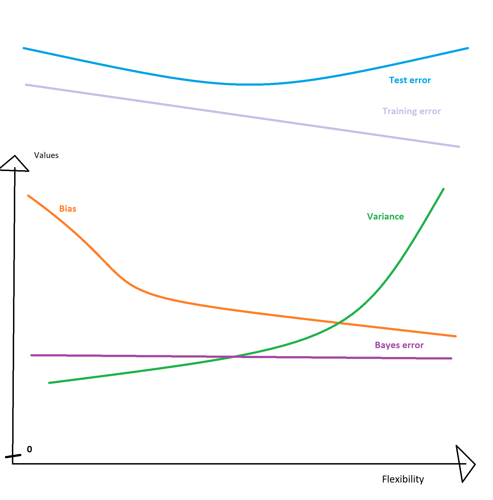

-   2.  Explain why each of the five curves has the shape displayed in
        part (a).

\*\*

-   **Every curve is above zero (they can reach zero, but not be
    negative)**
-   **Bias curve represents how much error is introduced by
    approximating real-world data, decreases from left to right
    (flexible models have lower bias)**
-   **Variance curve represents how much the estimated function would
    change using different input, increases from left to right (flexible
    moderls are more prone to bigger changes in their parameters due to
    small changes in provided data)**
-   **Bayes error (aka the error produced by a bayes classifier) is an
    analog of the irreducible error, which does not depend on the
    flexibility of the classifier, hence drawn as a straight line**
-   **Test error is the sum of bias, variance and irreducible error so
    it’s higher in the y-axis than each of them, but since it does not
    depend on the model used but on how good the model fit the real
    function, it’s drawn as a convex function where the minimum point
    represent the best level of flexibility that we should use in that
    application**
-   **Training error is also composed of the previous mentioned three
    terms, so it’s higher than them. Usually, as flexibility increases
    the training error is reduced due to overfitting to the training
    data, that’s why it progressively decreases from left to right**

### ex. 4

You will now think of some real-life applications for statistical
learning.

-   1.  Describe three real-life applications in which classification
        might be useful. Describe the response, as well as the
        predictors. Is the goal of each application inference or
        prediction? Explain your answer. **first example the prediction
        of the type of novel (criminal, romance, …) based on the written
        text of the book, which should be the input.** **Second example
        is the prediction on whether a patient will present or not for a
        follow-up visit. Data about his condition (list of diseases he
        has), his socio-economic status, time-space distance of the
        visit from today and from where he is living, previous behaviour
        and type of visit prescribed have to be collected.** **Third
        example is to predict if further investigation will be required
        for a patient presenting will a suspected nevus. Input data
        shall be the photo itself alongside with age, sex, smoking
        status and other Y/N factors relevant from current guidelines**

-   2.  Describe three real-life applications in which regression might
        be useful. Describe the response, as well as the predictors. Is
        the goal of each application inference or prediction? Explain
        your answer. **first example predict how many cars will wait a a
        traffic stop based on historical data obtained through a
        10-minute count of how many cars have passed through a camera.
        This is prediction.** **Second example is similar to the
        previous one but we want to understand which factors influence
        the traffic. Additional wheater data, day of the week have to be
        collected.** **Third example is to predict if a major
        cardiovascular event will happen in the next 5 years giving age,
        sex, smoking status and other comorbidities as an input**

-   3.  Describe three real-life applications in which cluster analysis
        might be useful. **first example is the suggestion of a film
        based on what similar clients have watched and liked alongside
        that one.** **second example would be to find which italian
        regions suffered the covid pandemic in the most similar way
        (regarding number of cases and death), analyzing daily
        statistics provided by the minister of health** **third example
        would be clustering different cancer-cell lines are more similar
        based on their expression profile**

### ex. 5

What are the advantages and disadvantages of a very flexible (versus a
less flexible) approach for regression or classification? Under what
circumstances might a more flexible approach be preferred to a less
flexible approach? When might a less flexible approach be preferred?
\*\* There are various trade-offs that should be considered.
High-variance models (flexible) are prone to errors while estimating a
function if few datas are provided. Stricter ones should be preferred in
those circumstances. On the other hand, when y and the vector of input
variables have a complex relationship, flexible models behave better
since they make fewer assumptions on the shape of the function itself.
Major guidance should be also obtained by methods trying to estimate the
real function, such as bootstrapping. At the end, one shall consider how
relevant is the explainability of the model, because there are cases
where this can be more important than a small increase in the
performance of the model itself. Usually more flexible models are more
difficult to explain\*\*

### ex. 6

Describe the differences between a parametric and a non-parametric
statistical learning approach. What are the advantages of a parametric
approach to regression or classification (as opposed to a nonparametric
approach)? What are its disadvantages?

**Parametric approaches (such as linear regression) makes assumptions on
the shape of the function itself, reducting the task of finding the best
estimating function to the one of fitting the parameters, which usually
requires less data. Of course, if the real shape of the function is not
similar to the one which is assumed, performance will be bad. On the
other hand, non-parametric methods are more flexible since they make
fewer assumptions on the shape of the function, but they require more
data to correctly estimate it.**

### ex. 7

The table below provides a training data set containing six
observations, three predictors, and one qualitative response variable.

Compute the Euclidean distance between each observation and the test
point, X1 = X2 = X3 = 0.

| Obs | X1  | X2  | X3  | Result | Euclidean distance |
|-----|-----|-----|-----|--------|--------------------|
| 1   | 0   | 3   | 0   | Red    | 9                  |
| 2   | 2   | 0   | 0   | Red    | 4                  |
| 3   | 0   | 1   | 3   | Red    | 10                 |
| 4   | 0   | 1   | 2   | Green  | 5                  |
| 5   | -1  | 0   | 1   | Green  | 2                  |
| 6   | 1   | 1   | 1   | Red    | 3                  |

-   2.  What is our prediction with K = 1? Why? **Green, since the 1-st
        nearest observation is the 5th one**

-   3.  What is our prediction with K = 3? Why? **Red, since the 3
        nearest observation (2-nd, 5-th and 6-th) are on average red**

-   4.  If the Bayes decision boundary in this problem is highly
        nonlinear, then would we expect the best value for K to be large
        or small? Why? **I would choose a small K for the NN since
        averaging more distant points could potentially include point
        from “over the class border”**

### ex. 8

This exercise relates to the College data set, which can be found in the
file College.csv on the book website. It contains a number of variables
for 777 different universities and colleges in the US. The variables are

\[omissis\]

``` r
college <- College
```

Use the summary() function to produce a numerical summary of the
variables in the data set

``` r
summary(college)
```

    ##  Private        Apps           Accept          Enroll       Top10perc    
    ##  No :212   Min.   :   81   Min.   :   72   Min.   :  35   Min.   : 1.00  
    ##  Yes:565   1st Qu.:  776   1st Qu.:  604   1st Qu.: 242   1st Qu.:15.00  
    ##            Median : 1558   Median : 1110   Median : 434   Median :23.00  
    ##            Mean   : 3002   Mean   : 2019   Mean   : 780   Mean   :27.56  
    ##            3rd Qu.: 3624   3rd Qu.: 2424   3rd Qu.: 902   3rd Qu.:35.00  
    ##            Max.   :48094   Max.   :26330   Max.   :6392   Max.   :96.00  
    ##    Top25perc      F.Undergrad     P.Undergrad         Outstate    
    ##  Min.   :  9.0   Min.   :  139   Min.   :    1.0   Min.   : 2340  
    ##  1st Qu.: 41.0   1st Qu.:  992   1st Qu.:   95.0   1st Qu.: 7320  
    ##  Median : 54.0   Median : 1707   Median :  353.0   Median : 9990  
    ##  Mean   : 55.8   Mean   : 3700   Mean   :  855.3   Mean   :10441  
    ##  3rd Qu.: 69.0   3rd Qu.: 4005   3rd Qu.:  967.0   3rd Qu.:12925  
    ##  Max.   :100.0   Max.   :31643   Max.   :21836.0   Max.   :21700  
    ##    Room.Board       Books           Personal         PhD        
    ##  Min.   :1780   Min.   :  96.0   Min.   : 250   Min.   :  8.00  
    ##  1st Qu.:3597   1st Qu.: 470.0   1st Qu.: 850   1st Qu.: 62.00  
    ##  Median :4200   Median : 500.0   Median :1200   Median : 75.00  
    ##  Mean   :4358   Mean   : 549.4   Mean   :1341   Mean   : 72.66  
    ##  3rd Qu.:5050   3rd Qu.: 600.0   3rd Qu.:1700   3rd Qu.: 85.00  
    ##  Max.   :8124   Max.   :2340.0   Max.   :6800   Max.   :103.00  
    ##     Terminal       S.F.Ratio      perc.alumni        Expend     
    ##  Min.   : 24.0   Min.   : 2.50   Min.   : 0.00   Min.   : 3186  
    ##  1st Qu.: 71.0   1st Qu.:11.50   1st Qu.:13.00   1st Qu.: 6751  
    ##  Median : 82.0   Median :13.60   Median :21.00   Median : 8377  
    ##  Mean   : 79.7   Mean   :14.09   Mean   :22.74   Mean   : 9660  
    ##  3rd Qu.: 92.0   3rd Qu.:16.50   3rd Qu.:31.00   3rd Qu.:10830  
    ##  Max.   :100.0   Max.   :39.80   Max.   :64.00   Max.   :56233  
    ##    Grad.Rate     
    ##  Min.   : 10.00  
    ##  1st Qu.: 53.00  
    ##  Median : 65.00  
    ##  Mean   : 65.46  
    ##  3rd Qu.: 78.00  
    ##  Max.   :118.00

Use the pairs() function to produce a scatterplot matrix of the first
ten columns or variables of the data

``` r
pairs(college[,1:10])
```

<!-- -->

Use the plot() function to produce side-by-side boxplots of Outstate
versus Private.

``` r
college %>%
  ggplot( aes( x = Private, y = Outstate)) +
  geom_boxplot()
```

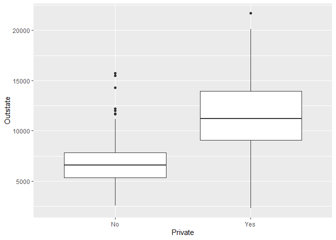<!-- -->

Create a new qualitative variable, called Elite,by binning the Top10perc
variable. We are going to divide universities into two groups based on
whether or not the proportion of students coming from the top 10% of
their high school classes exceeds 50 %

``` r
Elite <- rep("No", nrow(college))
Elite[college$Top10perc > 50] <- "Yes"
Elite <- as.factor(Elite)
college <- data.frame(college , Elite)
```

Use the summary() function to see how many elite universities there are.
Now use the plot() function to produce side-by-side boxplots of Outstate
versus Elite.

``` r
summary(college$Elite)
```

    ##  No Yes 
    ## 699  78

``` r
college %>%
  ggplot( aes( x = Elite, y = Outstate)) +
  geom_boxplot()
```

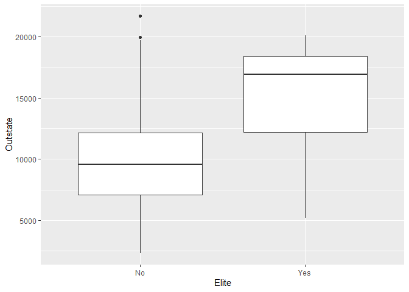<!-- -->

Use the hist() function to produce some histograms with differing
numbers of bins for a few of the quantitative variables. You may find
the command par(mfrow = c(2, 2)) useful: it will divide the print window
into four regions so that four plots can be made simultaneously.
Modifying the arguments to this function will divide the screen in other
ways.

``` r
hist_shorcut <- function(data, variable) {
  plot1 <- data %>%
    ggplot( aes( x = variable)) +
    geom_histogram(bins = 100)
  
  plot2 <- data %>%
    ggplot( aes( x = variable)) +
    geom_histogram(bins = 50)
  
  plot3 <- data %>%
    ggplot( aes( x = variable)) +
    geom_histogram(bins = 10)
  
  plot4 <- data %>%
    ggplot( aes( x = variable)) +
    geom_histogram(bins = 5)
  
  ggarrange(plot1, plot2, plot3, plot4, ncol=2, nrow=2)
}

hist_shorcut(college, college$Apps)
```

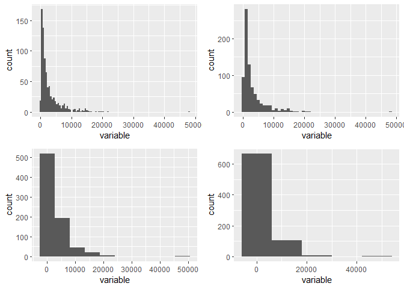<!-- -->

``` r
hist_shorcut(college, college$Outstate)
```

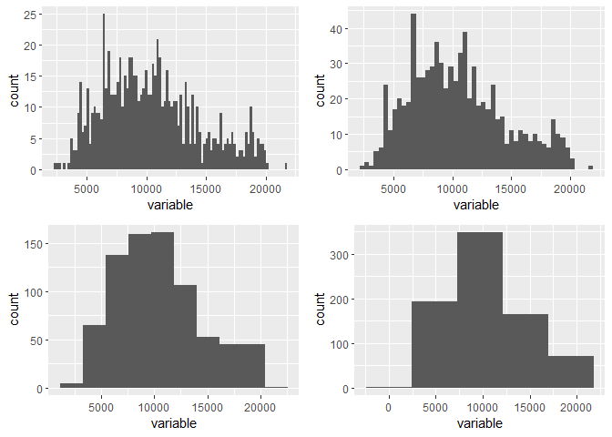<!-- -->

``` r
hist_shorcut(college, college$Terminal)
```

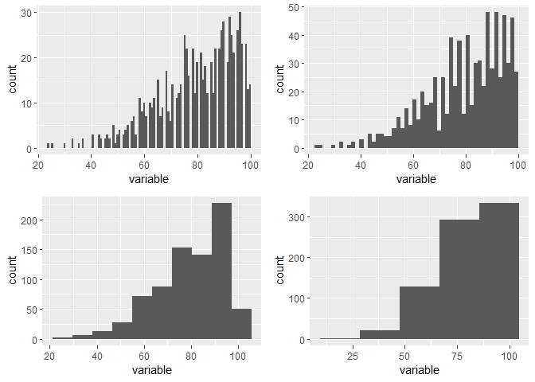<!-- -->

``` r
plot1 <- college %>%
  ggplot( aes( x = Grad.Rate)) +
  geom_histogram(bins = 100)

plot2 <- college %>%
  ggplot( aes( x = Grad.Rate)) +
  geom_histogram(bins = 50)

plot3 <- college %>%
  ggplot( aes( x = Grad.Rate)) +
  geom_histogram(bins = 10)

plot4 <- college %>%
  ggplot( aes( x = Grad.Rate)) +
  geom_histogram(bins = 5)

ggarrange(plot1, ggarrange(plot2, plot3, plot4, ncol=3), nrow=2)
```

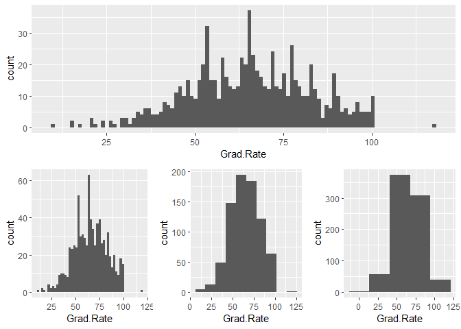<!-- -->

Continue exploring the data, and provide a brief summary of what you
discover

``` r
college %>%
  ggplot( aes( x = Outstate, 
               y = Grad.Rate, 
               color = Private)) +
  geom_point() +
  facet_wrap( ~Elite)
```

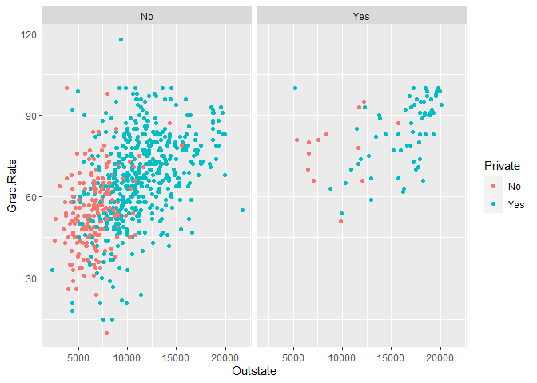<!-- -->

**In these chart the Elite universities are separated from the rest. We
can see they are fewer, mostly private, with high graduation rate and
generally higher fees. In the left chart we see that most public
universities are under 10k fee, while most of privates are over that
boundary. It seems to be a positive correlation between oustate fee and
graduation rate**

### ex. 9

This exercise involves the Auto data set studied in the lab. Make sure
that the missing values have been removed from the data.

``` r
auto <- Auto
```

-   1.  Which of the predictors are quantitative, and which are
        qualitative?

**Qualitative are name and origin, quantitative are mpg, cylinders (even
if this can be considered a factor), displacement, horsepower, weight,
acceleration, year**

-   What is the range of each quantitative predictor?

``` r
c <- data.frame( range(auto$mpg),
        range(auto$cylinders),
        range(auto$displacement),
        range(auto$horsepower),
        range(auto$weight),
        range(auto$acceleration),
        range(auto$year)
       )
colnames(c) <- colnames(auto[1:7])
rownames(c) <- c("min","max")
t(c)
```

    ##               min    max
    ## mpg             9   46.6
    ## cylinders       3    8.0
    ## displacement   68  455.0
    ## horsepower     46  230.0
    ## weight       1613 5140.0
    ## acceleration    8   24.8
    ## year           70   82.0

``` r
sd <- Auto %>%
  select(mpg:year) %>% 
  summarise( across(everything(), sd))

avg <- Auto %>%
  select(mpg:year) %>% 
  summarise( across(everything(), mean))

bind_rows(avg, sd)
```

    ##         mpg cylinders displacement horsepower    weight acceleration      year
    ## 1 23.445918  5.471939      194.412  104.46939 2977.5842    15.541327 75.979592
    ## 2  7.805007  1.705783      104.644   38.49116  849.4026     2.758864  3.683737

Now remove the 10th through 85th observations. What is the range, mean,
and standard deviation of each predictor in the subset of the data that
remains?

``` r
new_auto <- auto[-10:-85,]

range <- new_auto %>%
  select(mpg:year) %>% 
  summarise( across(everything()), range())

sd <- new_auto %>%
  select(mpg:year) %>% 
  summarise( across(everything()), sd)

avg <- new_auto %>%
  select(mpg:year) %>% 
  summarise( across(everything()), mean)

bind_rows(range, avg, sd)
```

Using the full data set, investigate the predictors graphically, using
scatterplots or other tools of your choice. Create some plots
highlighting the relationships among the predictors. Comment on your
findings.

``` r
auto$origin <- as.factor(auto$origin)

auto %>% 
  ggplot( aes( x = year,
               y = mpg,
               color = origin) ) +
  geom_jitter(alpha = 0.3) + 
  geom_smooth() +
  facet_wrap( ~origin)
```

    ## `geom_smooth()` using method = 'loess' and formula 'y ~ x'

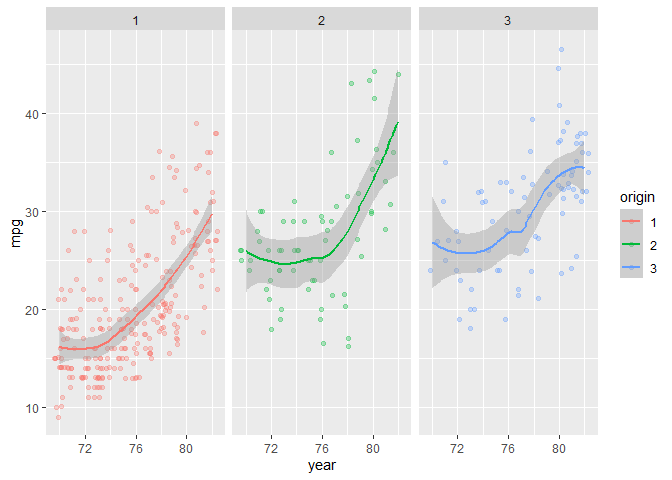<!-- -->

**In the years fuel efficiency (mpg) has increased steadily in America
(origin 1), in europe (origin 2) and less in japan (origin 3).
Nevertheless, it remains significantly slower in american, probably due
to a lower fuel cost**

``` r
auto %>% 
  ggplot( aes( x = year,
               y = weight,
               color = origin) ) +
  geom_jitter(alpha = 0.3) + 
  geom_smooth() +
  facet_wrap( ~origin)
```

    ## `geom_smooth()` using method = 'loess' and formula 'y ~ x'

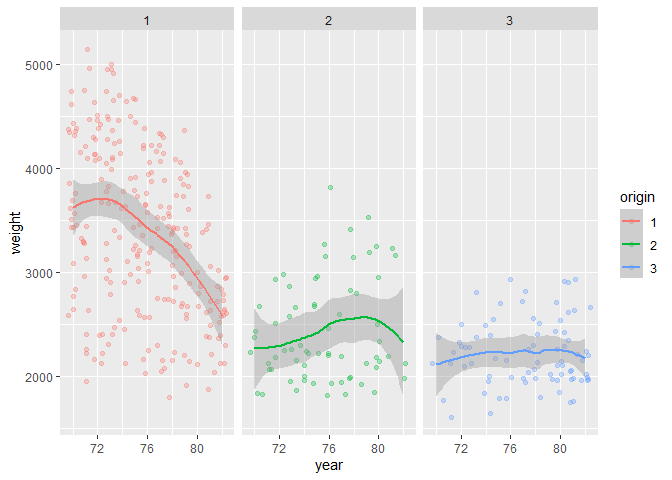<!-- -->

**During the years, new bigger vehicles tend to be less prevalent in
america, while europe and japan models do not show this trend**

``` r
auto %>% 
  ggplot( aes( x = horsepower,
               y = mpg)) +
  geom_jitter(aes(color = as.factor(cylinders) ),
              alpha = 0.3) +
  geom_smooth() +
  facet_wrap( ~year>77)
```

    ## `geom_smooth()` using method = 'loess' and formula 'y ~ x'

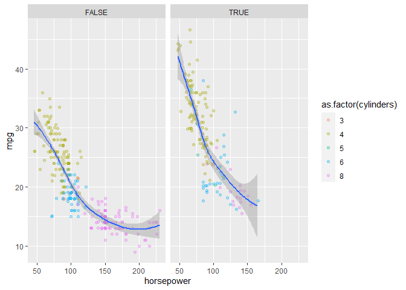<!-- -->

**horsepower has an inverse relationship with mpg, with more power is
associated with lower fuel efficiency. Car with 150+ hp are present only
before 1977. Moreover, the downward trend differs in steepness**

**So, can the effect of the increased fuel efficiency be explained only
by the construction of less powerful cars or there was a significant
improvement in their technology?**

``` r
auto %>% 
  ggplot( aes( x = year,
               y = horsepower) ) +
  geom_jitter( aes(color = mpg),
               alpha = 0.5) +
  geom_boxplot( aes(group = year),
                varwidth = TRUE) +
  geom_smooth()
```

    ## `geom_smooth()` using method = 'loess' and formula 'y ~ x'

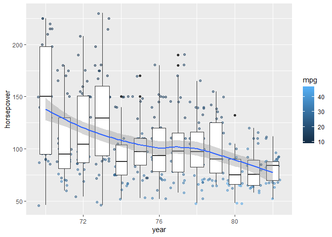<!-- -->

**Surely, part of the effect is explained by the decrease of hp during
the years, not sure if this explain all of it (also, it is difficult to
answer this question from and exploratory data analysis**

Suppose that we wish to predict gas mileage (mpg) on the basis of the
other variables. Do your plots suggest that any of the other variables
might be useful in predicting mpg? Justify your answer **already done**

### ex. 10

This exercise involves the Boston housing data set

-   1.  How many rows are in this data set? How many columns? What do
        the rows and columns represent?

``` r
dim(Boston)
```

    ## [1] 506  13

**data set containing housing values in 506 suburbs of Boston**

``` r
colnames(Boston)
```

    ##  [1] "crim"    "zn"      "indus"   "chas"    "nox"     "rm"      "age"    
    ##  [8] "dis"     "rad"     "tax"     "ptratio" "lstat"   "medv"

**each row is a suburb area, each column a different info about that
zone (crime rate, pollution, …)**

-   2.  Make some pairwise scatterplots of the predictors (columns) in
        this data set. Describe your findings.

``` r
p1 <- Boston %>% 
  ggplot( aes( x = crim)) +
  geom_histogram()

p2 <- Boston %>% 
  ggplot( aes( x = tax)) +
  geom_histogram()

p3 <- Boston %>% 
  ggplot( aes( x = zn)) +
  geom_histogram()

p4 <- Boston %>% 
  ggplot( aes( x = tax,
               y = crim,
               color = zn<10)) +
  geom_jitter() 

p5 <- Boston %>% 
  ggplot( aes( x = tax,
               y = zn,
               size = crim)) +
  geom_jitter()

p6 <- Boston %>% 
  ggplot( aes( x = crim,
               y = zn,
               color = tax > 500)) +
  geom_jitter()

ggarrange( ggarrange(p1, p2, p3, 
                     nrow = 3), 
           ggarrange( ggarrange(p4, p6,
                                ncol = 2), p5, 
                     nrow = 2), 
           ncol = 2,
           widths = c(1, 3))
```

    ## `stat_bin()` using `bins = 30`. Pick better value with `binwidth`.
    ## `stat_bin()` using `bins = 30`. Pick better value with `binwidth`.
    ## `stat_bin()` using `bins = 30`. Pick better value with `binwidth`.

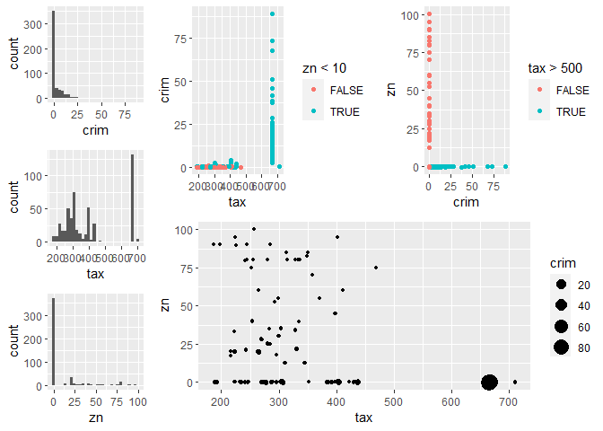<!-- -->

``` r
Boston %>% 
  ggplot( aes( x = dis,
               y = rad,
               color = tax > 500)) +
  geom_jitter()
```

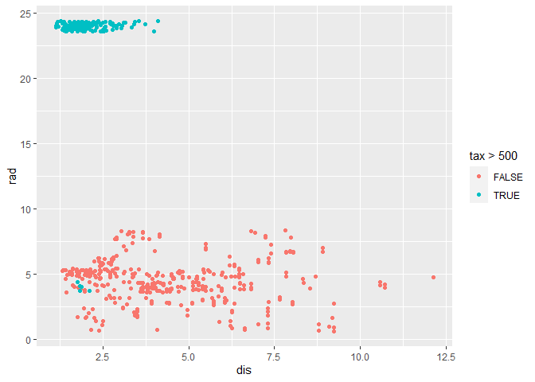<!-- -->

``` r
Boston %>% 
  ggplot( aes( x = lstat,
               y = dis,
               color = crim > 5)) +
  geom_jitter()
```

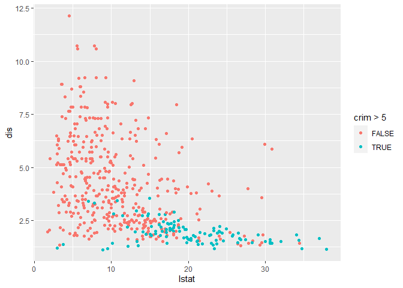<!-- -->

-   3.  Are any of the predictors associated with per capita crime rate?
        If so, explain the relationship
