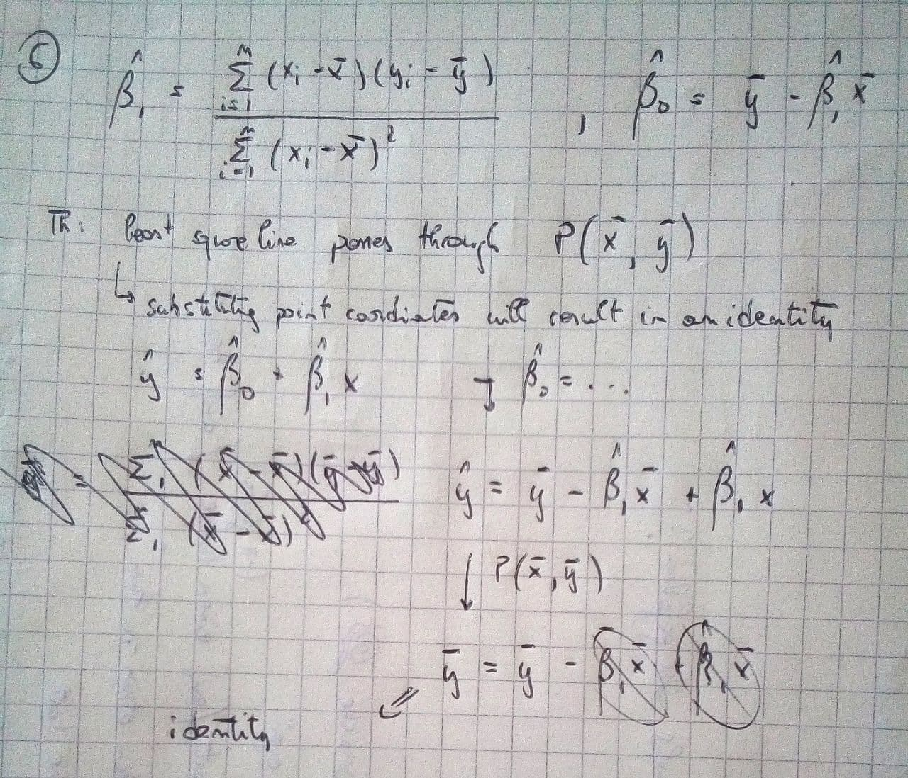

This is an [R Markdown](http://rmarkdown.rstudio.com) Notebook.
When you execute code within the notebook, the results appear beneath the code.

```{r, include = FALSE}
library(tidyverse)
library(ISLR2)
library(ggpubr)
library(MASS)
library(car)
library(dplyr)

custom_function = function(data, mapping, method = "loess", ...){
      p = ggplot(data = data, mapping = mapping) + 
      geom_point() + 
      geom_smooth(method=method, ...)
      
      p
    }

```

### ex. 1

**Describe the null hypotheses to which the p-values given in Table 3.4 correspond. Explain what conclusions you can draw based on these p-values. Your explanation should be phrased in terms of sales, TV, radio, and newspaper, rather than in terms of the coefficients of the linear model.**

- p-value of "intercept" is the probability that if there were no relationships in Advertising data, the resulting intercept which represent sales (obtained by fitting a linear model with TV, radio and newspaper predictors) would be different from 0, when no money is spent on predictors
- p-value of TV/Radio/Newspaper represent the probability that if there was no relationship between sales and money spent on TV/Radio/Newspaper, the change in sales for each euro spent on TV/Radio/Newspaper advertisement would be different from 0
- in general the null hypothesis is that money spent on TV or Radio or Newspapers are not correlated to the average sales of the product measured in the database (thus every pattern we see in the dataset is random)
- I'm confident that a LR model represent the reality within an acceptable level of accuracy when TV and Radio are used to model sales. At the same time, I'm not sure that adding newspaper will increase that accuracy, possibly only adding complexity without improving results.

### ex. 2

**Carefully explain the differences between the KNN classifier and KNN regression methods**

- KNN-c and KNN-r both select the K observation using the same definition of "nearest", thus selecting for a x1,x2...xK point in space the K observations that minimize the squared distance from it
- KNN-c then classifies the observation as the class most represented in that set of observations, irrespective of distance from the point
- KNN-r computes the average of the response on all the K points selected, first summing all the y and then dividing them by k
- Since the average can only make sense in a continuous or discrete space (there is no certainty that the predicted result will be one of the classification classes), it can not be generalized for cases with categorical variables than can not be represented on a x-axis

### ex. 3

**Suppose we have a data set with five predictors, X1 = GPA, X2 = IQ, X3 = Level (1 for College and 0 for High School), X4 = Interaction between GPA and IQ, and X5 = Interaction between GPA and Level. The response is starting salary after graduation (in thousands of dollars). Suppose we use least squares to fit the model, and get βˆ0 = 50, ˆβ1 = 20, ˆβ2 =0.07, ˆβ3 = 35, ˆβ4 =0.01, ˆβ5 = −10**

(a) Which answer is correct, and why? 

- i. For a fixed value of IQ and GPA, high school graduates earn more, on average, than college graduates. **no**
- ii. For a fixed value of IQ and GPA, college graduates earn more, on average, than high school graduates. **no**
- iii. For a fixed value of IQ and GPA, high school graduates earn more, on average, than college graduates provided that the GPA is high enough. **yes**
- iv. For a fixed value of IQ and GPA, college graduates earn more, on average, than high school graduates provided that the GPA is high enough. **no**

**The effect of beta4 can be ignored, since both GPA and IQ are kept fixed, and so is the value of their interaction term.**

**The effect of beta5 is 0 when x3 is 0, so the equation for the salary can be reduced to**

```{r, eval = FALSE}
# BETA = combined effect of Beta0 + Beta1*x1 + Beta2*x2 + beta4*x4
salary_high_school = BETA + beta3*x3 + beta5*x1*x3 
                   = BETA # since x3 = 0
salary_college = BETA + beta3*x3 + beta5*x1*x3 
               = BETA + beta3 + beta5*x1 # since x3 = 1
```

**So, for small values of x1 (GPA), salary_college > salary_high_school . But since beta5 is negative, as x1 increases, salary_college will get progressively smaller**

**(b) Predict the salary of a college graduate with IQ of 110 and a GPA of 4.0.**

```{r}
(salary_student_1 = 50 + 20*4.0 + 0.07*110 + 35*1 + 0.01*4.0*110 - 10*4.0*1)
```

(c) True or false: Since the coefficient for the GPA/IQ interaction term is very small, there is very little evidence of an interaction effect. Justify your answer.

**Short premise: IQ is a random variable with mean 100 and st.dev = 10, so it is not a good idea to use it in a linear model without transforming it: the difference between 80 and 90 is not the same between 90 and 100. Not sure if this also is true for GPA**

**TLDR: False. Full answer: the beta4 coefficient inform us about how strong is the association between salary and the combination of IQ and GPA, which is in fact weak (but please note that with GPA>3.5 at least 1/3 of the effect of IQ on salary is given by the interaction term). But, nothing can be said on the evidence of this interaction, that can not be appreciated without prediction intervals (which combine both the confidence interval of our prediction and our uncertainty on the estimate of the true beta4 value)**

### ex. 4

**I collect a set of data (n = 100 observations) containing a single predictor and a quantitative response. I then fit a linear regression model to the data, as well as a separate cubic regression, i.e. Y = β0 + β1*X + β2*X^2 + β3*X^3 + ϵ **

(a) Suppose that the true relationship between X and Y is linear, i.e. Y = β0 + β1X + ϵ. Consider the training residual sum of squares (RSS) for the linear regression, and also the training RSS for the cubic regression. Would we expect one to be lower than the other, would we expect them to be the same, or is there not enough information to tell? Justify your answer

**Adding quadratic and cubic terms introduce a more flexible model (lower bias, higher variance), which can provide a better fit to the training data. It depends on how much the error term random fluctuation is modelled by the additional terms to the Linear Regression (as the error term approaches zero, the training error of a cubic model will be more than a linear one, when the true relationship is linear)**

(b) Answer (a) using test rather than training RSS.

**Test RSS will be lower for a linear model than the one of a cubic model, when the true relationship is linear**

(c) Suppose that the true relationship between X and Y is not linear, but we don’t know how far it is from linear. Consider the training RSS for the linear regression, and also the training RSS for the cubic regression. Would we expect one to be lower than the other, would we expect them to be the same, or is there not enough information to tell? Justify your answer.

**The more a true relationship is far from a linear one, the more a cubic model can reduce its bias with only a slight increase of variance. In training data, a cubic model outperforms the linear one...**

(d) Answer (c) using test rather than training RSS.

**...but in test error it depends on the real case scenario: how much is the cubic one a better fit to the real function than the linear one? And how much random noise have been incorporated in the coefficients (due to high variability of a more complex model)?**

### ex. 5

Help

### ex. 6

Using (3.4), argue that in the case of simple linear regression, the least squares line always passes through the point (¯x, ¯y).



### ex. 7

**It is claimed in the text that in the case of simple linear regression of Y onto X, the R2 statistic (3.17) is equal to the square of the correlation between X and Y (3.18). Prove that this is the case. For simplicity, you may assume that ¯x =¯y= 0**

Help

### ex. 8

**This question involves the use of simple linear regression on the Auto data set.**

**(a) Use the lm() function to perform a simple linear regression with mpg as the response and horsepower as the predictor. Use the summary() function to print the results. Comment on the output.**

```{r}
attach(Auto)
lm.fit <- lm(mpg ∼ horsepower)
summary(lm.fit)
```

For example:

- i. Is there a relationship between the predictor and the response? **Yes, the probability that the pattern we observe is random is very remote**
- ii. How strong is the relationship between the predictor and the response? **Even if the coefficient is near zero, the relationship is pretty strong because horspower can vary from 50 to 200, while mpg from 10 to 40**

```{r, echo = FALSE, error = FALSE}
plot(horsepower, mpg)
abline(lm.fit , lwd = 3, col = "red")
```

- iii. Is the relationship between the predictor and the response positive or negative? **Negative, because the coefficient is negative**
- iv. What is the predicted mpg associated with a horsepower of 98? What are the associated 95% confidence and prediction intervals?

```{r}
(confidence_interval = predict(lm.fit , list(horsepower = 98), interval = "confidence") )
```

```{r}
(prediction_interval = predict(lm.fit , list(horsepower = 98), interval = "prediction") )
```

(c) Use the plot() function to produce diagnostic plots of the least squares regression fit. Comment on any problems you see with the fit. **we can see that residuals are not randomly distributed around 0, but they show a residual pattern not explained by the regression**

```{r}
plot(lm.fit) #instead of plot(predict(lm.fit), residuals(lm.fit))
```

### ex. 9

**This question involves the use of multiple linear regression on the Auto data set.**

**(a) Produce a scatterplot matrix which includes all of the variables in the data set**

```{r}
# old method
# pairs(Auto)

# new method (inspired by GitHub)
auto <- Auto

auto %>% 
  dplyr::select(-name) %>%
  GGally::ggpairs( lower = list(continuous = custom_function) )

```

**(b) Compute the matrix of correlations between the variables using the function cor(). You will need to exclude the name variable, which is qualitative.**

```{r}
auto <- Auto
auto %>% 
  dplyr::select(-name) %>% 
  cor()
```

**(c) Use the lm() function to perform a multiple linear regression with mpg as the response and all other variables except name as the predictors. Use the summary() function to print the results.** 

```{r}
auto_num <- auto %>% 
  dplyr::select(-name) 

lm.fit <- lm(mpg ~ .,
             data = auto_num)

summary(lm.fit)
```

**Comment on the output. For instance: **

**i. Is there a relationship between the predictors and the response?** Yes, a relationship is definitely plausible
**ii. Which predictors appear to have a statistically significant relationship to the response?** If we set a threashold of 0.01, "displacement" "weight" "year" and "origin" are low enough to refuse the hyphotesis of no relationship between each of them and "mpg"
**iii. What does the coefficient for the year variable suggest?** Since it's positive, whenever year increases so does also mpg (and since the p-value is extremely low, we can be sure enough that there is a strong correlation between year and mpg). For each additional year, mpg increases by 0.75. Nevertheless, coefficient alone is not enough, considering also the error term, we can predict mpg with a standard error of ~7%.


**(d) Use the plot() function to produce diagnostic plots of the linear regression fit. Comment on any problems you see with the fit. Do the residual plots suggest any unusually large outliers? Does the leverage plot identify any observations with unusually high leverage?**

```{r}
plot(lm.fit)
```

- evidence of non-linearity of the data: there is a modest evidence of non-linearity of the data. The U-shape of it suggest a transformation of predictors (quadratic?) may improve the fit
- correlation of error terms: no evidence to support the claim that the error in prediction of a car could be influenced by the error of the previous one. But, it is plausible that for instance car from the same manufacturer could show a correlation of error terms
- non-constant variance of error terms: there is cleare evidence of heteroscedasticity in the residuals vs fitted plot, as the error increases progressively. A concave transformation of the response would be advisable (log or sqrt, possibly)
- outliers: all values are within 2 standard deviations, well withing tolerance ranges
- high-leverage point: point 14 has high-leverage but a low standardized residual, so it doesn't affect the linear regression significantly
- collinearity: can not be seen from diagnostic plot, but very likely (see (a) exercise)

**(e) Use the * and : symbols to fit linear regression models with interaction effects. Do any interactions appear to be statistically significant?**

```{r}
#lm.fit.interact <- lm(mpg ~ cylinders + displacement *
#                            horsepower * weight * acceleration * 
#                            year * origin ,
#                      data = auto_num)

lm.fit.interact <- lm(mpg ~ cylinders +
                        displacement +
                        horsepower +
                        weight +
                        acceleration +
                        year +
                        origin +
                        horsepower:cylinders +
                        horsepower:origin +
                        displacement:origin +
                        horsepower:weight,
                      data = auto_num)
summary(lm.fit.interact)
```

First attempt: calculate all possible interaction terms (bad idea, no meaningful insight).
Second attempt: to decide the interaction term to add, I plotted every variable against each other, selecting the combination that behaves roughly in a non-linear way. All pairs analyzed show a suggestive p-value.

```{r}
plot(lm.fit.interact)
```

From the residuals vs fitted graph we can see how the additional interaction terms have captured most of the residual pattern in the first lm.

**(f) Try a few different transformations of the variables, such as log(X),
√X, X^2. Comment on your findings**

To select which variables to transform, I plotted every variable against the predictor (see the first column of ggpair plot in (a) ), trying to figure out which function to apply to linearize response:

- cylinders, displacement, horsepower and weight seem that they would benefit from a log transform
- acceleration and year are roughly linear so they don't need a transform
- origin seem to benefit from a x^2 transform
- regarding the 4 interaction terms, they were working before so it's difficult to understand if they should be adjusted

```{r}
lm.fit.trasform <- lm(mpg ~ log(cylinders) +
                        log(displacement) +
                        log(horsepower) +
                        log(weight) +
                        acceleration +
                        year +
                        I(origin^2) +
                        horsepower:cylinders +
                        horsepower:origin +
                        displacement:origin +
                        horsepower:weight,
                      data = auto_num)
summary(lm.fit.trasform)
```

The results are better than the lm.fit model but not significantly better than the lm.fit.interact one (and still with a persistent heteroscedasticity).

Nevertheless, 86% of the variance is explained by the LM, an improvement of ~5% over the simple linear model.

### ex. 10

**This question should be answered using the Carseats data set.**

**(a) Fit a multiple regression model to predict Sales using Price, Urban, and US.**

```{r}
carseats <- Carseats

lm.fit.a <- lm( Sales ~ Price + Urban + US,
                data = carseats)
summary(lm.fit.a)
```

**(b) Provide an interpretation of each coefficient in the model. Be careful—some of the variables in the model are qualitative!**

```{r}
ggplot(carseats) + geom_density( mapping = aes(x=Price))
```

Consider that the model explain only a modest fraction (<25%) of the total variance.

- coefficient of Price: slightly negative, but as can be seen from the plot price usually spans from 70 to 150 so change in Sales is not minimal. 
- coefficient of UrbanYES: slightly negative but the standard error term is way bigger than the effect of being in a Urban area (vs being not), making this predictor useless
- coefficient of USYES: Being in US moves the Sales 1.2 up, even if a standard error of 20% is observed, compared to being in another place

**(c) Write out the model in equation form, being careful to handle the qualitative variables properly.**

```{r, eval = FALSE}
Sales = (+13.043469) +
        Price * (-0.054459) +
        Urban * (-0.021916) + # Urban can be only 1 (UrbanYes) or 0 (UrbanNo)
        US *    (+1.200573)   # US can be only 1 (USYes) or 0 (USNo)
```

**(d) For which of the predictors can you reject the null hypothesis H0 : βj = 0?** For Price and US predictors

**(e) On the basis of your response to the previous question, fit a smaller model that only uses the predictors for which there is evidence of association with the outcome.**

```{r}
# benchmark model (all predictors)
lm.fit.bm <- lm( Sales ~ .,
                data = carseats)
# summary(lm.fit.bm)

# exercise (e)
lm.fit.e <- lm( Sales ~ Price + US,
                data = carseats)
summary(lm.fit.e)

```

**(f) How well do the models in (a) and (e) fit the data?** Basically in the same way, minimal differences are found in adjusted R-squared (amount of explained variance) and in RSE.

**(g) Using the model from (e), obtain 95% confidence intervals for the coefficient(s)**

```{r}
confint(lm.fit.e)
```

**(h) Is there evidence of outliers or high leverage observations in the model from (e)?**

```{r}
plot(lm.fit.e)
```

Standardized errors and leverage are well withing acceptable ranges.

### ex. 11

**In this problem we will investigate the t-statistic for the null hypothesis H0 : β = 0 in simple linear regression without an intercept. To begin, we generate a predictor x and a response y as follows.**

```{r}
set.seed(1)
x <- rnorm(100)
y <- 2 * x + rnorm(100)
```


```{r}
ggplot() + geom_point(aes(x=x, y=y))
```

**(a) Perform a simple linear regression of y onto x, without an intercept. Report the coefficient estimate ˆβ, the standard error of this coefficient estimate, and the t-statistic and p-value associated with the null hypothesis H0 : β = 0. Comment on these results.**

```{r}
lm.fit.y <- lm( y ~ x + 0)
summary(lm.fit.y)
```

```{r}
ggplot() + 
  geom_point(aes(x=x, y=y)) + 
  geom_abline(slope= coef(lm.fit.y), 
              intercept=0,
              color = "red")
```

So, 

- Coeff. estimate for beta: 1.9939
- Std. Error : 0.1065
- t value : 18.73
- P-value or Pr(>|t|) :  <2e-16

The real beta coefficient (which is usually unknown) lies inside < 1 std. error of the coefficient estimate we obtained from the sampled data. X and y behaves like random variables, so it makes sense for the coefficient not to be exactly 2 (but it will continue to converge to that value if we sample n->Inf. times ).
The process can be described by a t-distribution with 99 DoF, and the t-value is related to a p-value so low that we can reasonably discard the H0 hypothesis.

**(b) Now perform a simple linear regression of x onto y without an intercept, and report the coefficient estimate, its standard error, and the corresponding t-statistic and p-values associated with the null hypothesis H0 : β = 0. Comment on these results.**

```{r}
lm.fit.x <- lm( x ~ y + 0)
summary(lm.fit.x)
```

```{r}
ggplot() + 
  geom_point(aes(x=y, y=x)) + 
  geom_abline(slope= coef(lm.fit.x), 
              intercept=0,
              color = "red")
```

So, 

- Coeff. estimate for beta: 0.39111
- Std. Error : 0.02089
- t value : 18.73
- P-value or Pr(>|t|) :  <2e-16

Two considerations have to be made... the first one is that we know that the coefficient is not 0.5 but it has to take in account the effect of the rnorm term, which on average is 0 (as that is the mean), but not always. In fact, the x vector generated with the seed 1 has a mean of 0.1, and the rnorm term used to generated the y values has a mean of -0.038, which explains why the beta coefficient is not 0.5.

Comment for t-value and p-value does not change from previous point.

**(c) What is the relationship between the results obtained in (a) and (b)?**

If there was no rnorm term in the y equation, the linear regression of y onto x would be the reciprocal number of x onto y. Since the mean of that term is non-zero, the overall effect is to create an offset in the data (and 100 data points extracted from that distribution are not enough to reduce that effect enough to be negligible). So, the intercept of the linear model with the lowest possible error in non-zero, and trying to build a model from with a 0-intercept inevitably has a higher error in estimating the true beta coefficient.


(d)(e)(f) need help.

### ex. 12

**This problem involves simple linear regression without an intercept.**

**(a) Recall that the coefficient estimate ˆβ for the linear regression of Y onto X without an intercept is given by (3.38). Under what circumstance is the coefficient estimate for the regression of X onto Y the same as the coefficient estimate for the regression of Y onto X?**

Help

### ex. 13

**In this exercise you will create some simulated data and will fit simple linear regression models to it. Make sure to use set.seed(1) prior to starting part (a) to ensure consistent results.**

**(a) Using the rnorm() function, create a vector, x, containing 100 observations drawn from a N(0, 1) distribution. This represents a feature, X.**

```{r}
set.seed(1)
x <- rnorm(n = 100)
```

**(b) Using the rnorm() function, create a vector, eps, containing 100 observations drawn from a N(0, 0.25) distribution—a normal distribution with mean zero and variance 0.25**

```{r}
eps <- rnorm(n = 100, sd = sqrt(0.25))
```

**(c) Using x and eps, generate a vector y according to the model Y = −1 +0.5X + ϵ.**

```{r}
y <- -1 + 0.5 * x + eps
```

**What is the length of the vector y?** 100 (as x and eps, also) **What are the values of β0 and β1 in this linear model?** beta1 = 0.5, while beta0 is -1. Note that the combination of -1+mean(eps), which equals to -1.02 in our sample slightly changes the results in the sample, but not in the linear model we are describing.

**(d) Create a scatterplot displaying the relationship between x and y. Comment on what you observe.**

```{r}
ggplot() +
  geom_point( aes( x = x, y = y))
```

There is an evidence of a pattern between x and y, even if confused by the error terms. As expected from the distribution used to generate data point, around x = 0, there are more points, while extreme values are progressively smaller.

**(e) Fit a least squares linear model to predict y using x. Comment on the model obtained. How do βˆ0 and βˆ1 compare to β0 and β1?**

```{r}
lm.fit <- lm(y ∼ x )
summary(lm.fit)
```

They are not the same, but are within acceptable error ranges, as it is expected since they behave as random variables as well.

**(f) Display the least squares line on the scatterplot obtained in (d). Draw the population regression line on the plot, in a different color. Use the legend() command to create an appropriate legend**

```{r}
ggplot() + 
  geom_point(aes(x = x, y = y)) + 
  geom_abline(slope = coef(lm.fit)[2], 
              intercept = coef(lm.fit)[1],
              color = "red") +
  geom_abline(slope = 0.5,
              intercept = -1,
              color = "blue") +
  annotate(geom="text", 
           x=2, y=0, 
           label="Least Square Line",
           color="red") +
  annotate(geom="text", 
           x=1.5, y=0.5, 
           label="Population Regression line",
           color="blue")
```

**(g) Now fit a polynomial regression model that predicts y using x and x2. Is there evidence that the quadratic term improves the model fit? Explain your answer**

```{r}
lm.fit.q <- lm(y ∼ x + I(x^2) )
summary(lm.fit.q)
```

There is no indication that the quadratic term improves the fit (estimate is close to zero, standard error nearly as big as the the coefficient itself, and a p-value that can not exclude that the coefficient is due to random fluctuations instead of a real pattern). Even if R-squared is higher (even if only for a small quantity), that's probably an effect we see on training data and not on the population itself.

**(h) Repeat (a)–(f) after modifying the data generation process in such a way that there is less noise in the data. The model (3.39) should remain the same. You can do this by decreasing the variance of the normal distribution used to generate the error term ϵ in (b). Describe your results**

```{r}
# x <- rnorm(n = 100)
eps_reduced <- rnorm(n = 100, sd = 0.2)
y_reduced <- -1 + 0.5 * x + eps_reduced

lm.fit.red <- lm(y_reduced ∼ x )
summary(lm.fit.red)
```

```{r}
ggplot() + 
  geom_point(aes(x = x, y = y_reduced)) +
  geom_abline(slope = coef(lm.fit.red)[2], 
              intercept = coef(lm.fit.red)[1],
              color = "red") +
  geom_abline(slope = 0.5,
              intercept = -1,
              color = "blue") +
  annotate(geom="text", 
           x=2, y=0, 
           label="Least Square Line",
           color="red") +
  annotate(geom="text", 
           x=1.5, y=0.5, 
           label="Population Regression line",
           color="blue")

```

With reduced variance, the std error of the estimated shrinked to less than half, with a doubling of the t-value. The RSE of the model went down from 0.48 to 0.2, with an R-squared up to 83% (46% in the first model).

**(i) Repeat (a)–(f) after modifying the data generation process in such a way that there is more noise in the data. The model (3.39) should remain the same. You can do this by increasing the variance of the normal distribution used to generate the error term ϵ in (b). Describe your results.**

```{r}
# x <- rnorm(n = 100)
eps_higher <- rnorm(n = 100, sd = 0.8)
y_higher <- -1 + 0.5 * x + eps_higher

lm.fit.high <- lm(y_higher ∼ x )
summary(lm.fit.high)
```

```{r}
ggplot() + 
  geom_point(aes(x = x, y = y_higher)) +
  geom_abline(slope = coef(lm.fit.high)[2], 
              intercept = coef(lm.fit.high)[1],
              color = "red") +
  geom_abline(slope = 0.5,
              intercept = -1,
              color = "blue") +
  annotate(geom="text", 
           x=2, y=0, 
           label="Least Square Line",
           color="red") +
  annotate(geom="text", 
           x=1.5, y=0.5, 
           label="Population Regression line",
           color="blue")
```

The estimate of beta coefficients are still accurate, even if standard error has increased, but the R-squared of the model has decreased significantly to less than 25%, with an increase on the residual error to 0.77 (very high compared to average values of the data points).

**(j) What are the confidence intervals for β0 and β1 based on the original data set, the noisier data set, and the less noisy data set? Comment on your results**

```{r}
ggplot() +
  geom_point( aes(x = x, y = y), color = "red") +
  geom_point( aes(x = x, y = y_reduced), color = "blue") +
  geom_point( aes(x = x, y = y_higher), , color = "green")
```

For the initial LM

```{r}
confint(lm.fit)
```

For the model with reduced variance

```{r}
confint(lm.fit.red)
```

For the model with increased variance

```{r}
confint(lm.fit.high)
```

Comment on the finding: as expected, the larger the variance, the larger the confidence interval. Don't know how to elaborate more (what should I notice?)

### ex. 14

**This problem focuses on the collinearity problem.**

**(a) Perform the following commands in R. The last line corresponds to creating a linear model in which y is a function of x1 and x2. Write out the form of the linear model. What are the regression coefficients? **

```{r}
set.seed(1)
x1 <- runif (100) 
x2 <- 0.5 * x1 + rnorm (100) / 10
# ggplot() + geom_density(aes(x1)) # to visualize

y <- 2 + 2 * x1 + 0.3 * x2 + rnorm (100) # 2 as beta1, 0.3 as beta2, 2 as beta0
```

**(b) What is the correlation between x1 and x2? Create a scatterplot displaying the relationship between the variables.**

```{r}
ggplot() + 
  geom_point(aes(x1, x2)) +
  ggtitle("x1-x2 correlation =", cor(x1, x2))
```

**(c) Using this data, fit a least squares regression to predict y using x1 and x2. Describe the results obtained. What are βˆ0, ˆβ1, and βˆ2? How do these relate to the true β0, β1, and β2? Can you reject the null hypothesis H0 : β1 = 0? How about the null hypothesis H0 : β2 = 0?**

```{r}
lm.fit.both <- lm(y ∼ x1 + x2)
summary(lm.fit.both)
```

- estimated beta0 = 1.77, not really the real 2 but well within acceptable ranges (just outside 1 std. dev from the true value), with a good level of confidence we can reject the hypothesis that it is 0
- estimated beta1 = 2.77, not really the real 2 but well within acceptable ranges (just outside 1 std. dev from the true value), with a good level of confidence we can reject the hypothesis that it is 0
- estimated beta2 = 0, not really the real 0.3 and even if within acceptable error ranges, those are so big that the estimate is basically useless. Moreover, we can not be confident to refuse the hypothesis that the coefficient is non-zero

**(d) Now fit a least squares regression to predict y using only x1. Comment on your results. Can you reject the null hypothesis H0 : β1 = 0?**

```{r}
lm.fit.x1 <- lm(y ∼ x1)
summary(lm.fit.x1)
```

We can be confident to refuse the hypothesis that real beta1 is non-zero. Actually, since the amount of variance explained is the same as the lm.fit.both model, we can conclude that they performance is comparable and that x1 may suffice.

**(e) Now fit a least squares regression to predict y using only x2. Comment on your results. Can you reject the null hypothesis H0 : β2 = 0?**

```{r}
lm.fit.x2 <- lm(y ∼ x2)
summary(lm.fit.x2)
```

We can be confident to refuse the hypothesis that real beta2 is non-zero.

**(f) Do the results obtained in (c)–(e) contradict each other? Explain your answer.**

Linear regression relies on the absence of collinearity as one of its key assumptions. When it's violated, the statistical tests provide unreliable results. In fact, collinearity makes difficult to sort out individual effects.
Since the accuracy on the estimates is reduced, the standard error grows (leading to a decline in the t-statistic and p-value, for instance).
Moreover, this has a direct effect on the power of the hypothesis test, finding as non-significant potentially significant coefficients, which is precisely what happened in our case.

**(g) Now suppose we obtain one additional observation, which was unfortunately mismeasured.**

```{r}
x1 <- c(x1 , 0.1)
x2 <- c(x2 , 0.8)
y <- c(y, 6)
```

**Re-fit the linear models from (c) to (e) using this new data. What effect does this new observation have on the each of the models? In each model, is this observation an outlier? A high-leverage point? Both? Explain your answers**

```{r}
lm.fit.new.both <- lm(y ∼ x1 + x2)
summary(lm.fit.new.both)
```

As we can see from the summary, the coefficients are within acceptable ranges for beta0 and beta1 but way off (>2 std. dev) for x2. Moreover, we see that the estimate seems to be significant enough to reject the null hypothesis. But, as we can see from the diagnostic plots of the linear model, even if data point 101 is well within plausible data point for each vector taken alone, it's way off in the plot(x1,x2) [not shown], which result in an abnormally high leverage point, as can be seen in the 4th graph of the diagnostic series for the LM.

```{r}
plot(lm.fit.new.both)
```


```{r}
lm.fit.new.x1 <- lm(y ∼ x1)
summary(lm.fit.new.x1)
```

This model behaves well enough to be comparable to the previous one without the 101th data point, even if a decrease in R-squared of 5% is shown.

```{r}
plot(lm.fit.new.x1)
```

As can be seen from the diagnostic plots, 101 behaves as an outlier in this model (see in the graph "residuals vs fitted) but not as an high leverage point. That's why its effect on coefficient estimate is limited.

```{r}
lm.fit.new.x2 <- lm(y ∼ x2)
summary(lm.fit.new.x2)
```

```{r}
plot(lm.fit.new.x2)
```

The model is not significantly affected from the additional data point, giving a comparable performance (even a slightly better one) compared to the model before, probably due to the reduction of the collinearity given by the spurious data point. Not sure about this conclusion, could be only a random effect [!].

### ex. 15

**This problem involves the Boston data set, which we saw in the lab for this chapter. We will now try to predict per capita crime rate using the other variables in this data set. In other words, per capita crime rate is the response, and the other variables are the predictors.**

**(a) For each predictor, fit a simple linear regression model to predict the response. Describe your results. In which of the models is there a statistically significant association between the predictor and the response? Create some plots to back up your assertions.**

```{r}
boston <- ISLR2::Boston
var_names <- names(boston)
l <- list()

for(name in var_names[2:length(var_names)]) {
  # lm.fit.temp <- lm(crim ∼ get(name), data = boston) # old version
  lm.fit.temp <- lm( as.formula(paste("crim ∼ ", name)), 
                     data = boston) # new
  l[[name]] <- lm.fit.temp
}

for(lm in l) print(summary(lm))
```

Models that show a significant association between the predictor and the response variable are:

- zn, proportion of residential land zoned for lots over 25,000 sq.ft.
- indus, proportion of non-retail business acres per town
- nox, nitrogen oxides concentration (parts per 10 million)
- rm, average number of rooms per dwelling
- age, proportion of owner-occupied units built prior to 1940
- dis, weighted mean of distances to five Boston employment centres
- rad, index of accessibility to radial highways
- tax, full-value property-tax rate per $10,000
- ptratio, pupil-teacher ratio by town
- lstat, lower status of the population (percent)
- medv, median value of owner-occupied homes in $1000s

While are not showing sufficient evidence to reject the hypothesis that the beta1 coefficient is non-zero are:

- chas, Charles River dummy variable (= 1 if tract bounds river; 0 otherwise)

Please note that this does not mean that each variable is important  (or that they would be still significant in a multivariate linear model), but that in the case of those linear models they are sufficiently associated with the crime rate.

```{r}
boston %>% 
  #dplyr::select(-var) %>%
  GGally::ggpairs( lower = list(continuous = custom_function) )

```

**(b) Fit a multiple regression model to predict the response using all of the predictors. Describe your results. For which predictors can we reject the null hypothesis H0 : βj = 0?**

```{r}
lm.fit.all <- lm( crim ∼ ., data = boston) 
summary(lm.fit.all)
```

A p-value of 5% does not really mean anything in this case, because there are variables for which we are strongly confident in a non-zero coefficient (dis, rad, medv) with a very small p-value, moderately confident (zn, nox, lstat) with a p-value <0.1% and non confident (the others).

**(c) How do your results from (a) compare to your results from (b)? Create a plot displaying the univariate regression coefficients from (a) on the x-axis, and the multiple regression coefficients from (b) on the y-axis. That is, each predictor is displayed as a single point in the plot. Its coefficient in a simple linear regression model is shown on the x-axis, and its coefficient estimate in the multiple linear regression model is shown on the y-axis.**


## Quick recap

```{r, eval = FALSE}

lm.fit <- lm(medv ∼ lstat , data = Boston)
summary(lm.fit)

coef(lm.fit) #instead of names(lm.fit)
confint(lm.fit)

predict(lm.fit , data.frame(lstat = (c(5, 10, 15))), interval = "prediction")

attach(Boston)
plot(lstat , medv)
abline(lm.fit , lwd = 3, col = "red")

par(mfrow = c(2, 2))
plot(lm.fit)
```

