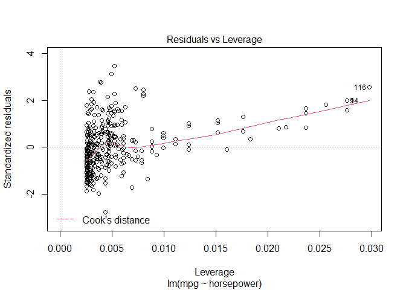

ISLR Ch.2
================

This is an [R Markdown](http://rmarkdown.rstudio.com) Notebook. When you
execute code within the notebook, the results appear beneath the code.

### ex. 1

**Describe the null hypotheses to which the p-values given in Table 3.4
correspond. Explain what conclusions you can draw based on these
p-values. Your explanation should be phrased in terms of sales, TV,
radio, and newspaper, rather than in terms of the coefficients of the
linear model.**

-   p-value of “intercept” is the probability that if there were no
    relationships in Advertising data, the resulting intercept which
    represent sales (obtained by fitting a linear model with TV, radio
    and newspaper predictors) would be different from 0, when no money
    is spent on predictors
-   p-value of TV/Radio/Newspaper represent the probability that if
    there was no relationship between sales and money spent on
    TV/Radio/Newspaper, the change in sales for each euro spent on
    TV/Radio/Newspaper advertisement would be different from 0
-   in general the null hypothesis is that money spent on TV or Radio or
    Newspapers are not correlated to the average sales of the product
    measured in the database (thus every pattern we see in the dataset
    is random)
-   I’m confident that a LR model represent the reality within an
    acceptable level of accuracy when TV and Radio are used to model
    sales. At the same time, I’m not sure that adding newspaper will
    increase that accuracy, possibly only adding complexity without
    improving results.

### ex. 2

**Carefully explain the differences between the KNN classifier and KNN
regression methods**

-   KNN-c and KNN-r both select the K observation using the same
    definition of “nearest”, thus selecting for a x1,x2…xK point in
    space the K observations that minimize the squared distance from it
-   KNN-c then classifies the observation as the class most represented
    in that set of observations, irrespective of distance from the point
-   KNN-r computes the average of the response on all the K points
    selected, first summing all the y and then dividing them by k
-   Since the average can only make sense in a continuous or discrete
    space (there is no certainty that the predicted result will be one
    of the classification classes), it can not be generalized for cases
    with categorical variables than can not be represented on a x-axis

### ex. 3

**Suppose we have a data set with five predictors, X1 = GPA, X2 = IQ, X3
= Level (1 for College and 0 for High School), X4 = Interaction between
GPA and IQ, and X5 = Interaction between GPA and Level. The response is
starting salary after graduation (in thousands of dollars). Suppose we
use least squares to fit the model, and get βˆ0 = 50, ˆβ1 = 20, ˆβ2
=0.07, ˆβ3 = 35, ˆβ4 =0.01, ˆβ5 = −10**

1.  Which answer is correct, and why?

-   1.  For a fixed value of IQ and GPA, high school graduates earn
        more, on average, than college graduates. **no**

-   2.  For a fixed value of IQ and GPA, college graduates earn more, on
        average, than high school graduates. **no**

-   3.  For a fixed value of IQ and GPA, high school graduates earn
        more, on average, than college graduates provided that the GPA
        is high enough. **yes**

-   4.  For a fixed value of IQ and GPA, college graduates earn more, on
        average, than high school graduates provided that the GPA is
        high enough. **no**

**The effect of beta4 can be ignored, since both GPA and IQ are kept
fixed, and so is the value of their interaction term.**

**The effect of beta5 is 0 when x3 is 0, so the equation for the salary
can be reduced to**

``` r
# BETA = combined effect of Beta0 + Beta1*x1 + Beta2*x2 + beta4*x4
salary_high_school = BETA + beta3*x3 + beta5*x1*x3 
                   = BETA # since x3 = 0
salary_college = BETA + beta3*x3 + beta5*x1*x3 
               = BETA + beta3 + beta5*x1 # since x3 = 1
```

**So, for small values of x1 (GPA), salary_college \> salary_high_school
. But since beta5 is negative, as x1 increases, salary_college will get
progressively smaller**

**(b) Predict the salary of a college graduate with IQ of 110 and a GPA
of 4.0.**

``` r
(salary_student_1 = 50 + 20*4.0 + 0.07*110 + 35*1 + 0.01*4.0*110 - 10*4.0*1)
```

    ## [1] 137.1

3.  True or false: Since the coefficient for the GPA/IQ interaction term
    is very small, there is very little evidence of an interaction
    effect. Justify your answer.

**Short premise: IQ is a random variable with mean 100 and st.dev = 10,
so it is not a good idea to use it in a linear model without
transforming it: the difference between 80 and 90 is not the same
between 90 and 100. Not sure if this also is true for GPA**

**TLDR: False. Full answer: the beta4 coefficient inform us about how
strong is the association between salary and the combination of IQ and
GPA, which is in fact weak (but please note that with GPA>3.5 at least
1/3 of the effect of IQ on salary is given by the interaction term).
But, nothing can be said on the evidence of this interaction, that can
not be appreciated without prediction intervals (which combine both the
confidence interval of our prediction and our uncertainty on the
estimate of the true beta4 value)**

### ex. 4

\*\*I collect a set of data (n = 100 observations) containing a single
predictor and a quantitative response. I then fit a linear regression
model to the data, as well as a separate cubic regression, i.e. Y = β0 +
β1*X + β2*X^2 + β3\*X^3 + ϵ \*\*

1.  Suppose that the true relationship between X and Y is linear, i.e. Y
    = β0 + β1X + ϵ. Consider the training residual sum of squares (RSS)
    for the linear regression, and also the training RSS for the cubic
    regression. Would we expect one to be lower than the other, would we
    expect them to be the same, or is there not enough information to
    tell? Justify your answer

**Adding quadratic and cubic terms introduce a more flexible model
(lower bias, higher variance), which can provide a better fit to the
training data. It depends on how much the error term random fluctuation
is modelled by the additional terms to the Linear Regression (as the
error term approaches zero, the training error of a cubic model will be
more than a linear one, when the true relationship is linear)**

2.  Answer (a) using test rather than training RSS.

**Test RSS will be lower for a linear model than the one of a cubic
model, when the true relationship is linear**

3.  Suppose that the true relationship between X and Y is not linear,
    but we don’t know how far it is from linear. Consider the training
    RSS for the linear regression, and also the training RSS for the
    cubic regression. Would we expect one to be lower than the other,
    would we expect them to be the same, or is there not enough
    information to tell? Justify your answer.

**The more a true relationship is far from a linear one, the more a
cubic model can reduce its bias with only a slight increase of variance.
In training data, a cubic model outperforms the linear one…**

4.  Answer (c) using test rather than training RSS.

**…but in test error it depends on the real case scenario: how much is
the cubic one a better fit to the real function than the linear one? And
how much random noise have been incorporated in the coefficients (due to
high variability of a more complex model)?**

### ex. 5

Help

### ex. 6

Using (3.4), argue that in the case of simple linear regression, the
least squares line always passes through the point (¯x, ¯y).


### ex. 7

**It is claimed in the text that in the case of simple linear regression
of Y onto X, the R2 statistic (3.17) is equal to the square of the
correlation between X and Y (3.18). Prove that this is the case. For
simplicity, you may assume that ¯x =¯y= 0**

Help

### ex. 8

**This question involves the use of simple linear regression on the Auto
data set.**

**(a) Use the lm() function to perform a simple linear regression with
mpg as the response and horsepower as the predictor. Use the summary()
function to print the results. Comment on the output.**

``` r
attach(Auto)
```

    ## Il seguente oggetto è mascherato da package:ggplot2:
    ## 
    ##     mpg

``` r
lm.fit <- lm(mpg ∼ horsepower)
summary(lm.fit)
```

    ## 
    ## Call:
    ## lm(formula = mpg ~ horsepower)
    ## 
    ## Residuals:
    ##      Min       1Q   Median       3Q      Max 
    ## -13.5710  -3.2592  -0.3435   2.7630  16.9240 
    ## 
    ## Coefficients:
    ##              Estimate Std. Error t value Pr(>|t|)    
    ## (Intercept) 39.935861   0.717499   55.66   <2e-16 ***
    ## horsepower  -0.157845   0.006446  -24.49   <2e-16 ***
    ## ---
    ## Signif. codes:  0 '***' 0.001 '**' 0.01 '*' 0.05 '.' 0.1 ' ' 1
    ## 
    ## Residual standard error: 4.906 on 390 degrees of freedom
    ## Multiple R-squared:  0.6059, Adjusted R-squared:  0.6049 
    ## F-statistic: 599.7 on 1 and 390 DF,  p-value: < 2.2e-16

For example:

-   1.  Is there a relationship between the predictor and the response?
        **Yes, the probability that the pattern we observe is random is
        very remote**

-   2.  How strong is the relationship between the predictor and the
        response? **Even if the coefficient is near zero, the
        relationship is pretty strong because horspower can vary from 50
        to 200, while mpg from 10 to 40**

<!-- -->

-   3.  Is the relationship between the predictor and the response
        positive or negative? **Negative, because the coefficient is
        negative**

-   4.  What is the predicted mpg associated with a horsepower of 98?
        What are the associated 95% confidence and prediction intervals?

``` r
(confidence_interval = predict(lm.fit , list(horsepower = 98), interval = "confidence") )
```

    ##        fit      lwr      upr
    ## 1 24.46708 23.97308 24.96108

``` r
(prediction_interval = predict(lm.fit , list(horsepower = 98), interval = "prediction") )
```

    ##        fit     lwr      upr
    ## 1 24.46708 14.8094 34.12476

3.  Use the plot() function to produce diagnostic plots of the least
    squares regression fit. Comment on any problems you see with the
    fit. **we can see that residuals are not randomly distributed around
    0, but they show a residual pattern not explained by the
    regression**

``` r
plot(lm.fit) #instead of plot(predict(lm.fit), residuals(lm.fit))
```

<!-- --><!-- --><!-- --><!-- -->

### ex. 9

**This question involves the use of multiple linear regression on the
Auto data set.**

**(a) Produce a scatterplot matrix which includes all of the variables
in the data set**

``` r
# old method
# pairs(Auto)

# new method (inspired by GitHub)
auto <- Auto

auto %>% 
  dplyr::select(-name) %>%
  GGally::ggpairs( lower = list(continuous = custom_function) )
```

    ## Registered S3 method overwritten by 'GGally':
    ##   method from   
    ##   +.gg   ggplot2

    ## `geom_smooth()` using formula 'y ~ x'
    ## `geom_smooth()` using formula 'y ~ x'
    ## `geom_smooth()` using formula 'y ~ x'

    ## Warning in simpleLoess(y, x, w, span, degree = degree, parametric =
    ## parametric, : pseudoinverse used at 6

    ## Warning in simpleLoess(y, x, w, span, degree = degree, parametric =
    ## parametric, : neighborhood radius 2

    ## Warning in simpleLoess(y, x, w, span, degree = degree, parametric =
    ## parametric, : reciprocal condition number 9.6355e-017

    ## Warning in predLoess(object$y, object$x, newx = if
    ## (is.null(newdata)) object$x else if (is.data.frame(newdata))
    ## as.matrix(model.frame(delete.response(terms(object)), : pseudoinverse used at 6

    ## Warning in predLoess(object$y, object$x, newx = if
    ## (is.null(newdata)) object$x else if (is.data.frame(newdata))
    ## as.matrix(model.frame(delete.response(terms(object)), : neighborhood radius 2

    ## Warning in predLoess(object$y, object$x, newx = if
    ## (is.null(newdata)) object$x else if (is.data.frame(newdata))
    ## as.matrix(model.frame(delete.response(terms(object)), : reciprocal condition
    ## number 9.6355e-017

    ## `geom_smooth()` using formula 'y ~ x'
    ## `geom_smooth()` using formula 'y ~ x'

    ## Warning in simpleLoess(y, x, w, span, degree = degree, parametric =
    ## parametric, : pseudoinverse used at 6

    ## Warning in simpleLoess(y, x, w, span, degree = degree, parametric =
    ## parametric, : neighborhood radius 2

    ## Warning in simpleLoess(y, x, w, span, degree = degree, parametric =
    ## parametric, : reciprocal condition number 9.6355e-017

    ## Warning in predLoess(object$y, object$x, newx = if
    ## (is.null(newdata)) object$x else if (is.data.frame(newdata))
    ## as.matrix(model.frame(delete.response(terms(object)), : pseudoinverse used at 6

    ## Warning in predLoess(object$y, object$x, newx = if
    ## (is.null(newdata)) object$x else if (is.data.frame(newdata))
    ## as.matrix(model.frame(delete.response(terms(object)), : neighborhood radius 2

    ## Warning in predLoess(object$y, object$x, newx = if
    ## (is.null(newdata)) object$x else if (is.data.frame(newdata))
    ## as.matrix(model.frame(delete.response(terms(object)), : reciprocal condition
    ## number 9.6355e-017

    ## `geom_smooth()` using formula 'y ~ x'
    ## `geom_smooth()` using formula 'y ~ x'
    ## `geom_smooth()` using formula 'y ~ x'

    ## Warning in simpleLoess(y, x, w, span, degree = degree, parametric =
    ## parametric, : pseudoinverse used at 6

    ## Warning in simpleLoess(y, x, w, span, degree = degree, parametric =
    ## parametric, : neighborhood radius 2

    ## Warning in simpleLoess(y, x, w, span, degree = degree, parametric =
    ## parametric, : reciprocal condition number 9.6355e-017

    ## Warning in predLoess(object$y, object$x, newx = if
    ## (is.null(newdata)) object$x else if (is.data.frame(newdata))
    ## as.matrix(model.frame(delete.response(terms(object)), : pseudoinverse used at 6

    ## Warning in predLoess(object$y, object$x, newx = if
    ## (is.null(newdata)) object$x else if (is.data.frame(newdata))
    ## as.matrix(model.frame(delete.response(terms(object)), : neighborhood radius 2

    ## Warning in predLoess(object$y, object$x, newx = if
    ## (is.null(newdata)) object$x else if (is.data.frame(newdata))
    ## as.matrix(model.frame(delete.response(terms(object)), : reciprocal condition
    ## number 9.6355e-017

    ## `geom_smooth()` using formula 'y ~ x'
    ## `geom_smooth()` using formula 'y ~ x'
    ## `geom_smooth()` using formula 'y ~ x'
    ## `geom_smooth()` using formula 'y ~ x'

    ## Warning in simpleLoess(y, x, w, span, degree = degree, parametric =
    ## parametric, : pseudoinverse used at 6

    ## Warning in simpleLoess(y, x, w, span, degree = degree, parametric =
    ## parametric, : neighborhood radius 2

    ## Warning in simpleLoess(y, x, w, span, degree = degree, parametric =
    ## parametric, : reciprocal condition number 9.6355e-017

    ## Warning in predLoess(object$y, object$x, newx = if
    ## (is.null(newdata)) object$x else if (is.data.frame(newdata))
    ## as.matrix(model.frame(delete.response(terms(object)), : pseudoinverse used at 6

    ## Warning in predLoess(object$y, object$x, newx = if
    ## (is.null(newdata)) object$x else if (is.data.frame(newdata))
    ## as.matrix(model.frame(delete.response(terms(object)), : neighborhood radius 2

    ## Warning in predLoess(object$y, object$x, newx = if
    ## (is.null(newdata)) object$x else if (is.data.frame(newdata))
    ## as.matrix(model.frame(delete.response(terms(object)), : reciprocal condition
    ## number 9.6355e-017

    ## `geom_smooth()` using formula 'y ~ x'
    ## `geom_smooth()` using formula 'y ~ x'
    ## `geom_smooth()` using formula 'y ~ x'
    ## `geom_smooth()` using formula 'y ~ x'
    ## `geom_smooth()` using formula 'y ~ x'

    ## Warning in simpleLoess(y, x, w, span, degree = degree, parametric =
    ## parametric, : pseudoinverse used at 6

    ## Warning in simpleLoess(y, x, w, span, degree = degree, parametric =
    ## parametric, : neighborhood radius 2

    ## Warning in simpleLoess(y, x, w, span, degree = degree, parametric =
    ## parametric, : reciprocal condition number 9.6355e-017

    ## Warning in predLoess(object$y, object$x, newx = if
    ## (is.null(newdata)) object$x else if (is.data.frame(newdata))
    ## as.matrix(model.frame(delete.response(terms(object)), : pseudoinverse used at 6

    ## Warning in predLoess(object$y, object$x, newx = if
    ## (is.null(newdata)) object$x else if (is.data.frame(newdata))
    ## as.matrix(model.frame(delete.response(terms(object)), : neighborhood radius 2

    ## Warning in predLoess(object$y, object$x, newx = if
    ## (is.null(newdata)) object$x else if (is.data.frame(newdata))
    ## as.matrix(model.frame(delete.response(terms(object)), : reciprocal condition
    ## number 9.6355e-017

    ## `geom_smooth()` using formula 'y ~ x'
    ## `geom_smooth()` using formula 'y ~ x'
    ## `geom_smooth()` using formula 'y ~ x'
    ## `geom_smooth()` using formula 'y ~ x'
    ## `geom_smooth()` using formula 'y ~ x'
    ## `geom_smooth()` using formula 'y ~ x'

    ## Warning in simpleLoess(y, x, w, span, degree = degree, parametric =
    ## parametric, : pseudoinverse used at 6

    ## Warning in simpleLoess(y, x, w, span, degree = degree, parametric =
    ## parametric, : neighborhood radius 2

    ## Warning in simpleLoess(y, x, w, span, degree = degree, parametric =
    ## parametric, : reciprocal condition number 9.6355e-017

    ## Warning in predLoess(object$y, object$x, newx = if
    ## (is.null(newdata)) object$x else if (is.data.frame(newdata))
    ## as.matrix(model.frame(delete.response(terms(object)), : pseudoinverse used at 6

    ## Warning in predLoess(object$y, object$x, newx = if
    ## (is.null(newdata)) object$x else if (is.data.frame(newdata))
    ## as.matrix(model.frame(delete.response(terms(object)), : neighborhood radius 2

    ## Warning in predLoess(object$y, object$x, newx = if
    ## (is.null(newdata)) object$x else if (is.data.frame(newdata))
    ## as.matrix(model.frame(delete.response(terms(object)), : reciprocal condition
    ## number 9.6355e-017

    ## `geom_smooth()` using formula 'y ~ x'
    ## `geom_smooth()` using formula 'y ~ x'
    ## `geom_smooth()` using formula 'y ~ x'
    ## `geom_smooth()` using formula 'y ~ x'
    ## `geom_smooth()` using formula 'y ~ x'

<!-- -->

**(b) Compute the matrix of correlations between the variables using the
function cor(). You will need to exclude the name variable, which is
qualitative.**

``` r
auto <- Auto
auto %>% 
  dplyr::select(-name) %>% 
  cor()
```

    ##                     mpg  cylinders displacement horsepower     weight
    ## mpg           1.0000000 -0.7776175   -0.8051269 -0.7784268 -0.8322442
    ## cylinders    -0.7776175  1.0000000    0.9508233  0.8429834  0.8975273
    ## displacement -0.8051269  0.9508233    1.0000000  0.8972570  0.9329944
    ## horsepower   -0.7784268  0.8429834    0.8972570  1.0000000  0.8645377
    ## weight       -0.8322442  0.8975273    0.9329944  0.8645377  1.0000000
    ## acceleration  0.4233285 -0.5046834   -0.5438005 -0.6891955 -0.4168392
    ## year          0.5805410 -0.3456474   -0.3698552 -0.4163615 -0.3091199
    ## origin        0.5652088 -0.5689316   -0.6145351 -0.4551715 -0.5850054
    ##              acceleration       year     origin
    ## mpg             0.4233285  0.5805410  0.5652088
    ## cylinders      -0.5046834 -0.3456474 -0.5689316
    ## displacement   -0.5438005 -0.3698552 -0.6145351
    ## horsepower     -0.6891955 -0.4163615 -0.4551715
    ## weight         -0.4168392 -0.3091199 -0.5850054
    ## acceleration    1.0000000  0.2903161  0.2127458
    ## year            0.2903161  1.0000000  0.1815277
    ## origin          0.2127458  0.1815277  1.0000000

**(c) Use the lm() function to perform a multiple linear regression with
mpg as the response and all other variables except name as the
predictors. Use the summary() function to print the results.**

``` r
auto_num <- auto %>% 
  dplyr::select(-name) 

lm.fit <- lm(mpg ~ .,
             data = auto_num)

summary(lm.fit)
```

    ## 
    ## Call:
    ## lm(formula = mpg ~ ., data = auto_num)
    ## 
    ## Residuals:
    ##     Min      1Q  Median      3Q     Max 
    ## -9.5903 -2.1565 -0.1169  1.8690 13.0604 
    ## 
    ## Coefficients:
    ##                Estimate Std. Error t value Pr(>|t|)    
    ## (Intercept)  -17.218435   4.644294  -3.707  0.00024 ***
    ## cylinders     -0.493376   0.323282  -1.526  0.12780    
    ## displacement   0.019896   0.007515   2.647  0.00844 ** 
    ## horsepower    -0.016951   0.013787  -1.230  0.21963    
    ## weight        -0.006474   0.000652  -9.929  < 2e-16 ***
    ## acceleration   0.080576   0.098845   0.815  0.41548    
    ## year           0.750773   0.050973  14.729  < 2e-16 ***
    ## origin         1.426141   0.278136   5.127 4.67e-07 ***
    ## ---
    ## Signif. codes:  0 '***' 0.001 '**' 0.01 '*' 0.05 '.' 0.1 ' ' 1
    ## 
    ## Residual standard error: 3.328 on 384 degrees of freedom
    ## Multiple R-squared:  0.8215, Adjusted R-squared:  0.8182 
    ## F-statistic: 252.4 on 7 and 384 DF,  p-value: < 2.2e-16

**Comment on the output. For instance: **

**i. Is there a relationship between the predictors and the response?**
Yes, a relationship is definitely plausible **ii. Which predictors
appear to have a statistically significant relationship to the
response?** If we set a threashold of 0.01, “displacement” “weight”
“year” and “origin” are low enough to refuse the hyphotesis of no
relationship between each of them and “mpg” **iii. What does the
coefficient for the year variable suggest?** Since it’s positive,
whenever year increases so does also mpg (and since the p-value is
extremely low, we can be sure enough that there is a strong correlation
between year and mpg). For each additional year, mpg increases by 0.75.
Nevertheless, coefficient alone is not enough, considering also the
error term, we can predict mpg with a standard error of \~7%.

**(d) Use the plot() function to produce diagnostic plots of the linear
regression fit. Comment on any problems you see with the fit. Do the
residual plots suggest any unusually large outliers? Does the leverage
plot identify any observations with unusually high leverage?**

``` r
plot(lm.fit)
```

<!-- --><!-- --><!-- --><!-- -->

-   evidence of non-linearity of the data: there is a modest evidence of
    non-linearity of the data. The U-shape of it suggest a
    transformation of predictors (quadratic?) may improve the fit
-   correlation of error terms: no evidence to support the claim that
    the error in prediction of a car could be influenced by the error of
    the previous one. But, it is plausible that for instance car from
    the same manufacturer could show a correlation of error terms
-   non-constant variance of error terms: there is cleare evidence of
    heteroscedasticity in the residuals vs fitted plot, as the error
    increases progressively. A concave transformation of the response
    would be advisable (log or sqrt, possibly)
-   outliers: all values are within 2 standard deviations, well withing
    tolerance ranges
-   high-leverage point: point 14 has high-leverage but a low
    standardized residual, so it doesn’t affect the linear regression
    significantly
-   collinearity: can not be seen from diagnostic plot, but very likely
    (see (a) exercise)

**(e) Use the \* and : symbols to fit linear regression models with
interaction effects. Do any interactions appear to be statistically
significant?**

``` r
#lm.fit.interact <- lm(mpg ~ cylinders + displacement *
#                            horsepower * weight * acceleration * 
#                            year * origin ,
#                      data = auto_num)

lm.fit.interact <- lm(mpg ~ cylinders +
                        displacement +
                        horsepower +
                        weight +
                        acceleration +
                        year +
                        origin +
                        horsepower:cylinders +
                        horsepower:origin +
                        displacement:origin +
                        horsepower:weight,
                      data = auto_num)
summary(lm.fit.interact)
```

    ## 
    ## Call:
    ## lm(formula = mpg ~ cylinders + displacement + horsepower + weight + 
    ##     acceleration + year + origin + horsepower:cylinders + horsepower:origin + 
    ##     displacement:origin + horsepower:weight, data = auto_num)
    ## 
    ## Residuals:
    ##     Min      1Q  Median      3Q     Max 
    ## -7.1673 -1.5541 -0.1332  1.3896 11.9345 
    ## 
    ## Coefficients:
    ##                        Estimate Std. Error t value Pr(>|t|)    
    ## (Intercept)           8.411e+00  5.902e+00   1.425  0.15493    
    ## cylinders            -1.845e+00  8.762e-01  -2.105  0.03591 *  
    ## displacement         -2.288e-02  1.267e-02  -1.806  0.07176 .  
    ## horsepower           -2.258e-01  5.695e-02  -3.965 8.76e-05 ***
    ## weight               -7.923e-03  1.471e-03  -5.385 1.27e-07 ***
    ## acceleration         -1.644e-01  9.044e-02  -1.817  0.06997 .  
    ## year                  7.327e-01  4.566e-02  16.045  < 2e-16 ***
    ## origin                1.068e+00  1.171e+00   0.913  0.36208    
    ## cylinders:horsepower  1.669e-02  8.075e-03   2.067  0.03939 *  
    ## horsepower:origin    -3.165e-02  1.804e-02  -1.754  0.08023 .  
    ## displacement:origin   2.179e-02  9.950e-03   2.190  0.02912 *  
    ## horsepower:weight     3.158e-05  1.045e-05   3.020  0.00269 ** 
    ## ---
    ## Signif. codes:  0 '***' 0.001 '**' 0.01 '*' 0.05 '.' 0.1 ' ' 1
    ## 
    ## Residual standard error: 2.891 on 380 degrees of freedom
    ## Multiple R-squared:  0.8667, Adjusted R-squared:  0.8628 
    ## F-statistic: 224.6 on 11 and 380 DF,  p-value: < 2.2e-16

First attempt: calculate all possible interaction terms (bad idea, no
meaningful insight). Second attempt: to decide the interaction term to
add, I plotted every variable against each other, selecting the
combination that behaves roughly in a non-linear way. All pairs analyzed
show a suggestive p-value.

``` r
plot(lm.fit.interact)
```

<!-- --><!-- --><!-- --><!-- -->

From the residuals vs fitted graph we can see how the additional
interaction terms have captured most of the residual pattern in the
first lm.

**(f) Try a few different transformations of the variables, such as
log(X), √X, X^2. Comment on your findings**

To select which variables to transform, I plotted every variable against
the predictor (see the first column of ggpair plot in (a) ), trying to
figure out which function to apply to linearize response:

-   cylinders, displacement, horsepower and weight seem that they would
    benefit from a log transform
-   acceleration and year are roughly linear so they don’t need a
    transform
-   origin seem to benefit from a x^2 transform
-   regarding the 4 interaction terms, they were working before so it’s
    difficult to understand if they should be adjusted

``` r
lm.fit.trasform <- lm(mpg ~ log(cylinders) +
                        log(displacement) +
                        log(horsepower) +
                        log(weight) +
                        acceleration +
                        year +
                        I(origin^2) +
                        horsepower:cylinders +
                        horsepower:origin +
                        displacement:origin +
                        horsepower:weight,
                      data = auto_num)
summary(lm.fit.trasform)
```

    ## 
    ## Call:
    ## lm(formula = mpg ~ log(cylinders) + log(displacement) + log(horsepower) + 
    ##     log(weight) + acceleration + year + I(origin^2) + horsepower:cylinders + 
    ##     horsepower:origin + displacement:origin + horsepower:weight, 
    ##     data = auto_num)
    ## 
    ## Residuals:
    ##     Min      1Q  Median      3Q     Max 
    ## -7.7982 -1.6200 -0.1031  1.4001 12.1930 
    ## 
    ## Coefficients:
    ##                        Estimate Std. Error t value Pr(>|t|)    
    ## (Intercept)           1.499e+02  1.760e+01   8.515 3.92e-16 ***
    ## log(cylinders)       -1.842e+00  2.760e+00  -0.667 0.504951    
    ## log(displacement)    -8.874e+00  2.727e+00  -3.254 0.001238 ** 
    ## log(horsepower)      -3.769e+00  3.753e+00  -1.004 0.315813    
    ## log(weight)          -1.530e+01  3.173e+00  -4.824 2.04e-06 ***
    ## acceleration         -1.415e-01  9.726e-02  -1.455 0.146444    
    ## year                  7.436e-01  4.539e-02  16.383  < 2e-16 ***
    ## I(origin^2)          -4.381e-02  2.173e-01  -0.202 0.840331    
    ## horsepower:cylinders  2.091e-03  4.233e-03   0.494 0.621644    
    ## horsepower:origin    -4.667e-02  1.721e-02  -2.712 0.006985 ** 
    ## origin:displacement   4.072e-02  1.135e-02   3.587 0.000378 ***
    ## horsepower:weight     7.023e-06  6.480e-06   1.084 0.279108    
    ## ---
    ## Signif. codes:  0 '***' 0.001 '**' 0.01 '*' 0.05 '.' 0.1 ' ' 1
    ## 
    ## Residual standard error: 2.868 on 380 degrees of freedom
    ## Multiple R-squared:  0.8688, Adjusted R-squared:  0.865 
    ## F-statistic: 228.7 on 11 and 380 DF,  p-value: < 2.2e-16

The results are better than the lm.fit model but not significantly
better than the lm.fit.interact one (and still with a persistent
heteroscedasticity).

Nevertheless, 86% of the variance is explained by the LM, an improvement
of \~5% over the simple linear model.

### ex. 10

**This question should be answered using the Carseats data set.**

**(a) Fit a multiple regression model to predict Sales using Price,
Urban, and US.**

``` r
carseats <- Carseats

lm.fit.a <- lm( Sales ~ Price + Urban + US,
                data = carseats)
summary(lm.fit.a)
```

    ## 
    ## Call:
    ## lm(formula = Sales ~ Price + Urban + US, data = carseats)
    ## 
    ## Residuals:
    ##     Min      1Q  Median      3Q     Max 
    ## -6.9206 -1.6220 -0.0564  1.5786  7.0581 
    ## 
    ## Coefficients:
    ##              Estimate Std. Error t value Pr(>|t|)    
    ## (Intercept) 13.043469   0.651012  20.036  < 2e-16 ***
    ## Price       -0.054459   0.005242 -10.389  < 2e-16 ***
    ## UrbanYes    -0.021916   0.271650  -0.081    0.936    
    ## USYes        1.200573   0.259042   4.635 4.86e-06 ***
    ## ---
    ## Signif. codes:  0 '***' 0.001 '**' 0.01 '*' 0.05 '.' 0.1 ' ' 1
    ## 
    ## Residual standard error: 2.472 on 396 degrees of freedom
    ## Multiple R-squared:  0.2393, Adjusted R-squared:  0.2335 
    ## F-statistic: 41.52 on 3 and 396 DF,  p-value: < 2.2e-16

**(b) Provide an interpretation of each coefficient in the model. Be
careful—some of the variables in the model are qualitative!**

``` r
ggplot(carseats) + geom_density( mapping = aes(x=Price))
```

<!-- -->

Consider that the model explain only a modest fraction (\<25%) of the
total variance.

-   coefficient of Price: slightly negative, but as can be seen from the
    plot price usually spans from 70 to 150 so change in Sales is not
    minimal.
-   coefficient of UrbanYES: slightly negative but the standard error
    term is way bigger than the effect of being in a Urban area (vs
    being not), making this predictor useless
-   coefficient of USYES: Being in US moves the Sales 1.2 up, even if a
    standard error of 20% is observed, compared to being in another
    place

**(c) Write out the model in equation form, being careful to handle the
qualitative variables properly.**

``` r
Sales = (+13.043469) +
        Price * (-0.054459) +
        Urban * (-0.021916) + # Urban can be only 1 (UrbanYes) or 0 (UrbanNo)
        US *    (+1.200573)   # US can be only 1 (USYes) or 0 (USNo)
```

**(d) For which of the predictors can you reject the null hypothesis H0
: βj = 0?** For Price and US predictors

**(e) On the basis of your response to the previous question, fit a
smaller model that only uses the predictors for which there is evidence
of association with the outcome.**

``` r
# benchmark model (all predictors)
lm.fit.bm <- lm( Sales ~ .,
                data = carseats)
# summary(lm.fit.bm)

# exercise (e)
lm.fit.e <- lm( Sales ~ Price + US,
                data = carseats)
summary(lm.fit.e)
```

    ## 
    ## Call:
    ## lm(formula = Sales ~ Price + US, data = carseats)
    ## 
    ## Residuals:
    ##     Min      1Q  Median      3Q     Max 
    ## -6.9269 -1.6286 -0.0574  1.5766  7.0515 
    ## 
    ## Coefficients:
    ##             Estimate Std. Error t value Pr(>|t|)    
    ## (Intercept) 13.03079    0.63098  20.652  < 2e-16 ***
    ## Price       -0.05448    0.00523 -10.416  < 2e-16 ***
    ## USYes        1.19964    0.25846   4.641 4.71e-06 ***
    ## ---
    ## Signif. codes:  0 '***' 0.001 '**' 0.01 '*' 0.05 '.' 0.1 ' ' 1
    ## 
    ## Residual standard error: 2.469 on 397 degrees of freedom
    ## Multiple R-squared:  0.2393, Adjusted R-squared:  0.2354 
    ## F-statistic: 62.43 on 2 and 397 DF,  p-value: < 2.2e-16

**(f) How well do the models in (a) and (e) fit the data?** Basically in
the same way, minimal differences are found in adjusted R-squared
(amount of explained variance) and in RSE.

**(g) Using the model from (e), obtain 95% confidence intervals for the
coefficient(s)**

``` r
confint(lm.fit.e)
```

    ##                   2.5 %      97.5 %
    ## (Intercept) 11.79032020 14.27126531
    ## Price       -0.06475984 -0.04419543
    ## USYes        0.69151957  1.70776632

**(h) Is there evidence of outliers or high leverage observations in the
model from (e)?**

``` r
plot(lm.fit.e)
```

<!-- --><!-- --><!-- --><!-- -->

Standardized errors and leverage are well withing acceptable ranges.

### ex. 11

**In this problem we will investigate the t-statistic for the null
hypothesis H0 : β = 0 in simple linear regression without an intercept.
To begin, we generate a predictor x and a response y as follows.**

``` r
set.seed(1)
x <- rnorm(100)
y <- 2 * x + rnorm(100)
```

``` r
ggplot() + geom_point(aes(x=x, y=y))
```

<!-- -->

**(a) Perform a simple linear regression of y onto x, without an
intercept. Report the coefficient estimate ˆβ, the standard error of
this coefficient estimate, and the t-statistic and p-value associated
with the null hypothesis H0 : β = 0. Comment on these results.**

``` r
lm.fit.y <- lm( y ~ x + 0)
summary(lm.fit.y)
```

    ## 
    ## Call:
    ## lm(formula = y ~ x + 0)
    ## 
    ## Residuals:
    ##     Min      1Q  Median      3Q     Max 
    ## -1.9154 -0.6472 -0.1771  0.5056  2.3109 
    ## 
    ## Coefficients:
    ##   Estimate Std. Error t value Pr(>|t|)    
    ## x   1.9939     0.1065   18.73   <2e-16 ***
    ## ---
    ## Signif. codes:  0 '***' 0.001 '**' 0.01 '*' 0.05 '.' 0.1 ' ' 1
    ## 
    ## Residual standard error: 0.9586 on 99 degrees of freedom
    ## Multiple R-squared:  0.7798, Adjusted R-squared:  0.7776 
    ## F-statistic: 350.7 on 1 and 99 DF,  p-value: < 2.2e-16

``` r
ggplot() + 
  geom_point(aes(x=x, y=y)) + 
  geom_abline(slope= coef(lm.fit.y), 
              intercept=0,
              color = "red")
```

<!-- -->

So,

-   Coeff. estimate for beta: 1.9939
-   Std. Error : 0.1065
-   t value : 18.73
-   P-value or Pr(>\|t\|) : \<2e-16

The real beta coefficient (which is usually unknown) lies inside \< 1
std. error of the coefficient estimate we obtained from the sampled
data. X and y behaves like random variables, so it makes sense for the
coefficient not to be exactly 2 (but it will continue to converge to
that value if we sample n->Inf. times ). The process can be described by
a t-distribution with 99 DoF, and the t-value is related to a p-value so
low that we can reasonably discard the H0 hypothesis.

**(b) Now perform a simple linear regression of x onto y without an
intercept, and report the coefficient estimate, its standard error, and
the corresponding t-statistic and p-values associated with the null
hypothesis H0 : β = 0. Comment on these results.**

``` r
lm.fit.x <- lm( x ~ y + 0)
summary(lm.fit.x)
```

    ## 
    ## Call:
    ## lm(formula = x ~ y + 0)
    ## 
    ## Residuals:
    ##     Min      1Q  Median      3Q     Max 
    ## -0.8699 -0.2368  0.1030  0.2858  0.8938 
    ## 
    ## Coefficients:
    ##   Estimate Std. Error t value Pr(>|t|)    
    ## y  0.39111    0.02089   18.73   <2e-16 ***
    ## ---
    ## Signif. codes:  0 '***' 0.001 '**' 0.01 '*' 0.05 '.' 0.1 ' ' 1
    ## 
    ## Residual standard error: 0.4246 on 99 degrees of freedom
    ## Multiple R-squared:  0.7798, Adjusted R-squared:  0.7776 
    ## F-statistic: 350.7 on 1 and 99 DF,  p-value: < 2.2e-16

``` r
ggplot() + 
  geom_point(aes(x=y, y=x)) + 
  geom_abline(slope= coef(lm.fit.x), 
              intercept=0,
              color = "red")
```

<!-- -->

So,

-   Coeff. estimate for beta: 0.39111
-   Std. Error : 0.02089
-   t value : 18.73
-   P-value or Pr(>\|t\|) : \<2e-16

Two considerations have to be made… the first one is that we know that
the coefficient is not 0.5 but it has to take in account the effect of
the rnorm term, which on average is 0 (as that is the mean), but not
always. In fact, the x vector generated with the seed 1 has a mean of
0.1, and the rnorm term used to generated the y values has a mean of
-0.038, which explains why the beta coefficient is not 0.5.

Comment for t-value and p-value does not change from previous point.

**(c) What is the relationship between the results obtained in (a) and
(b)?**

If there was no rnorm term in the y equation, the linear regression of y
onto x would be the reciprocal number of x onto y. Since the mean of
that term is non-zero, the overall effect is to create an offset in the
data (and 100 data points extracted from that distribution are not
enough to reduce that effect enough to be negligible). So, the intercept
of the linear model with the lowest possible error in non-zero, and
trying to build a model from with a 0-intercept inevitably has a higher
error in estimating the true beta coefficient.

(d)(e)(f) need help.

### ex. 12

**This problem involves simple linear regression without an intercept.**

**(a) Recall that the coefficient estimate ˆβ for the linear regression
of Y onto X without an intercept is given by (3.38). Under what
circumstance is the coefficient estimate for the regression of X onto Y
the same as the coefficient estimate for the regression of Y onto X?**

Help

### ex. 13

**In this exercise you will create some simulated data and will fit
simple linear regression models to it. Make sure to use set.seed(1)
prior to starting part (a) to ensure consistent results.**

**(a) Using the rnorm() function, create a vector, x, containing 100
observations drawn from a N(0, 1) distribution. This represents a
feature, X.**

``` r
set.seed(1)
x <- rnorm(n = 100)
```

**(b) Using the rnorm() function, create a vector, eps, containing 100
observations drawn from a N(0, 0.25) distribution—a normal distribution
with mean zero and variance 0.25**

``` r
eps <- rnorm(n = 100, sd = sqrt(0.25))
```

**(c) Using x and eps, generate a vector y according to the model Y = −1
+0.5X + ϵ.**

``` r
y <- -1 + 0.5 * x + eps
```

**What is the length of the vector y?** 100 (as x and eps, also) **What
are the values of β0 and β1 in this linear model?** beta1 = 0.5, while
beta0 is -1. Note that the combination of -1+mean(eps), which equals to
-1.02 in our sample slightly changes the results in the sample, but not
in the linear model we are describing.

**(d) Create a scatterplot displaying the relationship between x and y.
Comment on what you observe.**

``` r
ggplot() +
  geom_point( aes( x = x, y = y))
```

<!-- -->

There is an evidence of a pattern between x and y, even if confused by
the error terms. As expected from the distribution used to generate data
point, around x = 0, there are more points, while extreme values are
progressively smaller.

**(e) Fit a least squares linear model to predict y using x. Comment on
the model obtained. How do βˆ0 and βˆ1 compare to β0 and β1?**

``` r
lm.fit <- lm(y ∼ x )
summary(lm.fit)
```

    ## 
    ## Call:
    ## lm(formula = y ~ x)
    ## 
    ## Residuals:
    ##      Min       1Q   Median       3Q      Max 
    ## -0.93842 -0.30688 -0.06975  0.26970  1.17309 
    ## 
    ## Coefficients:
    ##             Estimate Std. Error t value Pr(>|t|)    
    ## (Intercept) -1.01885    0.04849 -21.010  < 2e-16 ***
    ## x            0.49947    0.05386   9.273 4.58e-15 ***
    ## ---
    ## Signif. codes:  0 '***' 0.001 '**' 0.01 '*' 0.05 '.' 0.1 ' ' 1
    ## 
    ## Residual standard error: 0.4814 on 98 degrees of freedom
    ## Multiple R-squared:  0.4674, Adjusted R-squared:  0.4619 
    ## F-statistic: 85.99 on 1 and 98 DF,  p-value: 4.583e-15

They are not the same, but are within acceptable error ranges, as it is
expected since they behave as random variables as well.

**(f) Display the least squares line on the scatterplot obtained in (d).
Draw the population regression line on the plot, in a different color.
Use the legend() command to create an appropriate legend**

``` r
ggplot() + 
  geom_point(aes(x = x, y = y)) + 
  geom_abline(slope = coef(lm.fit)[2], 
              intercept = coef(lm.fit)[1],
              color = "red") +
  geom_abline(slope = 0.5,
              intercept = -1,
              color = "blue") +
  annotate(geom="text", 
           x=2, y=0, 
           label="Least Square Line",
           color="red") +
  annotate(geom="text", 
           x=1.5, y=0.5, 
           label="Population Regression line",
           color="blue")
```

<!-- -->

**(g) Now fit a polynomial regression model that predicts y using x and
x2. Is there evidence that the quadratic term improves the model fit?
Explain your answer**

``` r
lm.fit.q <- lm(y ∼ x + I(x^2) )
summary(lm.fit.q)
```

    ## 
    ## Call:
    ## lm(formula = y ~ x + I(x^2))
    ## 
    ## Residuals:
    ##      Min       1Q   Median       3Q      Max 
    ## -0.98252 -0.31270 -0.06441  0.29014  1.13500 
    ## 
    ## Coefficients:
    ##             Estimate Std. Error t value Pr(>|t|)    
    ## (Intercept) -0.97164    0.05883 -16.517  < 2e-16 ***
    ## x            0.50858    0.05399   9.420  2.4e-15 ***
    ## I(x^2)      -0.05946    0.04238  -1.403    0.164    
    ## ---
    ## Signif. codes:  0 '***' 0.001 '**' 0.01 '*' 0.05 '.' 0.1 ' ' 1
    ## 
    ## Residual standard error: 0.479 on 97 degrees of freedom
    ## Multiple R-squared:  0.4779, Adjusted R-squared:  0.4672 
    ## F-statistic:  44.4 on 2 and 97 DF,  p-value: 2.038e-14

There is no indication that the quadratic term improves the fit
(estimate is close to zero, standard error nearly as big as the the
coefficient itself, and a p-value that can not exclude that the
coefficient is due to random fluctuations instead of a real pattern).
Even if R-squared is higher (even if only for a small quantity), that’s
probably an effect we see on training data and not on the population
itself.

**(h) Repeat (a)–(f) after modifying the data generation process in such
a way that there is less noise in the data. The model (3.39) should
remain the same. You can do this by decreasing the variance of the
normal distribution used to generate the error term ϵ in (b). Describe
your results**

``` r
# x <- rnorm(n = 100)
eps_reduced <- rnorm(n = 100, sd = 0.2)
y_reduced <- -1 + 0.5 * x + eps_reduced

lm.fit.red <- lm(y_reduced ∼ x )
summary(lm.fit.red)
```

    ## 
    ## Call:
    ## lm(formula = y_reduced ~ x)
    ## 
    ## Residuals:
    ##      Min       1Q   Median       3Q      Max 
    ## -0.58282 -0.09646 -0.00907  0.12985  0.52831 
    ## 
    ## Coefficients:
    ##             Estimate Std. Error t value Pr(>|t|)    
    ## (Intercept) -0.99453    0.02094  -47.49   <2e-16 ***
    ## x            0.50423    0.02326   21.68   <2e-16 ***
    ## ---
    ## Signif. codes:  0 '***' 0.001 '**' 0.01 '*' 0.05 '.' 0.1 ' ' 1
    ## 
    ## Residual standard error: 0.2079 on 98 degrees of freedom
    ## Multiple R-squared:  0.8275, Adjusted R-squared:  0.8257 
    ## F-statistic:   470 on 1 and 98 DF,  p-value: < 2.2e-16

``` r
ggplot() + 
  geom_point(aes(x = x, y = y_reduced)) +
  geom_abline(slope = coef(lm.fit.red)[2], 
              intercept = coef(lm.fit.red)[1],
              color = "red") +
  geom_abline(slope = 0.5,
              intercept = -1,
              color = "blue") +
  annotate(geom="text", 
           x=2, y=0, 
           label="Least Square Line",
           color="red") +
  annotate(geom="text", 
           x=1.5, y=0.5, 
           label="Population Regression line",
           color="blue")
```

<!-- -->

With reduced variance, the std error of the estimated shrinked to less
than half, with a doubling of the t-value. The RSE of the model went
down from 0.48 to 0.2, with an R-squared up to 83% (46% in the first
model).

**(i) Repeat (a)–(f) after modifying the data generation process in such
a way that there is more noise in the data. The model (3.39) should
remain the same. You can do this by increasing the variance of the
normal distribution used to generate the error term ϵ in (b). Describe
your results.**

``` r
# x <- rnorm(n = 100)
eps_higher <- rnorm(n = 100, sd = 0.8)
y_higher <- -1 + 0.5 * x + eps_higher

lm.fit.high <- lm(y_higher ∼ x )
summary(lm.fit.high)
```

    ## 
    ## Call:
    ## lm(formula = y_higher ~ x)
    ## 
    ## Residuals:
    ##      Min       1Q   Median       3Q      Max 
    ## -2.01301 -0.43620 -0.03021  0.53831  1.50310 
    ## 
    ## Coefficients:
    ##             Estimate Std. Error t value Pr(>|t|)    
    ## (Intercept) -0.95387    0.08023 -11.890  < 2e-16 ***
    ## x            0.45545    0.08911   5.111 1.58e-06 ***
    ## ---
    ## Signif. codes:  0 '***' 0.001 '**' 0.01 '*' 0.05 '.' 0.1 ' ' 1
    ## 
    ## Residual standard error: 0.7964 on 98 degrees of freedom
    ## Multiple R-squared:  0.2105, Adjusted R-squared:  0.2024 
    ## F-statistic: 26.12 on 1 and 98 DF,  p-value: 1.584e-06

``` r
ggplot() + 
  geom_point(aes(x = x, y = y_higher)) +
  geom_abline(slope = coef(lm.fit.high)[2], 
              intercept = coef(lm.fit.high)[1],
              color = "red") +
  geom_abline(slope = 0.5,
              intercept = -1,
              color = "blue") +
  annotate(geom="text", 
           x=2, y=0, 
           label="Least Square Line",
           color="red") +
  annotate(geom="text", 
           x=1.5, y=0.5, 
           label="Population Regression line",
           color="blue")
```

<!-- -->

The estimate of beta coefficients are still accurate, even if standard
error has increased, but the R-squared of the model has decreased
significantly to less than 25%, with an increase on the residual error
to 0.77 (very high compared to average values of the data points).

**(j) What are the confidence intervals for β0 and β1 based on the
original data set, the noisier data set, and the less noisy data set?
Comment on your results**

``` r
ggplot() +
  geom_point( aes(x = x, y = y), color = "red") +
  geom_point( aes(x = x, y = y_reduced), color = "blue") +
  geom_point( aes(x = x, y = y_higher), , color = "green")
```

<!-- -->

For the initial LM

``` r
confint(lm.fit)
```

    ##                  2.5 %     97.5 %
    ## (Intercept) -1.1150804 -0.9226122
    ## x            0.3925794  0.6063602

For the model with reduced variance

``` r
confint(lm.fit.red)
```

    ##                  2.5 %     97.5 %
    ## (Intercept) -1.0360826 -0.9529699
    ## x            0.4580754  0.5503914

For the model with increased variance

``` r
confint(lm.fit.high)
```

    ##                  2.5 %     97.5 %
    ## (Intercept) -1.1130720 -0.7946635
    ## x            0.2786177  0.6322846

Comment on the finding: as expected, the larger the variance, the larger
the confidence interval. Don’t know how to elaborate more (what should I
notice?)

### ex. 14

**This problem focuses on the collinearity problem.**

**(a) Perform the following commands in R. The last line corresponds to
creating a linear model in which y is a function of x1 and x2. Write out
the form of the linear model. What are the regression coefficients? **

``` r
set.seed(1)
x1 <- runif (100) 
x2 <- 0.5 * x1 + rnorm (100) / 10
# ggplot() + geom_density(aes(x1)) # to visualize

y <- 2 + 2 * x1 + 0.3 * x2 + rnorm (100) # 2 as beta1, 0.3 as beta2, 2 as beta0
```

**(b) What is the correlation between x1 and x2? Create a scatterplot
displaying the relationship between the variables.**

``` r
ggplot() + 
  geom_point(aes(x1, x2)) +
  ggtitle("x1-x2 correlation =", cor(x1, x2))
```

<!-- -->

**(c) Using this data, fit a least squares regression to predict y using
x1 and x2. Describe the results obtained. What are βˆ0, ˆβ1, and βˆ2?
How do these relate to the true β0, β1, and β2? Can you reject the null
hypothesis H0 : β1 = 0? How about the null hypothesis H0 : β2 = 0?**

``` r
lm.fit.both <- lm(y ∼ x1 + x2)
summary(lm.fit.both)
```

    ## 
    ## Call:
    ## lm(formula = y ~ x1 + x2)
    ## 
    ## Residuals:
    ##     Min      1Q  Median      3Q     Max 
    ## -2.8311 -0.7273 -0.0537  0.6338  2.3359 
    ## 
    ## Coefficients:
    ##             Estimate Std. Error t value Pr(>|t|)    
    ## (Intercept)   2.1305     0.2319   9.188 7.61e-15 ***
    ## x1            1.4396     0.7212   1.996   0.0487 *  
    ## x2            1.0097     1.1337   0.891   0.3754    
    ## ---
    ## Signif. codes:  0 '***' 0.001 '**' 0.01 '*' 0.05 '.' 0.1 ' ' 1
    ## 
    ## Residual standard error: 1.056 on 97 degrees of freedom
    ## Multiple R-squared:  0.2088, Adjusted R-squared:  0.1925 
    ## F-statistic:  12.8 on 2 and 97 DF,  p-value: 1.164e-05

-   estimated beta0 = 1.77, not really the real 2 but well within
    acceptable ranges (just outside 1 std. dev from the true value),
    with a good level of confidence we can reject the hypothesis that it
    is 0
-   estimated beta1 = 2.77, not really the real 2 but well within
    acceptable ranges (just outside 1 std. dev from the true value),
    with a good level of confidence we can reject the hypothesis that it
    is 0
-   estimated beta2 = 0, not really the real 0.3 and even if within
    acceptable error ranges, those are so big that the estimate is
    basically useless. Moreover, we can not be confident to refuse the
    hypothesis that the coefficient is non-zero

**(d) Now fit a least squares regression to predict y using only x1.
Comment on your results. Can you reject the null hypothesis H0 : β1 =
0?**

``` r
lm.fit.x1 <- lm(y ∼ x1)
summary(lm.fit.x1)
```

    ## 
    ## Call:
    ## lm(formula = y ~ x1)
    ## 
    ## Residuals:
    ##      Min       1Q   Median       3Q      Max 
    ## -2.89495 -0.66874 -0.07785  0.59221  2.45560 
    ## 
    ## Coefficients:
    ##             Estimate Std. Error t value Pr(>|t|)    
    ## (Intercept)   2.1124     0.2307   9.155 8.27e-15 ***
    ## x1            1.9759     0.3963   4.986 2.66e-06 ***
    ## ---
    ## Signif. codes:  0 '***' 0.001 '**' 0.01 '*' 0.05 '.' 0.1 ' ' 1
    ## 
    ## Residual standard error: 1.055 on 98 degrees of freedom
    ## Multiple R-squared:  0.2024, Adjusted R-squared:  0.1942 
    ## F-statistic: 24.86 on 1 and 98 DF,  p-value: 2.661e-06

We can be confident to refuse the hypothesis that real beta1 is
non-zero. Actually, since the amount of variance explained is the same
as the lm.fit.both model, we can conclude that they performance is
comparable and that x1 may suffice.

**(e) Now fit a least squares regression to predict y using only x2.
Comment on your results. Can you reject the null hypothesis H0 : β2 =
0?**

``` r
lm.fit.x2 <- lm(y ∼ x2)
summary(lm.fit.x2)
```

    ## 
    ## Call:
    ## lm(formula = y ~ x2)
    ## 
    ## Residuals:
    ##      Min       1Q   Median       3Q      Max 
    ## -2.62687 -0.75156 -0.03598  0.72383  2.44890 
    ## 
    ## Coefficients:
    ##             Estimate Std. Error t value Pr(>|t|)    
    ## (Intercept)   2.3899     0.1949   12.26  < 2e-16 ***
    ## x2            2.8996     0.6330    4.58 1.37e-05 ***
    ## ---
    ## Signif. codes:  0 '***' 0.001 '**' 0.01 '*' 0.05 '.' 0.1 ' ' 1
    ## 
    ## Residual standard error: 1.072 on 98 degrees of freedom
    ## Multiple R-squared:  0.1763, Adjusted R-squared:  0.1679 
    ## F-statistic: 20.98 on 1 and 98 DF,  p-value: 1.366e-05

We can be confident to refuse the hypothesis that real beta2 is
non-zero.

**(f) Do the results obtained in (c)–(e) contradict each other? Explain
your answer.**

Linear regression relies on the absence of collinearity as one of its
key assumptions. When it’s violated, the statistical tests provide
unreliable results. In fact, collinearity makes difficult to sort out
individual effects. Since the accuracy on the estimates is reduced, the
standard error grows (leading to a decline in the t-statistic and
p-value, for instance). Moreover, this has a direct effect on the power
of the hypothesis test, finding as non-significant potentially
significant coefficients, which is precisely what happened in our case.

**(g) Now suppose we obtain one additional observation, which was
unfortunately mismeasured.**

``` r
x1 <- c(x1 , 0.1)
x2 <- c(x2 , 0.8)
y <- c(y, 6)
```

**Re-fit the linear models from (c) to (e) using this new data. What
effect does this new observation have on the each of the models? In each
model, is this observation an outlier? A high-leverage point? Both?
Explain your answers**

``` r
lm.fit.new.both <- lm(y ∼ x1 + x2)
summary(lm.fit.new.both)
```

    ## 
    ## Call:
    ## lm(formula = y ~ x1 + x2)
    ## 
    ## Residuals:
    ##      Min       1Q   Median       3Q      Max 
    ## -2.73348 -0.69318 -0.05263  0.66385  2.30619 
    ## 
    ## Coefficients:
    ##             Estimate Std. Error t value Pr(>|t|)    
    ## (Intercept)   2.2267     0.2314   9.624 7.91e-16 ***
    ## x1            0.5394     0.5922   0.911  0.36458    
    ## x2            2.5146     0.8977   2.801  0.00614 ** 
    ## ---
    ## Signif. codes:  0 '***' 0.001 '**' 0.01 '*' 0.05 '.' 0.1 ' ' 1
    ## 
    ## Residual standard error: 1.075 on 98 degrees of freedom
    ## Multiple R-squared:  0.2188, Adjusted R-squared:  0.2029 
    ## F-statistic: 13.72 on 2 and 98 DF,  p-value: 5.564e-06

As we can see from the summary, the coefficients are within acceptable
ranges for beta0 and beta1 but way off (>2 std. dev) for x2. Moreover,
we see that the estimate seems to be significant enough to reject the
null hypothesis. But, as we can see from the diagnostic plots of the
linear model, even if data point 101 is well within plausible data point
for each vector taken alone, it’s way off in the plot(x1,x2) \[not
shown\], which result in an abnormally high leverage point, as can be
seen in the 4th graph of the diagnostic series for the LM.

``` r
plot(lm.fit.new.both)
```

<!-- --><!-- --><!-- --><!-- -->

``` r
lm.fit.new.x1 <- lm(y ∼ x1)
summary(lm.fit.new.x1)
```

    ## 
    ## Call:
    ## lm(formula = y ~ x1)
    ## 
    ## Residuals:
    ##     Min      1Q  Median      3Q     Max 
    ## -2.8897 -0.6556 -0.0909  0.5682  3.5665 
    ## 
    ## Coefficients:
    ##             Estimate Std. Error t value Pr(>|t|)    
    ## (Intercept)   2.2569     0.2390   9.445 1.78e-15 ***
    ## x1            1.7657     0.4124   4.282 4.29e-05 ***
    ## ---
    ## Signif. codes:  0 '***' 0.001 '**' 0.01 '*' 0.05 '.' 0.1 ' ' 1
    ## 
    ## Residual standard error: 1.111 on 99 degrees of freedom
    ## Multiple R-squared:  0.1562, Adjusted R-squared:  0.1477 
    ## F-statistic: 18.33 on 1 and 99 DF,  p-value: 4.295e-05

This model behaves well enough to be comparable to the previous one
without the 101th data point, even if a decrease in R-squared of 5% is
shown.

``` r
plot(lm.fit.new.x1)
```

<!-- --><!-- --><!-- --><!-- -->

As can be seen from the diagnostic plots, 101 behaves as an outlier in
this model (see in the graph “residuals vs fitted) but not as an high
leverage point. That’s why its effect on coefficient estimate is
limited.

``` r
lm.fit.new.x2 <- lm(y ∼ x2)
summary(lm.fit.new.x2)
```

    ## 
    ## Call:
    ## lm(formula = y ~ x2)
    ## 
    ## Residuals:
    ##      Min       1Q   Median       3Q      Max 
    ## -2.64729 -0.71021 -0.06899  0.72699  2.38074 
    ## 
    ## Coefficients:
    ##             Estimate Std. Error t value Pr(>|t|)    
    ## (Intercept)   2.3451     0.1912  12.264  < 2e-16 ***
    ## x2            3.1190     0.6040   5.164 1.25e-06 ***
    ## ---
    ## Signif. codes:  0 '***' 0.001 '**' 0.01 '*' 0.05 '.' 0.1 ' ' 1
    ## 
    ## Residual standard error: 1.074 on 99 degrees of freedom
    ## Multiple R-squared:  0.2122, Adjusted R-squared:  0.2042 
    ## F-statistic: 26.66 on 1 and 99 DF,  p-value: 1.253e-06

``` r
plot(lm.fit.new.x2)
```

<!-- --><!-- --><!-- --><!-- -->

The model is not significantly affected from the additional data point,
giving a comparable performance (even a slightly better one) compared to
the model before, probably due to the reduction of the collinearity
given by the spurious data point. Not sure about this conclusion, could
be only a random effect \[!\].

### ex. 15

**This problem involves the Boston data set, which we saw in the lab for
this chapter. We will now try to predict per capita crime rate using the
other variables in this data set. In other words, per capita crime rate
is the response, and the other variables are the predictors.**

**(a) For each predictor, fit a simple linear regression model to
predict the response. Describe your results. In which of the models is
there a statistically significant association between the predictor and
the response? Create some plots to back up your assertions.**

``` r
boston <- ISLR2::Boston
var_names <- names(boston)
l <- list()

for(name in var_names[2:length(var_names)]) {
  # lm.fit.temp <- lm(crim ∼ get(name), data = boston) # old version
  lm.fit.temp <- lm( as.formula(paste("crim ∼ ", name)), 
                     data = boston) # new
  l[[name]] <- lm.fit.temp
}

for(lm in l) print(summary(lm))
```

    ## 
    ## Call:
    ## lm(formula = as.formula(paste("crim ~ ", name)), data = boston)
    ## 
    ## Residuals:
    ##    Min     1Q Median     3Q    Max 
    ## -4.429 -4.222 -2.620  1.250 84.523 
    ## 
    ## Coefficients:
    ##             Estimate Std. Error t value Pr(>|t|)    
    ## (Intercept)  4.45369    0.41722  10.675  < 2e-16 ***
    ## zn          -0.07393    0.01609  -4.594 5.51e-06 ***
    ## ---
    ## Signif. codes:  0 '***' 0.001 '**' 0.01 '*' 0.05 '.' 0.1 ' ' 1
    ## 
    ## Residual standard error: 8.435 on 504 degrees of freedom
    ## Multiple R-squared:  0.04019,    Adjusted R-squared:  0.03828 
    ## F-statistic:  21.1 on 1 and 504 DF,  p-value: 5.506e-06
    ## 
    ## 
    ## Call:
    ## lm(formula = as.formula(paste("crim ~ ", name)), data = boston)
    ## 
    ## Residuals:
    ##     Min      1Q  Median      3Q     Max 
    ## -11.972  -2.698  -0.736   0.712  81.813 
    ## 
    ## Coefficients:
    ##             Estimate Std. Error t value Pr(>|t|)    
    ## (Intercept) -2.06374    0.66723  -3.093  0.00209 ** 
    ## indus        0.50978    0.05102   9.991  < 2e-16 ***
    ## ---
    ## Signif. codes:  0 '***' 0.001 '**' 0.01 '*' 0.05 '.' 0.1 ' ' 1
    ## 
    ## Residual standard error: 7.866 on 504 degrees of freedom
    ## Multiple R-squared:  0.1653, Adjusted R-squared:  0.1637 
    ## F-statistic: 99.82 on 1 and 504 DF,  p-value: < 2.2e-16
    ## 
    ## 
    ## Call:
    ## lm(formula = as.formula(paste("crim ~ ", name)), data = boston)
    ## 
    ## Residuals:
    ##    Min     1Q Median     3Q    Max 
    ## -3.738 -3.661 -3.435  0.018 85.232 
    ## 
    ## Coefficients:
    ##             Estimate Std. Error t value Pr(>|t|)    
    ## (Intercept)   3.7444     0.3961   9.453   <2e-16 ***
    ## chas         -1.8928     1.5061  -1.257    0.209    
    ## ---
    ## Signif. codes:  0 '***' 0.001 '**' 0.01 '*' 0.05 '.' 0.1 ' ' 1
    ## 
    ## Residual standard error: 8.597 on 504 degrees of freedom
    ## Multiple R-squared:  0.003124,   Adjusted R-squared:  0.001146 
    ## F-statistic: 1.579 on 1 and 504 DF,  p-value: 0.2094
    ## 
    ## 
    ## Call:
    ## lm(formula = as.formula(paste("crim ~ ", name)), data = boston)
    ## 
    ## Residuals:
    ##     Min      1Q  Median      3Q     Max 
    ## -12.371  -2.738  -0.974   0.559  81.728 
    ## 
    ## Coefficients:
    ##             Estimate Std. Error t value Pr(>|t|)    
    ## (Intercept)  -13.720      1.699  -8.073 5.08e-15 ***
    ## nox           31.249      2.999  10.419  < 2e-16 ***
    ## ---
    ## Signif. codes:  0 '***' 0.001 '**' 0.01 '*' 0.05 '.' 0.1 ' ' 1
    ## 
    ## Residual standard error: 7.81 on 504 degrees of freedom
    ## Multiple R-squared:  0.1772, Adjusted R-squared:  0.1756 
    ## F-statistic: 108.6 on 1 and 504 DF,  p-value: < 2.2e-16
    ## 
    ## 
    ## Call:
    ## lm(formula = as.formula(paste("crim ~ ", name)), data = boston)
    ## 
    ## Residuals:
    ##    Min     1Q Median     3Q    Max 
    ## -6.604 -3.952 -2.654  0.989 87.197 
    ## 
    ## Coefficients:
    ##             Estimate Std. Error t value Pr(>|t|)    
    ## (Intercept)   20.482      3.365   6.088 2.27e-09 ***
    ## rm            -2.684      0.532  -5.045 6.35e-07 ***
    ## ---
    ## Signif. codes:  0 '***' 0.001 '**' 0.01 '*' 0.05 '.' 0.1 ' ' 1
    ## 
    ## Residual standard error: 8.401 on 504 degrees of freedom
    ## Multiple R-squared:  0.04807,    Adjusted R-squared:  0.04618 
    ## F-statistic: 25.45 on 1 and 504 DF,  p-value: 6.347e-07
    ## 
    ## 
    ## Call:
    ## lm(formula = as.formula(paste("crim ~ ", name)), data = boston)
    ## 
    ## Residuals:
    ##    Min     1Q Median     3Q    Max 
    ## -6.789 -4.257 -1.230  1.527 82.849 
    ## 
    ## Coefficients:
    ##             Estimate Std. Error t value Pr(>|t|)    
    ## (Intercept) -3.77791    0.94398  -4.002 7.22e-05 ***
    ## age          0.10779    0.01274   8.463 2.85e-16 ***
    ## ---
    ## Signif. codes:  0 '***' 0.001 '**' 0.01 '*' 0.05 '.' 0.1 ' ' 1
    ## 
    ## Residual standard error: 8.057 on 504 degrees of freedom
    ## Multiple R-squared:  0.1244, Adjusted R-squared:  0.1227 
    ## F-statistic: 71.62 on 1 and 504 DF,  p-value: 2.855e-16
    ## 
    ## 
    ## Call:
    ## lm(formula = as.formula(paste("crim ~ ", name)), data = boston)
    ## 
    ## Residuals:
    ##    Min     1Q Median     3Q    Max 
    ## -6.708 -4.134 -1.527  1.516 81.674 
    ## 
    ## Coefficients:
    ##             Estimate Std. Error t value Pr(>|t|)    
    ## (Intercept)   9.4993     0.7304  13.006   <2e-16 ***
    ## dis          -1.5509     0.1683  -9.213   <2e-16 ***
    ## ---
    ## Signif. codes:  0 '***' 0.001 '**' 0.01 '*' 0.05 '.' 0.1 ' ' 1
    ## 
    ## Residual standard error: 7.965 on 504 degrees of freedom
    ## Multiple R-squared:  0.1441, Adjusted R-squared:  0.1425 
    ## F-statistic: 84.89 on 1 and 504 DF,  p-value: < 2.2e-16
    ## 
    ## 
    ## Call:
    ## lm(formula = as.formula(paste("crim ~ ", name)), data = boston)
    ## 
    ## Residuals:
    ##     Min      1Q  Median      3Q     Max 
    ## -10.164  -1.381  -0.141   0.660  76.433 
    ## 
    ## Coefficients:
    ##             Estimate Std. Error t value Pr(>|t|)    
    ## (Intercept) -2.28716    0.44348  -5.157 3.61e-07 ***
    ## rad          0.61791    0.03433  17.998  < 2e-16 ***
    ## ---
    ## Signif. codes:  0 '***' 0.001 '**' 0.01 '*' 0.05 '.' 0.1 ' ' 1
    ## 
    ## Residual standard error: 6.718 on 504 degrees of freedom
    ## Multiple R-squared:  0.3913, Adjusted R-squared:   0.39 
    ## F-statistic: 323.9 on 1 and 504 DF,  p-value: < 2.2e-16
    ## 
    ## 
    ## Call:
    ## lm(formula = as.formula(paste("crim ~ ", name)), data = boston)
    ## 
    ## Residuals:
    ##     Min      1Q  Median      3Q     Max 
    ## -12.513  -2.738  -0.194   1.065  77.696 
    ## 
    ## Coefficients:
    ##              Estimate Std. Error t value Pr(>|t|)    
    ## (Intercept) -8.528369   0.815809  -10.45   <2e-16 ***
    ## tax          0.029742   0.001847   16.10   <2e-16 ***
    ## ---
    ## Signif. codes:  0 '***' 0.001 '**' 0.01 '*' 0.05 '.' 0.1 ' ' 1
    ## 
    ## Residual standard error: 6.997 on 504 degrees of freedom
    ## Multiple R-squared:  0.3396, Adjusted R-squared:  0.3383 
    ## F-statistic: 259.2 on 1 and 504 DF,  p-value: < 2.2e-16
    ## 
    ## 
    ## Call:
    ## lm(formula = as.formula(paste("crim ~ ", name)), data = boston)
    ## 
    ## Residuals:
    ##    Min     1Q Median     3Q    Max 
    ## -7.654 -3.985 -1.912  1.825 83.353 
    ## 
    ## Coefficients:
    ##             Estimate Std. Error t value Pr(>|t|)    
    ## (Intercept) -17.6469     3.1473  -5.607 3.40e-08 ***
    ## ptratio       1.1520     0.1694   6.801 2.94e-11 ***
    ## ---
    ## Signif. codes:  0 '***' 0.001 '**' 0.01 '*' 0.05 '.' 0.1 ' ' 1
    ## 
    ## Residual standard error: 8.24 on 504 degrees of freedom
    ## Multiple R-squared:  0.08407,    Adjusted R-squared:  0.08225 
    ## F-statistic: 46.26 on 1 and 504 DF,  p-value: 2.943e-11
    ## 
    ## 
    ## Call:
    ## lm(formula = as.formula(paste("crim ~ ", name)), data = boston)
    ## 
    ## Residuals:
    ##     Min      1Q  Median      3Q     Max 
    ## -13.925  -2.822  -0.664   1.079  82.862 
    ## 
    ## Coefficients:
    ##             Estimate Std. Error t value Pr(>|t|)    
    ## (Intercept) -3.33054    0.69376  -4.801 2.09e-06 ***
    ## lstat        0.54880    0.04776  11.491  < 2e-16 ***
    ## ---
    ## Signif. codes:  0 '***' 0.001 '**' 0.01 '*' 0.05 '.' 0.1 ' ' 1
    ## 
    ## Residual standard error: 7.664 on 504 degrees of freedom
    ## Multiple R-squared:  0.2076, Adjusted R-squared:  0.206 
    ## F-statistic:   132 on 1 and 504 DF,  p-value: < 2.2e-16
    ## 
    ## 
    ## Call:
    ## lm(formula = as.formula(paste("crim ~ ", name)), data = boston)
    ## 
    ## Residuals:
    ##    Min     1Q Median     3Q    Max 
    ## -9.071 -4.022 -2.343  1.298 80.957 
    ## 
    ## Coefficients:
    ##             Estimate Std. Error t value Pr(>|t|)    
    ## (Intercept) 11.79654    0.93419   12.63   <2e-16 ***
    ## medv        -0.36316    0.03839   -9.46   <2e-16 ***
    ## ---
    ## Signif. codes:  0 '***' 0.001 '**' 0.01 '*' 0.05 '.' 0.1 ' ' 1
    ## 
    ## Residual standard error: 7.934 on 504 degrees of freedom
    ## Multiple R-squared:  0.1508, Adjusted R-squared:  0.1491 
    ## F-statistic: 89.49 on 1 and 504 DF,  p-value: < 2.2e-16

Models that show a significant association between the predictor and the
response variable are:

-   zn, proportion of residential land zoned for lots over 25,000 sq.ft.
-   indus, proportion of non-retail business acres per town
-   nox, nitrogen oxides concentration (parts per 10 million)
-   rm, average number of rooms per dwelling
-   age, proportion of owner-occupied units built prior to 1940
-   dis, weighted mean of distances to five Boston employment centres
-   rad, index of accessibility to radial highways
-   tax, full-value property-tax rate per $10,000
-   ptratio, pupil-teacher ratio by town
-   lstat, lower status of the population (percent)
-   medv, median value of owner-occupied homes in $1000s

While are not showing sufficient evidence to reject the hypothesis that
the beta1 coefficient is non-zero are:

-   chas, Charles River dummy variable (= 1 if tract bounds river; 0
    otherwise)

Please note that this does not mean that each variable is important (or
that they would be still significant in a multivariate linear model),
but that in the case of those linear models they are sufficiently
associated with the crime rate.

``` r
boston %>% 
  #dplyr::select(-var) %>%
  GGally::ggpairs( lower = list(continuous = custom_function) )
```

    ## `geom_smooth()` using formula 'y ~ x'
    ## `geom_smooth()` using formula 'y ~ x'
    ## `geom_smooth()` using formula 'y ~ x'

    ## Warning in simpleLoess(y, x, w, span, degree = degree, parametric =
    ## parametric, : pseudoinverse used at -0.5

    ## Warning in simpleLoess(y, x, w, span, degree = degree, parametric =
    ## parametric, : neighborhood radius 13

    ## Warning in simpleLoess(y, x, w, span, degree = degree, parametric =
    ## parametric, : reciprocal condition number 2.9038e-031

    ## Warning in simpleLoess(y, x, w, span, degree = degree, parametric =
    ## parametric, : There are other near singularities as well. 156.25

    ## Warning in predLoess(object$y, object$x, newx = if
    ## (is.null(newdata)) object$x else if (is.data.frame(newdata))
    ## as.matrix(model.frame(delete.response(terms(object)), : pseudoinverse used at
    ## -0.5

    ## Warning in predLoess(object$y, object$x, newx = if
    ## (is.null(newdata)) object$x else if (is.data.frame(newdata))
    ## as.matrix(model.frame(delete.response(terms(object)), : neighborhood radius 13

    ## Warning in predLoess(object$y, object$x, newx = if
    ## (is.null(newdata)) object$x else if (is.data.frame(newdata))
    ## as.matrix(model.frame(delete.response(terms(object)), : reciprocal condition
    ## number 2.9038e-031

    ## Warning in predLoess(object$y, object$x, newx = if
    ## (is.null(newdata)) object$x else if (is.data.frame(newdata))
    ## as.matrix(model.frame(delete.response(terms(object)), : There are other near
    ## singularities as well. 156.25

    ## `geom_smooth()` using formula 'y ~ x'
    ## `geom_smooth()` using formula 'y ~ x'

    ## Warning in simpleLoess(y, x, w, span, degree = degree, parametric =
    ## parametric, : pseudoinverse used at -0.5

    ## Warning in simpleLoess(y, x, w, span, degree = degree, parametric =
    ## parametric, : neighborhood radius 13

    ## Warning in simpleLoess(y, x, w, span, degree = degree, parametric =
    ## parametric, : reciprocal condition number 2.9038e-031

    ## Warning in simpleLoess(y, x, w, span, degree = degree, parametric =
    ## parametric, : There are other near singularities as well. 156.25

    ## Warning in predLoess(object$y, object$x, newx = if
    ## (is.null(newdata)) object$x else if (is.data.frame(newdata))
    ## as.matrix(model.frame(delete.response(terms(object)), : pseudoinverse used at
    ## -0.5

    ## Warning in predLoess(object$y, object$x, newx = if
    ## (is.null(newdata)) object$x else if (is.data.frame(newdata))
    ## as.matrix(model.frame(delete.response(terms(object)), : neighborhood radius 13

    ## Warning in predLoess(object$y, object$x, newx = if
    ## (is.null(newdata)) object$x else if (is.data.frame(newdata))
    ## as.matrix(model.frame(delete.response(terms(object)), : reciprocal condition
    ## number 2.9038e-031

    ## Warning in predLoess(object$y, object$x, newx = if
    ## (is.null(newdata)) object$x else if (is.data.frame(newdata))
    ## as.matrix(model.frame(delete.response(terms(object)), : There are other near
    ## singularities as well. 156.25

    ## `geom_smooth()` using formula 'y ~ x'
    ## `geom_smooth()` using formula 'y ~ x'
    ## `geom_smooth()` using formula 'y ~ x'

    ## Warning in simpleLoess(y, x, w, span, degree = degree, parametric =
    ## parametric, : pseudoinverse used at -0.5

    ## Warning in simpleLoess(y, x, w, span, degree = degree, parametric =
    ## parametric, : neighborhood radius 13

    ## Warning in simpleLoess(y, x, w, span, degree = degree, parametric =
    ## parametric, : reciprocal condition number 2.9038e-031

    ## Warning in simpleLoess(y, x, w, span, degree = degree, parametric =
    ## parametric, : There are other near singularities as well. 156.25

    ## Warning in predLoess(object$y, object$x, newx = if
    ## (is.null(newdata)) object$x else if (is.data.frame(newdata))
    ## as.matrix(model.frame(delete.response(terms(object)), : pseudoinverse used at
    ## -0.5

    ## Warning in predLoess(object$y, object$x, newx = if
    ## (is.null(newdata)) object$x else if (is.data.frame(newdata))
    ## as.matrix(model.frame(delete.response(terms(object)), : neighborhood radius 13

    ## Warning in predLoess(object$y, object$x, newx = if
    ## (is.null(newdata)) object$x else if (is.data.frame(newdata))
    ## as.matrix(model.frame(delete.response(terms(object)), : reciprocal condition
    ## number 2.9038e-031

    ## Warning in predLoess(object$y, object$x, newx = if
    ## (is.null(newdata)) object$x else if (is.data.frame(newdata))
    ## as.matrix(model.frame(delete.response(terms(object)), : There are other near
    ## singularities as well. 156.25

    ## `geom_smooth()` using formula 'y ~ x'
    ## `geom_smooth()` using formula 'y ~ x'

    ## Warning in simpleLoess(y, x, w, span, degree = degree, parametric =
    ## parametric, : at -0.005

    ## Warning in simpleLoess(y, x, w, span, degree = degree, parametric =
    ## parametric, : radius 2.5e-005

    ## Warning in simpleLoess(y, x, w, span, degree = degree, parametric =
    ## parametric, : all data on boundary of neighborhood. make span bigger

    ## Warning in simpleLoess(y, x, w, span, degree = degree, parametric =
    ## parametric, : pseudoinverse used at -0.005

    ## Warning in simpleLoess(y, x, w, span, degree = degree, parametric =
    ## parametric, : neighborhood radius 0.005

    ## Warning in simpleLoess(y, x, w, span, degree = degree, parametric =
    ## parametric, : reciprocal condition number 1

    ## Warning in simpleLoess(y, x, w, span, degree = degree, parametric =
    ## parametric, : There are other near singularities as well. 1.01

    ## Warning in simpleLoess(y, x, w, span, degree = degree, parametric =
    ## parametric, : zero-width neighborhood. make span bigger

    ## Warning: Computation failed in `stat_smooth()`:
    ## NA/NaN/Inf in chiamata a funzione esterna (arg 5)

    ## `geom_smooth()` using formula 'y ~ x'
    ## `geom_smooth()` using formula 'y ~ x'

    ## Warning in simpleLoess(y, x, w, span, degree = degree, parametric =
    ## parametric, : pseudoinverse used at -0.5

    ## Warning in simpleLoess(y, x, w, span, degree = degree, parametric =
    ## parametric, : neighborhood radius 13

    ## Warning in simpleLoess(y, x, w, span, degree = degree, parametric =
    ## parametric, : reciprocal condition number 2.9038e-031

    ## Warning in simpleLoess(y, x, w, span, degree = degree, parametric =
    ## parametric, : There are other near singularities as well. 156.25

    ## Warning in predLoess(object$y, object$x, newx = if
    ## (is.null(newdata)) object$x else if (is.data.frame(newdata))
    ## as.matrix(model.frame(delete.response(terms(object)), : pseudoinverse used at
    ## -0.5

    ## Warning in predLoess(object$y, object$x, newx = if
    ## (is.null(newdata)) object$x else if (is.data.frame(newdata))
    ## as.matrix(model.frame(delete.response(terms(object)), : neighborhood radius 13

    ## Warning in predLoess(object$y, object$x, newx = if
    ## (is.null(newdata)) object$x else if (is.data.frame(newdata))
    ## as.matrix(model.frame(delete.response(terms(object)), : reciprocal condition
    ## number 2.9038e-031

    ## Warning in predLoess(object$y, object$x, newx = if
    ## (is.null(newdata)) object$x else if (is.data.frame(newdata))
    ## as.matrix(model.frame(delete.response(terms(object)), : There are other near
    ## singularities as well. 156.25

    ## `geom_smooth()` using formula 'y ~ x'
    ## `geom_smooth()` using formula 'y ~ x'

    ## Warning in simpleLoess(y, x, w, span, degree = degree, parametric =
    ## parametric, : at -0.005

    ## Warning in simpleLoess(y, x, w, span, degree = degree, parametric =
    ## parametric, : radius 2.5e-005

    ## Warning in simpleLoess(y, x, w, span, degree = degree, parametric =
    ## parametric, : all data on boundary of neighborhood. make span bigger

    ## Warning in simpleLoess(y, x, w, span, degree = degree, parametric =
    ## parametric, : pseudoinverse used at -0.005

    ## Warning in simpleLoess(y, x, w, span, degree = degree, parametric =
    ## parametric, : neighborhood radius 0.005

    ## Warning in simpleLoess(y, x, w, span, degree = degree, parametric =
    ## parametric, : reciprocal condition number 1

    ## Warning in simpleLoess(y, x, w, span, degree = degree, parametric =
    ## parametric, : There are other near singularities as well. 1.01

    ## Warning in simpleLoess(y, x, w, span, degree = degree, parametric =
    ## parametric, : zero-width neighborhood. make span bigger

    ## Warning: Computation failed in `stat_smooth()`:
    ## NA/NaN/Inf in chiamata a funzione esterna (arg 5)

    ## `geom_smooth()` using formula 'y ~ x'
    ## `geom_smooth()` using formula 'y ~ x'
    ## `geom_smooth()` using formula 'y ~ x'

    ## Warning in simpleLoess(y, x, w, span, degree = degree, parametric =
    ## parametric, : pseudoinverse used at -0.5

    ## Warning in simpleLoess(y, x, w, span, degree = degree, parametric =
    ## parametric, : neighborhood radius 13

    ## Warning in simpleLoess(y, x, w, span, degree = degree, parametric =
    ## parametric, : reciprocal condition number 2.9038e-031

    ## Warning in simpleLoess(y, x, w, span, degree = degree, parametric =
    ## parametric, : There are other near singularities as well. 156.25

    ## Warning in predLoess(object$y, object$x, newx = if
    ## (is.null(newdata)) object$x else if (is.data.frame(newdata))
    ## as.matrix(model.frame(delete.response(terms(object)), : pseudoinverse used at
    ## -0.5

    ## Warning in predLoess(object$y, object$x, newx = if
    ## (is.null(newdata)) object$x else if (is.data.frame(newdata))
    ## as.matrix(model.frame(delete.response(terms(object)), : neighborhood radius 13

    ## Warning in predLoess(object$y, object$x, newx = if
    ## (is.null(newdata)) object$x else if (is.data.frame(newdata))
    ## as.matrix(model.frame(delete.response(terms(object)), : reciprocal condition
    ## number 2.9038e-031

    ## Warning in predLoess(object$y, object$x, newx = if
    ## (is.null(newdata)) object$x else if (is.data.frame(newdata))
    ## as.matrix(model.frame(delete.response(terms(object)), : There are other near
    ## singularities as well. 156.25

    ## `geom_smooth()` using formula 'y ~ x'
    ## `geom_smooth()` using formula 'y ~ x'

    ## Warning in simpleLoess(y, x, w, span, degree = degree, parametric =
    ## parametric, : at -0.005

    ## Warning in simpleLoess(y, x, w, span, degree = degree, parametric =
    ## parametric, : radius 2.5e-005

    ## Warning in simpleLoess(y, x, w, span, degree = degree, parametric =
    ## parametric, : all data on boundary of neighborhood. make span bigger

    ## Warning in simpleLoess(y, x, w, span, degree = degree, parametric =
    ## parametric, : pseudoinverse used at -0.005

    ## Warning in simpleLoess(y, x, w, span, degree = degree, parametric =
    ## parametric, : neighborhood radius 0.005

    ## Warning in simpleLoess(y, x, w, span, degree = degree, parametric =
    ## parametric, : reciprocal condition number 1

    ## Warning in simpleLoess(y, x, w, span, degree = degree, parametric =
    ## parametric, : There are other near singularities as well. 1.01

    ## Warning in simpleLoess(y, x, w, span, degree = degree, parametric =
    ## parametric, : zero-width neighborhood. make span bigger

    ## Warning: Computation failed in `stat_smooth()`:
    ## NA/NaN/Inf in chiamata a funzione esterna (arg 5)

    ## `geom_smooth()` using formula 'y ~ x'
    ## `geom_smooth()` using formula 'y ~ x'
    ## `geom_smooth()` using formula 'y ~ x'
    ## `geom_smooth()` using formula 'y ~ x'

    ## Warning in simpleLoess(y, x, w, span, degree = degree, parametric =
    ## parametric, : pseudoinverse used at -0.5

    ## Warning in simpleLoess(y, x, w, span, degree = degree, parametric =
    ## parametric, : neighborhood radius 13

    ## Warning in simpleLoess(y, x, w, span, degree = degree, parametric =
    ## parametric, : reciprocal condition number 2.9038e-031

    ## Warning in simpleLoess(y, x, w, span, degree = degree, parametric =
    ## parametric, : There are other near singularities as well. 156.25

    ## Warning in predLoess(object$y, object$x, newx = if
    ## (is.null(newdata)) object$x else if (is.data.frame(newdata))
    ## as.matrix(model.frame(delete.response(terms(object)), : pseudoinverse used at
    ## -0.5

    ## Warning in predLoess(object$y, object$x, newx = if
    ## (is.null(newdata)) object$x else if (is.data.frame(newdata))
    ## as.matrix(model.frame(delete.response(terms(object)), : neighborhood radius 13

    ## Warning in predLoess(object$y, object$x, newx = if
    ## (is.null(newdata)) object$x else if (is.data.frame(newdata))
    ## as.matrix(model.frame(delete.response(terms(object)), : reciprocal condition
    ## number 2.9038e-031

    ## Warning in predLoess(object$y, object$x, newx = if
    ## (is.null(newdata)) object$x else if (is.data.frame(newdata))
    ## as.matrix(model.frame(delete.response(terms(object)), : There are other near
    ## singularities as well. 156.25

    ## `geom_smooth()` using formula 'y ~ x'
    ## `geom_smooth()` using formula 'y ~ x'

    ## Warning in simpleLoess(y, x, w, span, degree = degree, parametric =
    ## parametric, : at -0.005

    ## Warning in simpleLoess(y, x, w, span, degree = degree, parametric =
    ## parametric, : radius 2.5e-005

    ## Warning in simpleLoess(y, x, w, span, degree = degree, parametric =
    ## parametric, : all data on boundary of neighborhood. make span bigger

    ## Warning in simpleLoess(y, x, w, span, degree = degree, parametric =
    ## parametric, : pseudoinverse used at -0.005

    ## Warning in simpleLoess(y, x, w, span, degree = degree, parametric =
    ## parametric, : neighborhood radius 0.005

    ## Warning in simpleLoess(y, x, w, span, degree = degree, parametric =
    ## parametric, : reciprocal condition number 1

    ## Warning in simpleLoess(y, x, w, span, degree = degree, parametric =
    ## parametric, : There are other near singularities as well. 1.01

    ## Warning in simpleLoess(y, x, w, span, degree = degree, parametric =
    ## parametric, : zero-width neighborhood. make span bigger

    ## Warning: Computation failed in `stat_smooth()`:
    ## NA/NaN/Inf in chiamata a funzione esterna (arg 5)

    ## `geom_smooth()` using formula 'y ~ x'
    ## `geom_smooth()` using formula 'y ~ x'
    ## `geom_smooth()` using formula 'y ~ x'
    ## `geom_smooth()` using formula 'y ~ x'
    ## `geom_smooth()` using formula 'y ~ x'

    ## Warning in simpleLoess(y, x, w, span, degree = degree, parametric =
    ## parametric, : pseudoinverse used at -0.5

    ## Warning in simpleLoess(y, x, w, span, degree = degree, parametric =
    ## parametric, : neighborhood radius 13

    ## Warning in simpleLoess(y, x, w, span, degree = degree, parametric =
    ## parametric, : reciprocal condition number 2.9038e-031

    ## Warning in simpleLoess(y, x, w, span, degree = degree, parametric =
    ## parametric, : There are other near singularities as well. 156.25

    ## Warning in predLoess(object$y, object$x, newx = if
    ## (is.null(newdata)) object$x else if (is.data.frame(newdata))
    ## as.matrix(model.frame(delete.response(terms(object)), : pseudoinverse used at
    ## -0.5

    ## Warning in predLoess(object$y, object$x, newx = if
    ## (is.null(newdata)) object$x else if (is.data.frame(newdata))
    ## as.matrix(model.frame(delete.response(terms(object)), : neighborhood radius 13

    ## Warning in predLoess(object$y, object$x, newx = if
    ## (is.null(newdata)) object$x else if (is.data.frame(newdata))
    ## as.matrix(model.frame(delete.response(terms(object)), : reciprocal condition
    ## number 2.9038e-031

    ## Warning in predLoess(object$y, object$x, newx = if
    ## (is.null(newdata)) object$x else if (is.data.frame(newdata))
    ## as.matrix(model.frame(delete.response(terms(object)), : There are other near
    ## singularities as well. 156.25

    ## `geom_smooth()` using formula 'y ~ x'
    ## `geom_smooth()` using formula 'y ~ x'

    ## Warning in simpleLoess(y, x, w, span, degree = degree, parametric =
    ## parametric, : at -0.005

    ## Warning in simpleLoess(y, x, w, span, degree = degree, parametric =
    ## parametric, : radius 2.5e-005

    ## Warning in simpleLoess(y, x, w, span, degree = degree, parametric =
    ## parametric, : all data on boundary of neighborhood. make span bigger

    ## Warning in simpleLoess(y, x, w, span, degree = degree, parametric =
    ## parametric, : pseudoinverse used at -0.005

    ## Warning in simpleLoess(y, x, w, span, degree = degree, parametric =
    ## parametric, : neighborhood radius 0.005

    ## Warning in simpleLoess(y, x, w, span, degree = degree, parametric =
    ## parametric, : reciprocal condition number 1

    ## Warning in simpleLoess(y, x, w, span, degree = degree, parametric =
    ## parametric, : There are other near singularities as well. 1.01

    ## Warning in simpleLoess(y, x, w, span, degree = degree, parametric =
    ## parametric, : zero-width neighborhood. make span bigger

    ## Warning: Computation failed in `stat_smooth()`:
    ## NA/NaN/Inf in chiamata a funzione esterna (arg 5)

    ## `geom_smooth()` using formula 'y ~ x'
    ## `geom_smooth()` using formula 'y ~ x'
    ## `geom_smooth()` using formula 'y ~ x'
    ## `geom_smooth()` using formula 'y ~ x'
    ## `geom_smooth()` using formula 'y ~ x'
    ## `geom_smooth()` using formula 'y ~ x'

    ## Warning in simpleLoess(y, x, w, span, degree = degree, parametric =
    ## parametric, : pseudoinverse used at -0.5

    ## Warning in simpleLoess(y, x, w, span, degree = degree, parametric =
    ## parametric, : neighborhood radius 13

    ## Warning in simpleLoess(y, x, w, span, degree = degree, parametric =
    ## parametric, : reciprocal condition number 2.9038e-031

    ## Warning in simpleLoess(y, x, w, span, degree = degree, parametric =
    ## parametric, : There are other near singularities as well. 156.25

    ## Warning in predLoess(object$y, object$x, newx = if
    ## (is.null(newdata)) object$x else if (is.data.frame(newdata))
    ## as.matrix(model.frame(delete.response(terms(object)), : pseudoinverse used at
    ## -0.5

    ## Warning in predLoess(object$y, object$x, newx = if
    ## (is.null(newdata)) object$x else if (is.data.frame(newdata))
    ## as.matrix(model.frame(delete.response(terms(object)), : neighborhood radius 13

    ## Warning in predLoess(object$y, object$x, newx = if
    ## (is.null(newdata)) object$x else if (is.data.frame(newdata))
    ## as.matrix(model.frame(delete.response(terms(object)), : reciprocal condition
    ## number 2.9038e-031

    ## Warning in predLoess(object$y, object$x, newx = if
    ## (is.null(newdata)) object$x else if (is.data.frame(newdata))
    ## as.matrix(model.frame(delete.response(terms(object)), : There are other near
    ## singularities as well. 156.25

    ## `geom_smooth()` using formula 'y ~ x'
    ## `geom_smooth()` using formula 'y ~ x'

    ## Warning in simpleLoess(y, x, w, span, degree = degree, parametric =
    ## parametric, : at -0.005

    ## Warning in simpleLoess(y, x, w, span, degree = degree, parametric =
    ## parametric, : radius 2.5e-005

    ## Warning in simpleLoess(y, x, w, span, degree = degree, parametric =
    ## parametric, : all data on boundary of neighborhood. make span bigger

    ## Warning in simpleLoess(y, x, w, span, degree = degree, parametric =
    ## parametric, : pseudoinverse used at -0.005

    ## Warning in simpleLoess(y, x, w, span, degree = degree, parametric =
    ## parametric, : neighborhood radius 0.005

    ## Warning in simpleLoess(y, x, w, span, degree = degree, parametric =
    ## parametric, : reciprocal condition number 1

    ## Warning in simpleLoess(y, x, w, span, degree = degree, parametric =
    ## parametric, : There are other near singularities as well. 1.01

    ## Warning in simpleLoess(y, x, w, span, degree = degree, parametric =
    ## parametric, : zero-width neighborhood. make span bigger

    ## Warning: Computation failed in `stat_smooth()`:
    ## NA/NaN/Inf in chiamata a funzione esterna (arg 5)

    ## `geom_smooth()` using formula 'y ~ x'
    ## `geom_smooth()` using formula 'y ~ x'
    ## `geom_smooth()` using formula 'y ~ x'
    ## `geom_smooth()` using formula 'y ~ x'
    ## `geom_smooth()` using formula 'y ~ x'
    ## `geom_smooth()` using formula 'y ~ x'
    ## `geom_smooth()` using formula 'y ~ x'

    ## Warning in simpleLoess(y, x, w, span, degree = degree, parametric =
    ## parametric, : pseudoinverse used at -0.5

    ## Warning in simpleLoess(y, x, w, span, degree = degree, parametric =
    ## parametric, : neighborhood radius 13

    ## Warning in simpleLoess(y, x, w, span, degree = degree, parametric =
    ## parametric, : reciprocal condition number 2.9038e-031

    ## Warning in simpleLoess(y, x, w, span, degree = degree, parametric =
    ## parametric, : There are other near singularities as well. 156.25

    ## Warning in predLoess(object$y, object$x, newx = if
    ## (is.null(newdata)) object$x else if (is.data.frame(newdata))
    ## as.matrix(model.frame(delete.response(terms(object)), : pseudoinverse used at
    ## -0.5

    ## Warning in predLoess(object$y, object$x, newx = if
    ## (is.null(newdata)) object$x else if (is.data.frame(newdata))
    ## as.matrix(model.frame(delete.response(terms(object)), : neighborhood radius 13

    ## Warning in predLoess(object$y, object$x, newx = if
    ## (is.null(newdata)) object$x else if (is.data.frame(newdata))
    ## as.matrix(model.frame(delete.response(terms(object)), : reciprocal condition
    ## number 2.9038e-031

    ## Warning in predLoess(object$y, object$x, newx = if
    ## (is.null(newdata)) object$x else if (is.data.frame(newdata))
    ## as.matrix(model.frame(delete.response(terms(object)), : There are other near
    ## singularities as well. 156.25

    ## `geom_smooth()` using formula 'y ~ x'
    ## `geom_smooth()` using formula 'y ~ x'

    ## Warning in simpleLoess(y, x, w, span, degree = degree, parametric =
    ## parametric, : at -0.005

    ## Warning in simpleLoess(y, x, w, span, degree = degree, parametric =
    ## parametric, : radius 2.5e-005

    ## Warning in simpleLoess(y, x, w, span, degree = degree, parametric =
    ## parametric, : all data on boundary of neighborhood. make span bigger

    ## Warning in simpleLoess(y, x, w, span, degree = degree, parametric =
    ## parametric, : pseudoinverse used at -0.005

    ## Warning in simpleLoess(y, x, w, span, degree = degree, parametric =
    ## parametric, : neighborhood radius 0.005

    ## Warning in simpleLoess(y, x, w, span, degree = degree, parametric =
    ## parametric, : reciprocal condition number 1

    ## Warning in simpleLoess(y, x, w, span, degree = degree, parametric =
    ## parametric, : There are other near singularities as well. 1.01

    ## Warning in simpleLoess(y, x, w, span, degree = degree, parametric =
    ## parametric, : zero-width neighborhood. make span bigger

    ## Warning: Computation failed in `stat_smooth()`:
    ## NA/NaN/Inf in chiamata a funzione esterna (arg 5)

    ## `geom_smooth()` using formula 'y ~ x'
    ## `geom_smooth()` using formula 'y ~ x'
    ## `geom_smooth()` using formula 'y ~ x'
    ## `geom_smooth()` using formula 'y ~ x'
    ## `geom_smooth()` using formula 'y ~ x'
    ## `geom_smooth()` using formula 'y ~ x'
    ## `geom_smooth()` using formula 'y ~ x'
    ## `geom_smooth()` using formula 'y ~ x'

    ## Warning in simpleLoess(y, x, w, span, degree = degree, parametric =
    ## parametric, : pseudoinverse used at -0.5

    ## Warning in simpleLoess(y, x, w, span, degree = degree, parametric =
    ## parametric, : neighborhood radius 13

    ## Warning in simpleLoess(y, x, w, span, degree = degree, parametric =
    ## parametric, : reciprocal condition number 2.9038e-031

    ## Warning in simpleLoess(y, x, w, span, degree = degree, parametric =
    ## parametric, : There are other near singularities as well. 156.25

    ## Warning in predLoess(object$y, object$x, newx = if
    ## (is.null(newdata)) object$x else if (is.data.frame(newdata))
    ## as.matrix(model.frame(delete.response(terms(object)), : pseudoinverse used at
    ## -0.5

    ## Warning in predLoess(object$y, object$x, newx = if
    ## (is.null(newdata)) object$x else if (is.data.frame(newdata))
    ## as.matrix(model.frame(delete.response(terms(object)), : neighborhood radius 13

    ## Warning in predLoess(object$y, object$x, newx = if
    ## (is.null(newdata)) object$x else if (is.data.frame(newdata))
    ## as.matrix(model.frame(delete.response(terms(object)), : reciprocal condition
    ## number 2.9038e-031

    ## Warning in predLoess(object$y, object$x, newx = if
    ## (is.null(newdata)) object$x else if (is.data.frame(newdata))
    ## as.matrix(model.frame(delete.response(terms(object)), : There are other near
    ## singularities as well. 156.25

    ## `geom_smooth()` using formula 'y ~ x'
    ## `geom_smooth()` using formula 'y ~ x'

    ## Warning in simpleLoess(y, x, w, span, degree = degree, parametric =
    ## parametric, : at -0.005

    ## Warning in simpleLoess(y, x, w, span, degree = degree, parametric =
    ## parametric, : radius 2.5e-005

    ## Warning in simpleLoess(y, x, w, span, degree = degree, parametric =
    ## parametric, : all data on boundary of neighborhood. make span bigger

    ## Warning in simpleLoess(y, x, w, span, degree = degree, parametric =
    ## parametric, : pseudoinverse used at -0.005

    ## Warning in simpleLoess(y, x, w, span, degree = degree, parametric =
    ## parametric, : neighborhood radius 0.005

    ## Warning in simpleLoess(y, x, w, span, degree = degree, parametric =
    ## parametric, : reciprocal condition number 1

    ## Warning in simpleLoess(y, x, w, span, degree = degree, parametric =
    ## parametric, : There are other near singularities as well. 1.01

    ## Warning in simpleLoess(y, x, w, span, degree = degree, parametric =
    ## parametric, : zero-width neighborhood. make span bigger

    ## Warning: Computation failed in `stat_smooth()`:
    ## NA/NaN/Inf in chiamata a funzione esterna (arg 5)

    ## `geom_smooth()` using formula 'y ~ x'
    ## `geom_smooth()` using formula 'y ~ x'
    ## `geom_smooth()` using formula 'y ~ x'
    ## `geom_smooth()` using formula 'y ~ x'
    ## `geom_smooth()` using formula 'y ~ x'
    ## `geom_smooth()` using formula 'y ~ x'
    ## `geom_smooth()` using formula 'y ~ x'
    ## `geom_smooth()` using formula 'y ~ x'
    ## `geom_smooth()` using formula 'y ~ x'

    ## Warning in simpleLoess(y, x, w, span, degree = degree, parametric =
    ## parametric, : pseudoinverse used at -0.5

    ## Warning in simpleLoess(y, x, w, span, degree = degree, parametric =
    ## parametric, : neighborhood radius 13

    ## Warning in simpleLoess(y, x, w, span, degree = degree, parametric =
    ## parametric, : reciprocal condition number 2.9038e-031

    ## Warning in simpleLoess(y, x, w, span, degree = degree, parametric =
    ## parametric, : There are other near singularities as well. 156.25

    ## Warning in predLoess(object$y, object$x, newx = if
    ## (is.null(newdata)) object$x else if (is.data.frame(newdata))
    ## as.matrix(model.frame(delete.response(terms(object)), : pseudoinverse used at
    ## -0.5

    ## Warning in predLoess(object$y, object$x, newx = if
    ## (is.null(newdata)) object$x else if (is.data.frame(newdata))
    ## as.matrix(model.frame(delete.response(terms(object)), : neighborhood radius 13

    ## Warning in predLoess(object$y, object$x, newx = if
    ## (is.null(newdata)) object$x else if (is.data.frame(newdata))
    ## as.matrix(model.frame(delete.response(terms(object)), : reciprocal condition
    ## number 2.9038e-031

    ## Warning in predLoess(object$y, object$x, newx = if
    ## (is.null(newdata)) object$x else if (is.data.frame(newdata))
    ## as.matrix(model.frame(delete.response(terms(object)), : There are other near
    ## singularities as well. 156.25

    ## `geom_smooth()` using formula 'y ~ x'
    ## `geom_smooth()` using formula 'y ~ x'

    ## Warning in simpleLoess(y, x, w, span, degree = degree, parametric =
    ## parametric, : at -0.005

    ## Warning in simpleLoess(y, x, w, span, degree = degree, parametric =
    ## parametric, : radius 2.5e-005

    ## Warning in simpleLoess(y, x, w, span, degree = degree, parametric =
    ## parametric, : all data on boundary of neighborhood. make span bigger

    ## Warning in simpleLoess(y, x, w, span, degree = degree, parametric =
    ## parametric, : pseudoinverse used at -0.005

    ## Warning in simpleLoess(y, x, w, span, degree = degree, parametric =
    ## parametric, : neighborhood radius 0.005

    ## Warning in simpleLoess(y, x, w, span, degree = degree, parametric =
    ## parametric, : reciprocal condition number 1

    ## Warning in simpleLoess(y, x, w, span, degree = degree, parametric =
    ## parametric, : There are other near singularities as well. 1.01

    ## Warning in simpleLoess(y, x, w, span, degree = degree, parametric =
    ## parametric, : zero-width neighborhood. make span bigger

    ## Warning: Computation failed in `stat_smooth()`:
    ## NA/NaN/Inf in chiamata a funzione esterna (arg 5)

    ## `geom_smooth()` using formula 'y ~ x'
    ## `geom_smooth()` using formula 'y ~ x'
    ## `geom_smooth()` using formula 'y ~ x'
    ## `geom_smooth()` using formula 'y ~ x'
    ## `geom_smooth()` using formula 'y ~ x'
    ## `geom_smooth()` using formula 'y ~ x'
    ## `geom_smooth()` using formula 'y ~ x'
    ## `geom_smooth()` using formula 'y ~ x'

<!-- -->

**(b) Fit a multiple regression model to predict the response using all
of the predictors. Describe your results. For which predictors can we
reject the null hypothesis H0 : βj = 0?**

``` r
lm.fit.all <- lm( crim ∼ ., data = boston) 
summary(lm.fit.all)
```

    ## 
    ## Call:
    ## lm(formula = crim ~ ., data = boston)
    ## 
    ## Residuals:
    ##    Min     1Q Median     3Q    Max 
    ## -8.534 -2.248 -0.348  1.087 73.923 
    ## 
    ## Coefficients:
    ##               Estimate Std. Error t value Pr(>|t|)    
    ## (Intercept) 13.7783938  7.0818258   1.946 0.052271 .  
    ## zn           0.0457100  0.0187903   2.433 0.015344 *  
    ## indus       -0.0583501  0.0836351  -0.698 0.485709    
    ## chas        -0.8253776  1.1833963  -0.697 0.485841    
    ## nox         -9.9575865  5.2898242  -1.882 0.060370 .  
    ## rm           0.6289107  0.6070924   1.036 0.300738    
    ## age         -0.0008483  0.0179482  -0.047 0.962323    
    ## dis         -1.0122467  0.2824676  -3.584 0.000373 ***
    ## rad          0.6124653  0.0875358   6.997 8.59e-12 ***
    ## tax         -0.0037756  0.0051723  -0.730 0.465757    
    ## ptratio     -0.3040728  0.1863598  -1.632 0.103393    
    ## lstat        0.1388006  0.0757213   1.833 0.067398 .  
    ## medv        -0.2200564  0.0598240  -3.678 0.000261 ***
    ## ---
    ## Signif. codes:  0 '***' 0.001 '**' 0.01 '*' 0.05 '.' 0.1 ' ' 1
    ## 
    ## Residual standard error: 6.46 on 493 degrees of freedom
    ## Multiple R-squared:  0.4493, Adjusted R-squared:  0.4359 
    ## F-statistic: 33.52 on 12 and 493 DF,  p-value: < 2.2e-16

A p-value of 5% does not really mean anything in this case, because
there are variables for which we are strongly confident in a non-zero
coefficient (dis, rad, medv) with a very small p-value, moderately
confident (zn, nox, lstat) with a p-value \<0.1% and non confident (the
others).

**(c) How do your results from (a) compare to your results from (b)?
Create a plot displaying the univariate regression coefficients from (a)
on the x-axis, and the multiple regression coefficients from (b) on the
y-axis. That is, each predictor is displayed as a single point in the
plot. Its coefficient in a simple linear regression model is shown on
the x-axis, and its coefficient estimate in the multiple linear
regression model is shown on the y-axis.**

## Quick recap

``` r
lm.fit <- lm(medv ∼ lstat , data = Boston)
summary(lm.fit)

coef(lm.fit) #instead of names(lm.fit)
confint(lm.fit)

predict(lm.fit , data.frame(lstat = (c(5, 10, 15))), interval = "prediction")

attach(Boston)
plot(lstat , medv)
abline(lm.fit , lwd = 3, col = "red")

par(mfrow = c(2, 2))
plot(lm.fit)
```
