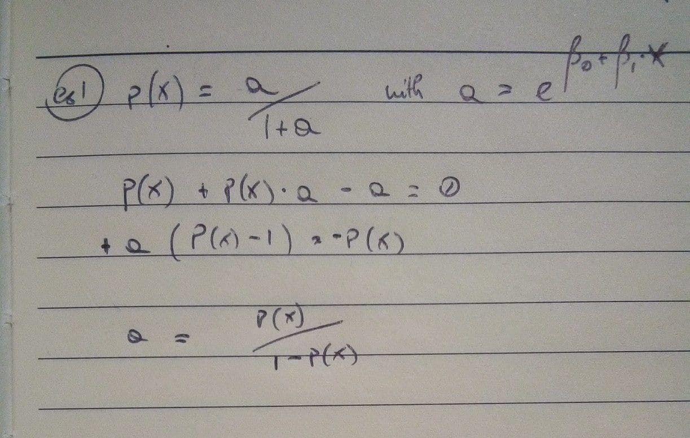

This is an [R Markdown](http://rmarkdown.rstudio.com) Notebook.
When you execute code within the notebook, the results appear beneath the code.

```{r, include = FALSE}
library(tidyverse)
library(ISLR2)
library(ggpubr)
library(MASS)
library(car)
library(dplyr)
```

### ex. 1

**Using a little bit of algebra, prove that (4.2) is equivalent to (4.3). In other words, the logistic function representation and logit representation for the logistic regression model are equivalent**



### ex. 2

Help

### ex. 3

Help

### ex. 4

**When the number of features p is large, there tends to be a deterioration in the performance of KNN and other local approaches that perform prediction using only observations that are near the test observation for which a prediction must be made. This phenomenon is known as the curse of dimensionality, and it ties into the fact that non-parametric approaches often perform poorly when p is large. We will now investigate this curse**

**(a) Suppose that we have a set of observations, each with measurements on p = 1 feature, X. We assume that X is uniformly (evenly) distributed on [0, 1]. Associated with each observation is a response value. Suppose that we wish to predict a test observation’s response using only observations that are within 10% of the range of X closest to that test observation. For instance, in order to predict the response for a test observation with X =0.6, we will use observations in the range [0.55, 0.65]. On average, what fraction of the available observations will we use to make the prediction?** 10%. Please note that for X < 0.5 or X > .95 an uneven range is used (e.g. [0, 0.1] for X < 0.5)

**(b) Now suppose that we have a set of observations, each with measurements on p = 2 features, X1 and X2. We assume that (X1,X2) are uniformly distributed on [0, 1] × [0, 1]. We wish to predict a test observation’s response using only observations that are within 10% of the range of X1 and within 10% of the range of X2 closest to that test observation. For instance, in order to predict the response for a test observation with X1 =0.6 and X2 =0.35, we will use observations in the range [0.55, 0.65] for X1 and in the range [0.3, 0.4] for X2. On average, what fraction of the available observations will we use to make the prediction?** We are moving in a 2-dimensional space where each observation can be represented by the combination of its predictors. We expect 90% of observations to be within 10% of p1 alone, but they will be uniformly distributed for their p2 value. In fact, only 10% of them will have a close enough p2 value. From a statistical point of view, we are asking the probability that an observation falls within p1 range AND p2 range.

**(c) Now suppose that we have a set of observations on p = 100 features. Again the observations are uniformly distributed on each feature, and again each feature ranges in value from 0 to 1. We wish to predict a test observation’s response using observations within the 10% of each feature’s range that is closest to that test observation. What fraction of the available observations will we use to make the prediction?** Since the observation must respect all the conditions at the same time, the percentage of available observations in 0.1^100 or 1*10^(-100) to use an exponential notation.

**(d) Using your answers to parts (a)–(c), argue that a drawback of KNN when p is large is that there are very few training observations “near” any given test observation**
A good definition of "nearness" can be the Mean Squared distance between two observations, where the lowest the more similar are two observations. If we imagine to consider near enough the values under a certain value, every predictor that we add reduces the pool of available data points by the proportion of them which are outside that bound.

**(e) Now suppose that we wish to make a prediction for a test observation by creating a p-dimensional hypercube centered around the test observation that contains, on average, 10% of the training observations. For p =1, 2, and 100, what is the length of each side of the hypercube? Comment on your answer** 

- For the 1-dimensional cube, the line is long 0.1
- For the 2-dimensional cube, when the side is long 0.1 we are now containing only 1% of observations. The area for which we contain 10% of obs has a length of sqrt(0.1) ∼ 30%
- Even in the 100-dimensional cube the side is long 100-root of 0.1 ∼ 97%

### ex. 5

**We now examine the differences between LDA and QDA.**

**(a) If the Bayes decision boundary is linear, do we expect LDA or QDA to perform better on the training set? On the test set?**

On the training set a more flexible model will always perform better, since it can model for also a part of the noise, while on the test set LDA perform better than QDA since it represent better the real situation.

**b) If the Bayes decision boundary is non-linear, do we expect LDA or QDA to perform better on the training set? On the test set?**

Both on the training and the test set the QDA will perform better.

**(c) In general, as the sample size n increases, do we expect the test prediction accuracy of QDA relative to LDA to improve, decline, or be unchanged? Why?**

Since QDA has more parameters to estimate compared to LDA, it benefits from a great amount of data more, because they progressively reduce it's variance (while LDA can perform discretly good even with a small n, since it has intrinsically low variance) and since it was the high variance (not the bias) which was limiting its accuracy, the performance will improve more. Of course, this argument is based on the assumption that the QDA better represent the real situation (for instance, in a problem where the decision boundary is linear, the accuracy of QDA won't be superior to the one of LDA).

**(d) True or False: Even if the Bayes decision boundary for a given problem is linear, we will probably achieve a superior test error rate using QDA rather than LDA because QDA is flexible enough to model a linear decision boundary. Justify your answer.** False, because in the training data part of the noise will be modeled and incorporated in the coefficients, which will deteriorate the performance on the test set.

### ex. 6

**Suppose we collect data for a group of students in a statistics class with variables X1 =hours studied, X2 =undergrad GPA, and Y= receive an A. We fit a logistic regression and produce estimated coefficient, ˆβ0 = −6, ˆβ1 =0.05, ˆβ2 = 1**

**(a) Estimate the probability that a student who studies for 40 h and has an undergrad GPA of 3.5 gets an A in the class.**

```{r}
beta0 <- -6.
beta1 <- 0.05
beta2 <- 1.

x1 <- 40.
x2 <- 3.5

exp <- exp(beta0 + beta1*x1 + beta2*x2) # = 0.6
( prob_a <- exp / (1 + exp) )
```

**(b) How many hours would the student in part (a) need to study to have a 50% chance of getting an A in the class?**

```{r}
prob_a <- 0.5
exp <- prob_a / (1 - prob_a) # = 1

# exp = 1 ->(implica)-> beta0 + beta1*x1 + beta2*x2 = 0
( x1 <- - (beta0 + beta2*x2) / beta1 )
```

