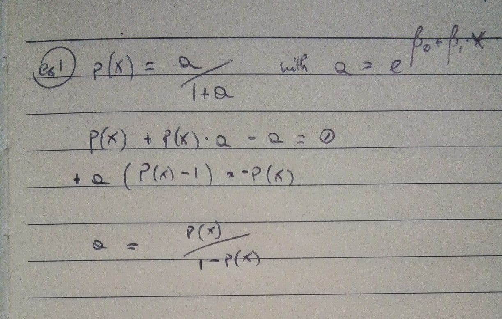
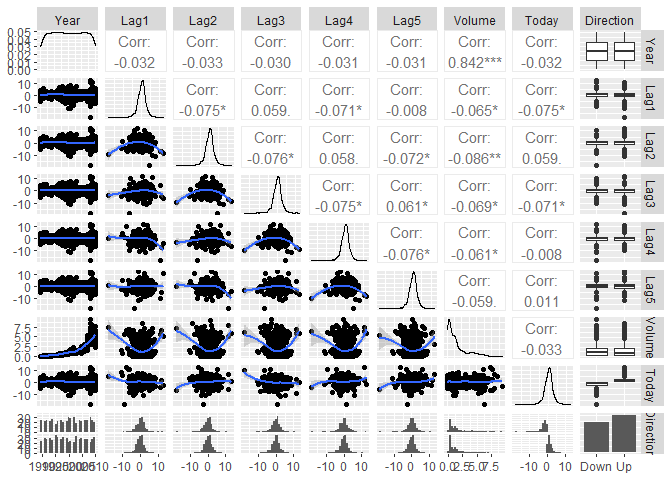
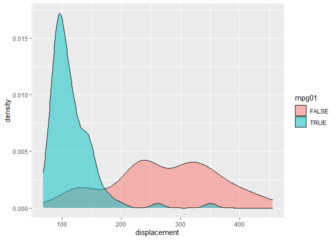
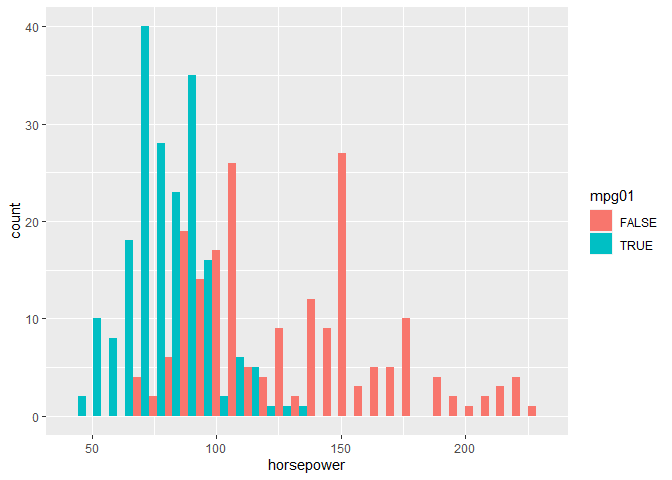
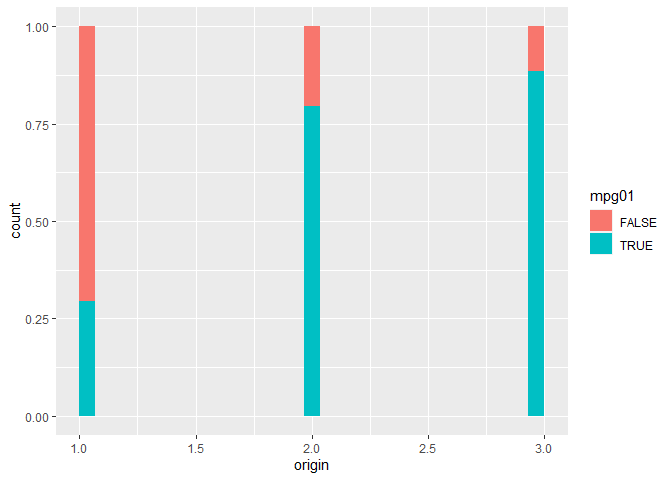
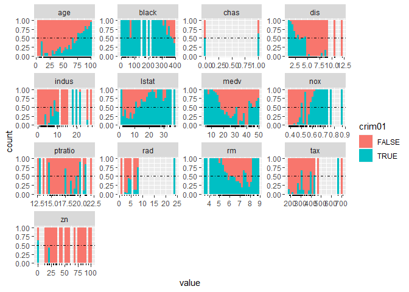

ISLR Ch.4
================

This is an [R Markdown](http://rmarkdown.rstudio.com) Notebook. When you execute code within the notebook, the results appear beneath the code.

### ex. 1

**Using a little bit of algebra, prove that (4.2) is equivalent to (4.3). In other words, the logistic function representation and logit representation for the logistic regression model are equivalent**



### ex. 2

Help

### ex. 3

Help

### ex. 4

**When the number of features p is large, there tends to be a deterioration in the performance of KNN and other local approaches that perform prediction using only observations that are near the test observation for which a prediction must be made. This phenomenon is known as the curse of dimensionality, and it ties into the fact that non-parametric approaches often perform poorly when p is large. We will now investigate this curse**

**(a) Suppose that we have a set of observations, each with measurements on p = 1 feature, X. We assume that X is uniformly (evenly) distributed on \[0, 1\]. Associated with each observation is a response value. Suppose that we wish to predict a test observation’s response using only observations that are within 10% of the range of X closest to that test observation. For instance, in order to predict the response for a test observation with X =0.6, we will use observations in the range \[0.55, 0.65\]. On average, what fraction of the available observations will we use to make the prediction?** 10%. Please note that for X &lt; 0.5 or X &gt; .95 an uneven range is used (e.g. \[0, 0.1\] for X &lt; 0.5)

**(b) Now suppose that we have a set of observations, each with measurements on p = 2 features, X1 and X2. We assume that (X1,X2) are uniformly distributed on \[0, 1\] × \[0, 1\]. We wish to predict a test observation’s response using only observations that are within 10% of the range of X1 and within 10% of the range of X2 closest to that test observation. For instance, in order to predict the response for a test observation with X1 =0.6 and X2 =0.35, we will use observations in the range \[0.55, 0.65\] for X1 and in the range \[0.3, 0.4\] for X2. On average, what fraction of the available observations will we use to make the prediction?** We are moving in a 2-dimensional space where each observation can be represented by the combination of its predictors. We expect 90% of observations to be within 10% of p1 alone, but they will be uniformly distributed for their p2 value. In fact, only 10% of them will have a close enough p2 value. From a statistical point of view, we are asking the probability that an observation falls within p1 range AND p2 range.

**(c) Now suppose that we have a set of observations on p = 100 features. Again the observations are uniformly distributed on each feature, and again each feature ranges in value from 0 to 1. We wish to predict a test observation’s response using observations within the 10% of each feature’s range that is closest to that test observation. What fraction of the available observations will we use to make the prediction?** Since the observation must respect all the conditions at the same time, the percentage of available observations in 0.1^100 or 1\*10^(-100) to use an exponential notation.

**(d) Using your answers to parts (a)–(c), argue that a drawback of KNN when p is large is that there are very few training observations “near” any given test observation** A good definition of "nearness" can be the Mean Squared distance between two observations, where the lowest the more similar are two observations. If we imagine to consider near enough the values under a certain value, every predictor that we add reduces the pool of available data points by the proportion of them which are outside that bound.

**(e) Now suppose that we wish to make a prediction for a test observation by creating a p-dimensional hypercube centered around the test observation that contains, on average, 10% of the training observations. For p =1, 2, and 100, what is the length of each side of the hypercube? Comment on your answer**

-   For the 1-dimensional cube, the line is long 0.1
-   For the 2-dimensional cube, when the side is long 0.1 we are now containing only 1% of observations. The area for which we contain 10% of obs has a length of sqrt(0.1) ∼ 30%
-   Even in the 100-dimensional cube the side is long 100-root of 0.1 ∼ 97%

### ex. 5

**We now examine the differences between LDA and QDA.**

**(a) If the Bayes decision boundary is linear, do we expect LDA or QDA to perform better on the training set? On the test set?**

On the training set a more flexible model will always perform better, since it can model for also a part of the noise, while on the test set LDA perform better than QDA since it represent better the real situation.

**b) If the Bayes decision boundary is non-linear, do we expect LDA or QDA to perform better on the training set? On the test set?**

Both on the training and the test set the QDA will perform better.

**(c) In general, as the sample size n increases, do we expect the test prediction accuracy of QDA relative to LDA to improve, decline, or be unchanged? Why?**

Since QDA has more parameters to estimate compared to LDA, it benefits from a great amount of data more, because they progressively reduce it's variance (while LDA can perform discretly good even with a small n, since it has intrinsically low variance) and since it was the high variance (not the bias) which was limiting its accuracy, the performance will improve more. Of course, this argument is based on the assumption that the QDA better represent the real situation (for instance, in a problem where the decision boundary is linear, the accuracy of QDA won't be superior to the one of LDA).

**(d) True or False: Even if the Bayes decision boundary for a given problem is linear, we will probably achieve a superior test error rate using QDA rather than LDA because QDA is flexible enough to model a linear decision boundary. Justify your answer.** False, because in the training data part of the noise will be modeled and incorporated in the coefficients, which will deteriorate the performance on the test set.

### ex. 6

**Suppose we collect data for a group of students in a statistics class with variables X1 =hours studied, X2 =undergrad GPA, and Y= receive an A. We fit a logistic regression and produce estimated coefficient, ˆβ0 = −6, ˆβ1 =0.05, ˆβ2 = 1**

**(a) Estimate the probability that a student who studies for 40 h and has an undergrad GPA of 3.5 gets an A in the class.**

``` r
beta0 <- -6.
beta1 <- 0.05
beta2 <- 1.

x1 <- 40.
x2 <- 3.5

exp <- exp(beta0 + beta1*x1 + beta2*x2) # = 0.6
( prob_a <- exp / (1 + exp) )
```

    ## [1] 0.3775407

**(b) How many hours would the student in part (a) need to study to have a 50% chance of getting an A in the class?**

``` r
prob_a <- 0.5
exp <- prob_a / (1 - prob_a) # = 1

# exp = 1 ->(implica)-> beta0 + beta1*x1 + beta2*x2 = 0
( x1 <- - (beta0 + beta2*x2) / beta1 )
```

    ## [1] 50

### ex. 7

**Suppose that we wish to predict whether a given stock will issue a dividend this year (“Yes” or “No”) based on X, last year’s percent profit. We examine a large number of companies and discover that the mean value of X for companies that issued a dividend was X¯ = 10, while the mean for those that didn’t was X¯ = 0. In addition, the variance of X for these two sets of companies was ˆσ2 = 36. Finally, 80% of companies issued dividends. Assuming that X follows a normal distribution, predict the probability that a company will issue a dividend this year given that its percentage profit was X = 4 last year**

Since there are only two possible outcomes, we are proceeding to calculate the value of the density function for both of them

``` r
mu_yes <- 10
mu_no <- 0
x <- 4
var <- 36
prior_yes <- 0.8
prior_no <- 1 - prior_yes

# dividend YES
first_term_yes <- 1 / sqrt(2 * prior_yes * var)
exp_yes <- exp( -1 * (x-mu_yes)^2 / (2 * var) )
f_x_yes <- first_term_yes * exp_yes

# dividend NO
first_term_no <- 1 / sqrt(2 * prior_no * var)
exp_no <- exp( -1 * (x-mu_no)^2 / (2 * var) )
f_x_no <- first_term_no * exp_no

# posterior probability
( f_x_yes / (f_x_yes + f_x_no) )
```

    ## [1] 0.2746962

### ex. 8

**Suppose that we take a data set, divide it into equally-sized training and test sets, and then try out two different classification procedures.First we use logistic regression and get an error rate of 20% on the training data and 30% on the test data. Next we use 1-nearest neighbors (i.e. K = 1) and get an average error rate (averaged over both test and training data sets) of 18 %. Based on these results, which method should we prefer to use for classification of new observations? Why?** The LR method shows a modest quantity of overfitting and a greater error on the test set, KNN-1 should be preferred on new obs.

### ex. 9

**On average, what fraction of people with an odds of 0.37 of defaulting on their credit card payment will in fact default?**

``` r
odds <- 0.37
(rr <- odds/(1+odds) )
```

    ## [1] 0.270073

**Suppose that an individual has a 16% chance of defaulting on her credit card payment. What are the odds that she will default?**

``` r
rr <- 0.15
( odds <- rr/(1-rr) )
```

    ## [1] 0.1764706

### ex. 10

### ex. 11

### ex. 12

**Suppose that you wish to classify an observation X ∈ R into apples and oranges. You fit a logistic regression model and find that**

Pr(Y = orange|X = x) = exp(ˆβ0 + ˆβ1x) / \[ 1 + exp(ˆβ0 + ˆβ1x) \]

**Your friend fits a logistic regression model to the same data using the softmax formulation in (4.13), and finds that**

Pr(Y = orange|X = x) = exp(ˆα orange0 +ˆα orange1x) / \[ exp(ˆα orange0 +ˆα orange1x) + exp(ˆα apple0 +ˆα apple1x) \]

**(a) What is the log odds of orange versus apple in your model?** ˆβ0 + ˆβ1x

**(b) What is the log odds of orange versus apple in your friend’s model?** ˆα (ˆα orange0 -ˆα apple0) + (ˆα orange1 -ˆα apple1)x

**(c) Suppose that in your model, βˆ0 = 2 and βˆ1 = −1. What are the coefficient estimates in your friend’s model? Be as specific as possible.** Since (a) and (b) should be the same, (ˆα orange0 -ˆα apple0) = 2 and (ˆα orange1 -ˆα apple1) = -1

**(d) Now suppose that you and your friend fit the same two models on a different data set. This time, your friend gets the coefficient estimates ˆαorange0 =1.2, ˆαorange1 = −2, ˆαapple0 = 3, ˆαapple1 = 0.6. What are the coefficient estimates in your model?**

``` r
beta0 <- 1.2 - 3
beta1 <- -2 - 0.6
```

**(e) Finally, suppose you apply both models from (d) to a data set with 2,000 test observations. What fraction of the time do you expect the predicted class labels from your model to agree with those from your friend’s model? Explain your answer.** Even if coefficients are different, predictions should be the same between max-likelihood and softmax.

### ex. 13

**This question should be answered using the Weekly data set, which is part of the ISLR2 package. This data is similar in nature to the Smarket data from this chapter’s lab, except that it contains 1, 089 weekly returns for 21 years, from the beginning of 1990 to the end of 2010.**

``` r
weekly <- ISLR2::Weekly
```

**(a) Produce some numerical and graphical summaries of the Weekly data. Do there appear to be any patterns?**

``` r
cor(weekly[, -which(names(weekly) == "Direction")])
```

    ##               Year         Lag1        Lag2        Lag3         Lag4
    ## Year    1.00000000 -0.032289274 -0.03339001 -0.03000649 -0.031127923
    ## Lag1   -0.03228927  1.000000000 -0.07485305  0.05863568 -0.071273876
    ## Lag2   -0.03339001 -0.074853051  1.00000000 -0.07572091  0.058381535
    ## Lag3   -0.03000649  0.058635682 -0.07572091  1.00000000 -0.075395865
    ## Lag4   -0.03112792 -0.071273876  0.05838153 -0.07539587  1.000000000
    ## Lag5   -0.03051910 -0.008183096 -0.07249948  0.06065717 -0.075675027
    ## Volume  0.84194162 -0.064951313 -0.08551314 -0.06928771 -0.061074617
    ## Today  -0.03245989 -0.075031842  0.05916672 -0.07124364 -0.007825873
    ##                Lag5      Volume        Today
    ## Year   -0.030519101  0.84194162 -0.032459894
    ## Lag1   -0.008183096 -0.06495131 -0.075031842
    ## Lag2   -0.072499482 -0.08551314  0.059166717
    ## Lag3    0.060657175 -0.06928771 -0.071243639
    ## Lag4   -0.075675027 -0.06107462 -0.007825873
    ## Lag5    1.000000000 -0.05851741  0.011012698
    ## Volume -0.058517414  1.00000000 -0.033077783
    ## Today   0.011012698 -0.03307778  1.000000000

``` r
custom_function = function(data, mapping, method = "loess", ...){
      p = ggplot(data = data, mapping = mapping) + 
      geom_point() + 
      geom_smooth(method=method, ...)
      
      p
    }

weekly %>% 
  GGally::ggpairs( lower = list(continuous = custom_function) )
```

    ## `geom_smooth()` using formula 'y ~ x'
    ## `geom_smooth()` using formula 'y ~ x'
    ## `geom_smooth()` using formula 'y ~ x'
    ## `geom_smooth()` using formula 'y ~ x'
    ## `geom_smooth()` using formula 'y ~ x'
    ## `geom_smooth()` using formula 'y ~ x'
    ## `geom_smooth()` using formula 'y ~ x'
    ## `geom_smooth()` using formula 'y ~ x'
    ## `geom_smooth()` using formula 'y ~ x'
    ## `geom_smooth()` using formula 'y ~ x'
    ## `geom_smooth()` using formula 'y ~ x'
    ## `geom_smooth()` using formula 'y ~ x'
    ## `geom_smooth()` using formula 'y ~ x'
    ## `geom_smooth()` using formula 'y ~ x'
    ## `geom_smooth()` using formula 'y ~ x'
    ## `geom_smooth()` using formula 'y ~ x'
    ## `geom_smooth()` using formula 'y ~ x'
    ## `geom_smooth()` using formula 'y ~ x'
    ## `geom_smooth()` using formula 'y ~ x'
    ## `geom_smooth()` using formula 'y ~ x'
    ## `geom_smooth()` using formula 'y ~ x'
    ## `geom_smooth()` using formula 'y ~ x'
    ## `geom_smooth()` using formula 'y ~ x'
    ## `geom_smooth()` using formula 'y ~ x'
    ## `geom_smooth()` using formula 'y ~ x'
    ## `geom_smooth()` using formula 'y ~ x'
    ## `geom_smooth()` using formula 'y ~ x'
    ## `geom_smooth()` using formula 'y ~ x'

    ## `stat_bin()` using `bins = 30`. Pick better value with `binwidth`.
    ## `stat_bin()` using `bins = 30`. Pick better value with `binwidth`.
    ## `stat_bin()` using `bins = 30`. Pick better value with `binwidth`.
    ## `stat_bin()` using `bins = 30`. Pick better value with `binwidth`.
    ## `stat_bin()` using `bins = 30`. Pick better value with `binwidth`.
    ## `stat_bin()` using `bins = 30`. Pick better value with `binwidth`.
    ## `stat_bin()` using `bins = 30`. Pick better value with `binwidth`.
    ## `stat_bin()` using `bins = 30`. Pick better value with `binwidth`.



No strong correlations can be seen between data (volume vs today shows that the value of stock has increased in the observed period).

**Use the full data set to perform a logistic regression with Direction as the response and the five lag variables plus Volume as predictors. Use the summary function to print the results. Do any of the predictors appear to be statistically significant? If so, which ones?**

``` r
lr.fit <- glm(Direction ∼ Lag1 + Lag2 + Lag3 + Lag4 + Lag5 + Volume,
              data = weekly,
              family = "binomial")
summary(lr.fit)
```

    ## 
    ## Call:
    ## glm(formula = Direction ~ Lag1 + Lag2 + Lag3 + Lag4 + Lag5 + 
    ##     Volume, family = "binomial", data = weekly)
    ## 
    ## Deviance Residuals: 
    ##     Min       1Q   Median       3Q      Max  
    ## -1.6949  -1.2565   0.9913   1.0849   1.4579  
    ## 
    ## Coefficients:
    ##             Estimate Std. Error z value Pr(>|z|)   
    ## (Intercept)  0.26686    0.08593   3.106   0.0019 **
    ## Lag1        -0.04127    0.02641  -1.563   0.1181   
    ## Lag2         0.05844    0.02686   2.175   0.0296 * 
    ## Lag3        -0.01606    0.02666  -0.602   0.5469   
    ## Lag4        -0.02779    0.02646  -1.050   0.2937   
    ## Lag5        -0.01447    0.02638  -0.549   0.5833   
    ## Volume      -0.02274    0.03690  -0.616   0.5377   
    ## ---
    ## Signif. codes:  0 '***' 0.001 '**' 0.01 '*' 0.05 '.' 0.1 ' ' 1
    ## 
    ## (Dispersion parameter for binomial family taken to be 1)
    ## 
    ##     Null deviance: 1496.2  on 1088  degrees of freedom
    ## Residual deviance: 1486.4  on 1082  degrees of freedom
    ## AIC: 1500.4
    ## 
    ## Number of Fisher Scoring iterations: 4

Lag2 has a p-value &lt; 0.5, the only one under that level.

**Compute the confusion matrix and overall fraction of correct predictions. Explain what the confusion matrix is telling you about the types of mistakes made by logistic regression.**

``` r
lr_probs <- predict(lr.fit, type = "response")

lr_pred <- rep(times = dim(weekly)[1], x = "Down")
lr_pred[lr_probs > 0.5] <- "Up"

table(lr_pred, weekly[["Direction"]])
```

    ##        
    ## lr_pred Down  Up
    ##    Down   54  48
    ##    Up    430 557

``` r
mean(lr_pred == weekly[["Direction"]])
```

    ## [1] 0.5610652

The error is similar for both the classes: once a class is predicted, we can be only slightly more than 50% sure that this is the real one, and we are still talking about evaluating the model on the same dataset it was trained on.

**Now fit the logistic regression model using a training data period from 1990 to 2008, with Lag2 as the only predictor. Compute the confusion matrix and the overall fraction of correct predictions for the held out data (that is, the data from 2009 and 2010).**

``` r
train <- weekly[["Year"]] <= 2008
test <- weekly[!train, ]
direction <- weekly[["Direction"]][!train]

lr.fit <- glm(Direction ∼ Lag2,
              data = weekly,
              family = "binomial",
              subset = train)

lr_probs <- predict(lr.fit, 
                    type = "response",
                    newdata = test)

quick_eval <- function(l_probs, test_true) {
  lr_pred <- rep(times = length(l_probs), x = "Down")
  lr_pred[l_probs > 0.5] <- "Up"
  
  return( list( conf_mat = table(lr_pred, test_true), 
               accuracy = mean(lr_pred == test_true))
  )
}

quick_eval(lr_probs, direction)
```

    ## $conf_mat
    ##        test_true
    ## lr_pred Down Up
    ##    Down    9  5
    ##    Up     34 56
    ## 
    ## $accuracy
    ## [1] 0.625

1.  Repeat (d) using LDA.

``` r
lda.fit <- lda(Direction ∼ Lag2,
               data = weekly,
               subset = train)

lda_probs <- predict(lda.fit, 
                    type = "response",
                    newdata = test)

quick_eval(lda_probs[["posterior"]][,"Up"], direction)
```

    ## $conf_mat
    ##        test_true
    ## lr_pred Down Up
    ##    Down    9  5
    ##    Up     34 56
    ## 
    ## $accuracy
    ## [1] 0.625

1.  Repeat (d) using QDA.

``` r
qda.fit <- qda(Direction ∼ Lag2,
               data = weekly,
               subset = train)

qda_probs <- predict(qda.fit, 
                    type = "response",
                    newdata = test)

quick_eval(qda_probs[["posterior"]][,"Up"], direction)
```

    ## $conf_mat
    ##        test_true
    ## lr_pred Down Up
    ##      Up   43 61
    ## 
    ## $accuracy
    ## [1] 0.5865385

1.  Repeat (d) using KNN with K = 1.

``` r
set.seed(1)
k_preds <- knn( train = as.matrix(weekly[train, "Lag2"]),
                test =  as.matrix(weekly[!train, "Lag2"]),
                cl = weekly[train, "Direction"],
                k = 1 )

(list( conf_mat = table(k_preds, direction), 
       accuracy = mean(k_preds == direction)) )
```

    ## $conf_mat
    ##        direction
    ## k_preds Down Up
    ##    Down   21 30
    ##    Up     22 31
    ## 
    ## $accuracy
    ## [1] 0.5

1.  Repeat (d) using naive Bayes.

``` r
nb.fit <- naiveBayes(Direction ∼ Lag2,
               data = weekly,
               subset = train)

nb_probs <- predict(nb.fit,
                    type = "raw",
                    newdata = test)

quick_eval(nb_probs[,"Up"], direction)
```

    ## $conf_mat
    ##        test_true
    ## lr_pred Down Up
    ##      Up   43 61
    ## 
    ## $accuracy
    ## [1] 0.5865385

**(i) Which of these methods appears to provide the best results on this data?** LDA with a treshold of 0.5

**(j)** skip

### ex. 14

**In this problem, you will develop a model to predict whether a given car gets high or low gas mileage based on the Auto data set.**

``` r
auto <- Auto
```

**(a) Create a binary variable, mpg01, that contains a 1 if mpg contains a value above its median, and a 0 if mpg contains a value below its median. You can compute the median using the median() function. Note you may find it helpful to use the data.frame() function to create a single data set containing both mpg01 and the other Auto variables**

``` r
auto <- auto %>%
  mutate( mpg01 = mpg > median(mpg) ) %>% 
  dplyr::select(-mpg)
```

**(b) Explore the data graphically in order to investigate the association between mpg01 and the other features. Which of the other features seem most likely to be useful in predicting mpg01? Scatterplots and boxplots may be useful tools to answer this question. Describe your findings.**

``` r
ggplot(data = auto,
       aes( fill = mpg01) ) +
  geom_histogram(aes( x = cylinders),
                 position = "fill" )
```

    ## `stat_bin()` using `bins = 30`. Pick better value with `binwidth`.

    ## Warning: Removed 50 rows containing missing values (geom_bar).


``` r
ggplot(data = auto,
       aes( fill = mpg01) ) +
  geom_density(aes( x = displacement),
               alpha = 0.5 )
```



``` r
ggplot(data = auto,
       aes( fill = mpg01) ) +
  geom_histogram(aes( x = horsepower),
               position = "dodge")
```

    ## `stat_bin()` using `bins = 30`. Pick better value with `binwidth`.



``` r
ggplot(data = auto,
       aes( fill = mpg01) ) +
  geom_histogram(aes( x = weight),
               position = "dodge")
```

    ## `stat_bin()` using `bins = 30`. Pick better value with `binwidth`.


``` r
ggplot(data = auto,
       aes( fill = mpg01) ) +
  geom_density(aes( x = acceleration),
               alpha = 0.5,
               position = "fill") +
  geom_hline( yintercept = 0.5,
              linetype = "dotdash" )
```


``` r
ggplot(data = auto,
       aes( fill = mpg01) ) +
  geom_density(aes( x = year),
               alpha = 0.5,
               position = "fill") +
  geom_hline( yintercept = 0.5,
              linetype = "dotdash" )
```


``` r
ggplot(data = auto,
       aes( fill = mpg01) ) +
  geom_histogram(aes( x = origin),
               # alpha = 0.5,
               position = "fill")
```

    ## `stat_bin()` using `bins = 30`. Pick better value with `binwidth`.

    ## Warning: Removed 52 rows containing missing values (geom_bar).



cylinders, displacement, horsepower, weight and origin seem to have a stronger relationship with mpg01

**(c) Split the data into a training set and a test set.**

``` r
train <- auto %>%
  slice_sample(prop = 0.75) 
  
test <- auto %>% 
  anti_join(train)
```

    ## Joining, by = c("cylinders", "displacement", "horsepower", "weight", "acceleration", "year", "origin", "name", "mpg01")

**(d) Perform LDA on the training data in order to predict mpg01 using the variables that seemed most associated with mpg01 in (b). What is the test error of the model obtained?**

``` r
lda.fit <- lda( mpg01 ~ cylinders + displacement + horsepower + 
                  weight + origin,
                data = train)

lda_probs <- predict(lda.fit, 
                    type = "response",
                    newdata = test)

table(lda_probs[["class"]],test[["mpg01"]])
```

    ##        
    ##         FALSE TRUE
    ##   FALSE    43    3
    ##   TRUE      9   43

``` r
1 - mean(lda_probs[["class"]] == test[["mpg01"]])
```

    ## [1] 0.122449

**(e) Perform QDA on the training data in order to predict mpg01 using the variables that seemed most associated with mpg01 in (b). What is the test error of the model obtained?**

``` r
qda.fit <- qda( mpg01 ~ cylinders + displacement + horsepower + 
                  weight + origin,
                data = train)

qda_probs <- predict(qda.fit, 
                    type = "response",
                    newdata = test)

table(qda_probs[["class"]],test[["mpg01"]])
```

    ##        
    ##         FALSE TRUE
    ##   FALSE    44    5
    ##   TRUE      8   41

``` r
1 - mean(qda_probs[["class"]] == test[["mpg01"]])
```

    ## [1] 0.1326531

**(f) Perform logistic regression on the training data in order to predict mpg01 using the variables that seemed most associated with mpg01 in (b). What is the test error of the model obtained?**

``` r
lr.fit <- glm( mpg01 ~ cylinders + displacement + horsepower + 
                  weight + origin,
               family = "binomial",
               data = train)

lr_probs <- predict(lr.fit, 
                    type = "response",
                    newdata = test)

table(lr_probs > 0.5, test[["mpg01"]])
```

    ##        
    ##         FALSE TRUE
    ##   FALSE    46    6
    ##   TRUE      6   40

``` r
1 - mean((lr_probs > 0.5) == test[["mpg01"]])
```

    ## [1] 0.122449

**(g) Perform naive Bayes on the training data in order to predict mpg01 using the variables that seemed most associated with mpg01 in (b). What is the test error of the model obtained?**

``` r
nb.fit <- naiveBayes( mpg01 ~ cylinders + displacement + horsepower + 
                  weight + origin,
               data = train)

nb_probs <- predict(nb.fit, 
                    type = "class",
                    newdata = test)

table(nb_probs,test[["mpg01"]])
```

    ##         
    ## nb_probs FALSE TRUE
    ##    FALSE    43    3
    ##    TRUE      9   43

``` r
1 - mean(nb_probs == test[["mpg01"]])
```

    ## [1] 0.122449

**(h) Perform KNN on the training data, with several values of K, in order to predict mpg01. Use only the variables that seemed most associated with mpg01 in (b). What test errors do you obtain? Which value of K seems to perform the best on this data set?** Used every variable (no "name"), test errors are lower at k = 4 and k = 20, even if the differences are minimal

``` r
k_list <- c(1:15, 2:8 *10)
err_list <- vector(mode = "double", length = 0)

for(k in k_list) {
  knn_preds <- knn( train = train %>% dplyr::select(-mpg01,-name),
                  test = test %>% dplyr::select(-mpg01,-name),
                  cl = train[["mpg01"]],
                  k = k )

  # table(knn_preds,test[["mpg01"]])
  err_list <- c(err_list, 
                1 - mean(knn_preds == test[["mpg01"]]) )
}

k_err_list <- bind_cols(k_list, err_list)
```

    ## New names:
    ## * NA -> ...1
    ## * NA -> ...2

``` r
colnames(k_err_list) <- c("k", "error")

ggplot(k_err_list) +
  geom_line( aes( x = k,
                   y = error)) +
  scale_x_log10()
```


### ex. 15

**This problem involves writing functions**

**(a) Write a function, Power(), that prints out the result of raising 2 to the 3rd power. In other words, your function should compute 23 and print out the results.**

``` r
Power <- function() {
  ( x <- 2^3 )
}
```

**(b) Create a new function, Power2(), that allows you to pass any two numbers, x and a, and prints out the value of x^a.**

``` r
Power2 <- function(x, a) {
  ( x^a )
}
```

**(c) Using the Power2() function that you just wrote, compute 10^3, 8^17, and 131^3**

``` r
c(Power2(10,3), Power2(8,17), Power2(131,3) )
```

    ## [1] 1.000000e+03 2.251800e+15 2.248091e+06

**(d) Now create a new function, Power3(), that actually returns the result x^a as an R object, rather than simply printing it to the screen. **

``` r
Power3 <- function(x, a) {
  return( x^a )
}
```

**(e) Now using the Power3() function, create a plot of f(x)= x^2. The x-axis should display a range of integers from 1 to 10, and the y-axis should display x2. Label the axes appropriately, and use an appropriate title for the figure. Consider displaying either the x-axis, the y-axis, or both on the log-scale.**

``` r
ggplot() +
  geom_point( aes( x = 1:10,
                   y = Power3(..x.., 2)) ) +
  labs(title = "f(x) = x^2",
       x = "x", y = "y") +
  scale_y_log10()
```


**(f) Create a function, PlotPower(), that allows you to create a plot of x against x^a for a fixed a and for a range of values of x**

``` r
PlotPower <- function(x, a) {
  #implicit return of the ggplot object
  ggplot() +
  geom_point( aes( x = x,
                   y = Power3(..x.., a)) ) +
  labs(title = "f(x) = x^2",
       x = "x", y = "y")
}
```

### ex. 16

**16. Using the Boston data set, fit classification models in order to predict whether a given census tract has a crime rate above or below the median. Explore logistic regression, LDA, naive Bayes, and KNN models using various subsets of the predictors. Describe your findings.**

``` r
boston <- Boston

boston <- boston %>%
  mutate( crim01 = crim > median(crim) ) %>% 
  dplyr::select(-crim)


boston %>%
  gather(-crim01, key = "var", value = "value") %>% 
  ggplot(aes(x = value, 
             fill = crim01) ) +
    geom_histogram( position = "fill") + #or geom_density
    geom_rug() +
    geom_hline( yintercept = 0.5,
                linetype = "dotdash" ) +
    facet_wrap(~ var, scales = "free")
```

    ## `stat_bin()` using `bins = 30`. Pick better value with `binwidth`.

    ## Warning: Removed 202 rows containing missing values (geom_bar).



``` r
model_create_eval <- function(f, data) {
  train <- data %>%
    slice_sample(prop = 0.8) 
  test <- data %>% 
    anti_join(train)
  
  lr_fit <- glm(f,
                data = train,
                family = "binomial")
  
  lda_fit <- lda(f,
                 data = train)
  
  qda_fit <- qda(f,
                 data = train)
  
  nb_fit <- naiveBayes(f,
                       data = train)
  
  #knn
  
  lr_probs <- predict(lr_fit, 
                      type = "response",
                      newdata = test)
  
  lda_probs <- predict(lda_fit, 
                      type = "response",
                      newdata = test)[["posterior"]][,"TRUE"]
  
  qda_probs <- predict(qda_fit, 
                      type = "response",
                      newdata = test)[["posterior"]][,"TRUE"]
  
  nb_probs <- predict(nb_fit,
                      type = "raw",
                      newdata = test)[,"TRUE"]
  
  probs_list <- list( lr = lr_probs,
                      lda = lda_probs,
                      qda = qda_probs,
                      nb = nb_probs)
  
  #roc plot
  precrec_obj <- evalmod(scores = probs_list, 
                         modnames = names(probs_list),
                         labels = test[["crim01"]])
  a <- autoplot(precrec_obj,
           curvetype = "ROC")
  ggarrange( a, diag_plots(probs_list, results = test[["crim01"]]),
             ncol = 2 )
}

# diagnostic single plot
d_plot <- function(d_probs, results, treshold = 0.5, ...) {
  ggplot() +
    geom_density(aes( x = d_probs,
                    fill = results),
               alpha = 0.5, ...) +
    geom_vline( xintercept = treshold,
                linetype = "dotdash" ) +
    scale_fill_discrete(name = "Crime level")
}

# diagnostic plots (all together)
diag_plots <- function(probs_list, results, x = 0.5) {
  
  ggarrange(d_plot(probs_list[["lr"]], results, x),  
              d_plot(probs_list[["lr"]], results, x, position = "fill"),
            d_plot(probs_list[["lda"]], results, x), 
              d_plot(probs_list[["lda"]], results, x, position = "fill"),
            d_plot(probs_list[["qda"]], results, x), 
              d_plot(probs_list[["qda"]], results, x, position = "fill"),
            d_plot(probs_list[["nb"]], results, x),  
              d_plot(probs_list[["nb"]], results, x, position = "fill"),
            ncol=2, nrow=4)
}
```

``` r
f <- as.formula( crim01 ~ black + tax + nox)
model_create_eval(f, boston)
```

    ## Joining, by = c("zn", "indus", "chas", "nox", "rm", "age", "dis", "rad", "tax", "ptratio", "black", "lstat", "medv", "crim01")


