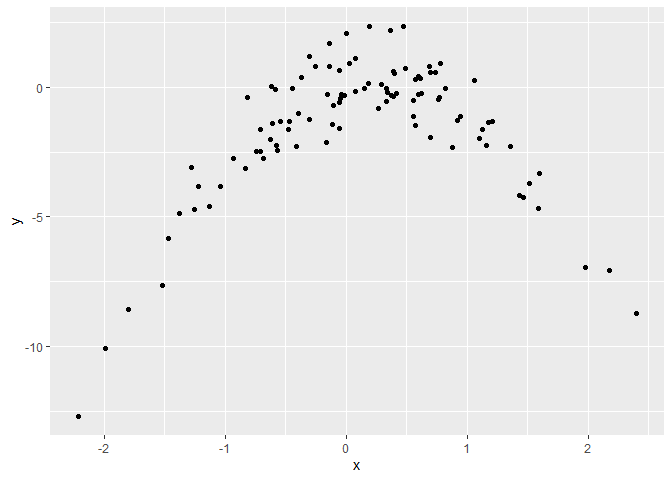

ISLR Ch.5
================

This is an [R Markdown](http://rmarkdown.rstudio.com) Notebook. When you execute code within the notebook, the results appear beneath the code.

### ex. 1

**Using basic statistical properties of the variance, as well as single variable calculus, derive (5.6). In other words, prove that α given by (5.6) does indeed minimize Var(αX + (1 − α)Y)** First, derive variance formula, then set it equal to 0. It should be equal to (5.6)

### ex. 2

**We will now derive the probability that a given observation is part of a bootstrap sample. Suppose that we obtain a bootstrap sample from a set of n observations.**

**(a) What is the probability that the first bootstrap observation is not the jth observation from the original sample? Justify your answer.** The probability that the first observation is the jth sample is 1/n, so (a) is 1-1/n for each j in n.

**(b) What is the probability that the second bootstrap observation is not the jth observation from the original sample?** 1-1/n

**(c) Argue that the probability that the jth observation is not in the bootstrap sample is (1 − 1/n)^n** Not to be in the bootstrap sample it is necessary that it is not in the first AND not in the second AND ... so those statements should be TRUE at the same time, thus deriving the (c) formula.

**(d) When n = 5, what is the probability that the jth observation is in the bootstrap sample?** It can be there 1,2,3,4 or 5 times (we could calculate those exact probabilities), only it can not be there 0 times, so it is easy to obtain that probability...

``` r
p0 <- (1 - 1/5)^5
(1 - p0)
```

    ## [1] 0.67232

**(e) When n = 100, what is the probability that the jth observation is in the bootstrap sample?**

``` r
n <- 100
p0 <- (1 - 1/n)^n
(1 - p0) #at least once
```

    ## [1] 0.6339677

**(f) When n = 10, 000, what is the probability that the jth observation is in the bootstrap sample?**

``` r
n <- 10000
p0 <- (1 - 1/n)^n
(1 - p0) #at least once
```

    ## [1] 0.632139

**(g) Create a plot that displays, for each integer value of n from 1 to 100, 000, the probability that the jth observation is in the bootstrap sample. Comment on what you observe.** We can see that the values rapidly decrease and tend to stabilize around 0.63

``` r
p0 <- function(n) (1 - 1/n)^n

ggplot() +
  geom_line( aes( x = 1:100000,
                  y = 1 - p0(..x..) )) +
  scale_x_log10() +
  ylim(0.5, 1)
```

    ## Warning: Removed 9 row(s) containing missing values (geom_path).


**(h) We will now investigate numerically the probability that a bootstrap sample of size n = 100 contains the jth observation. Here j = 4. We repeatedly create bootstrap samples, and each time we record whether or not the fourth observation is contained in the bootstrap sample. Comment on the results obtained.** Same formula as in the previous point, probability tend to converge to 63%

``` r
store <- rep(NA, 10000)
for(i in 1:10000){ 
  store[i] <- sum(sample(1:100 , rep=TRUE) == 4) > 0
}
mean(store)
```

    ## [1] 0.6315

### ex. 3

**We now review k-fold cross-validation. (a) Explain how k-fold cross-validation is implemented.** First, decide a k. Then, divide the train dataset in k subsets. For each kth subset, train the model on all the other subsets and calculate the error on the kth one. Once you have the error for each of the k subsets, average it to obtain the estimate of MSE.

**(b) What are the advantages and disadvantages of k-fold crossvalidation relative to:**

1.  The validation set approach? Less bias since it uses a bigger training set
2.  LOOCV? Less variance since training many near-identical models as in LOOCV has higher variance than the one of less correlated models as in k-fold CV

### ex. 4

**Suppose that we use some statistical learning method to make a prediction for the response Y for a particular value of the predictor X. Carefully describe how we might estimate the standard deviation of our prediction.** Prediction implies a function that maps a training set to the estimate of the response value. We need to code (or to describe) that function that should be

``` r
f <- function( training_set ) {
  #some calculation
  return(response)
  }
```

Then we decide the number t of times that we wan to create a bootstrap database, proceed to create the bootstrapped training\_set by randomly selecting observations from the training set (with replacement) until we have a dataset of the same length of the original one, and proceed to calculate the estimate of the response.

Once we have a vector of all the estimated responses from all the bootstrapped databases we simply calculate the std.dev of it.

### ex. 5

**In Chapter 4, we used logistic regression to predict the probability of default using income and balance on the Default data set. We will now estimate the test error of this logistic regression model using the validation set approach. Do not forget to set a random seed before beginning your analysis.**

**(a) Fit a logistic regression model that uses income and balance to predict default**

``` r
default_data <- Default

lr_fit <- glm(default ~ income + balance,
              data = default_data,
              family = "binomial" )

summary(lr_fit)
```

    ## 
    ## Call:
    ## glm(formula = default ~ income + balance, family = "binomial", 
    ##     data = default_data)
    ## 
    ## Deviance Residuals: 
    ##     Min       1Q   Median       3Q      Max  
    ## -2.4725  -0.1444  -0.0574  -0.0211   3.7245  
    ## 
    ## Coefficients:
    ##               Estimate Std. Error z value Pr(>|z|)    
    ## (Intercept) -1.154e+01  4.348e-01 -26.545  < 2e-16 ***
    ## income       2.081e-05  4.985e-06   4.174 2.99e-05 ***
    ## balance      5.647e-03  2.274e-04  24.836  < 2e-16 ***
    ## ---
    ## Signif. codes:  0 '***' 0.001 '**' 0.01 '*' 0.05 '.' 0.1 ' ' 1
    ## 
    ## (Dispersion parameter for binomial family taken to be 1)
    ## 
    ##     Null deviance: 2920.6  on 9999  degrees of freedom
    ## Residual deviance: 1579.0  on 9997  degrees of freedom
    ## AIC: 1585
    ## 
    ## Number of Fisher Scoring iterations: 8

**(b) Using the validation set approach, estimate the test error of this model**

``` r
set.seed(123)
dims <- dim(default_data)[1]
train <- sample( dims,  dims/2)

lr_fit_vs <- glm(default ~ income + balance,
              data = default_data,
              family = "binomial" ,
              subset = train)

lr_preds_cv <- predict( lr_fit_vs,
                        type = "response",
                        newdata = default_data[-train,])

# test error
1 - mean( (lr_preds_cv > 0.5) == (default_data[-train,"default"] == "Yes") )
```

    ## [1] 0.0276

**(c) Repeat the process in (b) three times, using three different splits of the observations into a training set and a validation set. Comment on the results obtained** Each error rate is different because different are train and test set. This method of validation has a higher bias (likely to overestimate true error), while retaining only a little variance.

``` r
set.seed(111)
train <- sample( dims,  dims/2)
lr_fit_vs <- glm(default ~ income + balance, data = default_data,
              family = "binomial", subset = train)
lr_preds_cv <- predict( lr_fit_vs, type = "response", newdata = default_data[-train,])
first <- 1 - mean( (lr_preds_cv > 0.5) == (default_data[-train,"default"] == "Yes") )

set.seed(222)
train <- sample( dims,  dims/2)
lr_fit_vs <- glm(default ~ income + balance, data = default_data,
              family = "binomial", subset = train)
lr_preds_cv <- predict( lr_fit_vs, type = "response", newdata = default_data[-train,])
second <- 1 - mean( (lr_preds_cv > 0.5) == (default_data[-train,"default"] == "Yes") )

set.seed(333)
train <- sample( dims,  dims/2)
lr_fit_vs <- glm(default ~ income + balance, data = default_data,
              family = "binomial", subset = train)
lr_preds_cv <- predict( lr_fit_vs, type = "response", newdata = default_data[-train,])
third <- 1 - mean( (lr_preds_cv > 0.5) == (default_data[-train,"default"] == "Yes") )

( c(first, second, third) )
```

    ## [1] 0.0240 0.0280 0.0272

**(d) Now consider a logistic regression model that predicts the probability of default using income, balance, and a dummy variable for student. Estimate the test error for this model using the validation set approach. Comment on whether or not including a dummy variable for student leads to a reduction in the test error rate.**

``` r
set.seed(123)
dims <- dim(default_data)[1]
train <- sample( dims,  dims/2)

lr_fit_vs <- glm(default ~ income + balance + student,
              data = default_data,
              family = "binomial" ,
              subset = train)

lr_preds_cv <- predict( lr_fit_vs,
                        type = "response",
                        newdata = default_data[-train,])

# test error
1 - mean( (lr_preds_cv > 0.5) == (default_data[-train,"default"] == "Yes") )
```

    ## [1] 0.0272

Not necessarily, including variables in the model lowers the test error only if they are useful to the prediction, and it can be that the reduction is not seen, also considering that we are using only half of the data to fit the model.

### ex. 6

**We continue to consider the use of a logistic regression model to predict the probability of default using income and balance on the Default data set. In particular, we will now compute estimates for the standard errors of the income and balance logistic regression coefficients in two different ways: (1) using the bootstrap, and (2) using the standard formula for computing the standard errors in the glm() function. Do not forget to set a random seed before beginning your analysis.**

**(a) Using the summary() and glm() functions, determine the estimated standard errors for the coefficients associated with income and balance in a multiple logistic regression model that uses both predictors**

``` r
set.seed(123)
lr_fit <- glm(default ~ income + balance,
              data = default_data,
              family = "binomial")
lr_preds <- predict(lr_fit, data = default_data, type = "response")
summary(lr_fit)
```

    ## 
    ## Call:
    ## glm(formula = default ~ income + balance, family = "binomial", 
    ##     data = default_data)
    ## 
    ## Deviance Residuals: 
    ##     Min       1Q   Median       3Q      Max  
    ## -2.4725  -0.1444  -0.0574  -0.0211   3.7245  
    ## 
    ## Coefficients:
    ##               Estimate Std. Error z value Pr(>|z|)    
    ## (Intercept) -1.154e+01  4.348e-01 -26.545  < 2e-16 ***
    ## income       2.081e-05  4.985e-06   4.174 2.99e-05 ***
    ## balance      5.647e-03  2.274e-04  24.836  < 2e-16 ***
    ## ---
    ## Signif. codes:  0 '***' 0.001 '**' 0.01 '*' 0.05 '.' 0.1 ' ' 1
    ## 
    ## (Dispersion parameter for binomial family taken to be 1)
    ## 
    ##     Null deviance: 2920.6  on 9999  degrees of freedom
    ## Residual deviance: 1579.0  on 9997  degrees of freedom
    ## AIC: 1585
    ## 
    ## Number of Fisher Scoring iterations: 8

``` r
ggplot() +
  geom_histogram( aes( x = lr_preds,
                       fill = default_data[,"default"] == "Yes")) +
  geom_vline( xintercept = 0.5) +
  scale_y_log10() +
  ggtitle("Mean Error = ", 1 - mean( (lr_preds > 0.5) == (default_data[,"default"] == "Yes") ) )
```

    ## `stat_bin()` using `bins = 30`. Pick better value with `binwidth`.

    ## Warning: Transformation introduced infinite values in continuous y-axis

    ## Warning: Removed 2 rows containing missing values (geom_bar).


**(b) Write a function, boot.fn(), that takes as input the Default data set as well as an index of the observations, and that outputs the coefficient estimates for income and balance in the multiple logistic regression model**

``` r
boot.fn <- function(data, index) {
  model <- glm(default ~ income + balance,
               data = data,
               family = "binomial",
               subset = index)
  return( coef(model)[-1] )
}
```

**(c) Use the boot() function together with your boot.fn() function to estimate the standard errors of the logistic regression coefficients for income and balance**

``` r
boot( data = default_data,
      statistic = boot.fn,
      R = 100 )
```

``` r
ORDINARY NONPARAMETRIC BOOTSTRAP

Call:
boot(data = default_data, statistic = boot.fn, R = 1000)

Bootstrap Statistics :
        original       bias     std. error
t1* 2.080898e-05 1.582518e-07 4.729534e-06
t2* 5.647103e-03 1.296980e-05 2.217214e-04
```

``` r
Call:
glm(formula = default ~ income + balance, family = "binomial", 
    data = default_data)

Coefficients:
              Estimate Std. Error z value Pr(>|z|)
income       2.081e-05  4.985e-06   4.174 2.99e-05 ***
balance      5.647e-03  2.274e-04  24.836  < 2e-16 ***
```

**(d) Comment on the estimated standard errors obtained using the glm() function and using your bootstrap function.** The bootstrap error for income is 4.73e-06 while for glm function is 4.98e-06. The bootstrap error for balance is 2.22e-04 while for glm function is 2.27e-04. In both cases we see that the std error is lower in the estimates obtained through bootstrap. We also believe that they are more similar to the true error, because the quick method that hides behind the glm formula relies on assumptions that aren't really met.

### ex. 7

**In Sections 5.3.2 and 5.3.3, we saw that the cv.glm() function can be used in order to compute the LOOCV test error estimate. Alternatively, one could compute those quantities using just the glm() and predict.glm() functions, and a for loop. You will now take this approach in order to compute the LOOCV error for a simple logistic regression model on the Weekly data set. Recall that in the context of classification problems, the LOOCV error is given in (5.4).**

**(a) Fit a logistic regression model that predicts Direction using Lag1 and Lag2**

``` r
weekly <- Weekly

lr_fit <- glm( Direction ~ Lag1 + Lag2,
               data = weekly,
               family = "binomial")
lr_preds <- predict(lr_fit, weekly, type = "response")
summary(lr_fit)
```

    ## 
    ## Call:
    ## glm(formula = Direction ~ Lag1 + Lag2, family = "binomial", data = weekly)
    ## 
    ## Deviance Residuals: 
    ##    Min      1Q  Median      3Q     Max  
    ## -1.623  -1.261   1.001   1.083   1.506  
    ## 
    ## Coefficients:
    ##             Estimate Std. Error z value Pr(>|z|)    
    ## (Intercept)  0.22122    0.06147   3.599 0.000319 ***
    ## Lag1        -0.03872    0.02622  -1.477 0.139672    
    ## Lag2         0.06025    0.02655   2.270 0.023232 *  
    ## ---
    ## Signif. codes:  0 '***' 0.001 '**' 0.01 '*' 0.05 '.' 0.1 ' ' 1
    ## 
    ## (Dispersion parameter for binomial family taken to be 1)
    ## 
    ##     Null deviance: 1496.2  on 1088  degrees of freedom
    ## Residual deviance: 1488.2  on 1086  degrees of freedom
    ## AIC: 1494.2
    ## 
    ## Number of Fisher Scoring iterations: 4

**(b) Fit a logistic regression model that predicts Direction using Lag1 and Lag2 using all but the first observation.**

``` r
lr_fit2 <- glm( Direction ~ Lag1 + Lag2,
                data = weekly,
                family = "binomial",
                subset = 2:dim(weekly)[1])
lr_preds2 <- predict(lr_fit2, weekly, type = "response")
summary(lr_fit2)
```

    ## 
    ## Call:
    ## glm(formula = Direction ~ Lag1 + Lag2, family = "binomial", data = weekly, 
    ##     subset = 2:dim(weekly)[1])
    ## 
    ## Deviance Residuals: 
    ##     Min       1Q   Median       3Q      Max  
    ## -1.6258  -1.2617   0.9999   1.0819   1.5071  
    ## 
    ## Coefficients:
    ##             Estimate Std. Error z value Pr(>|z|)    
    ## (Intercept)  0.22324    0.06150   3.630 0.000283 ***
    ## Lag1        -0.03843    0.02622  -1.466 0.142683    
    ## Lag2         0.06085    0.02656   2.291 0.021971 *  
    ## ---
    ## Signif. codes:  0 '***' 0.001 '**' 0.01 '*' 0.05 '.' 0.1 ' ' 1
    ## 
    ## (Dispersion parameter for binomial family taken to be 1)
    ## 
    ##     Null deviance: 1494.6  on 1087  degrees of freedom
    ## Residual deviance: 1486.5  on 1085  degrees of freedom
    ## AIC: 1492.5
    ## 
    ## Number of Fisher Scoring iterations: 4

**(c) Use the model from (b) to predict the direction of the first observation. You can do this by predicting that the first observation will go up if P(Direction = "Up"|Lag1, Lag2) &gt; 0.5. Was this observation correctly classified?**

``` r
lr_preds2[1] > 0.5 # predicted class of 1st obs
```

    ##    1 
    ## TRUE

``` r
weekly[1,"Direction"] == "Up" # real class of 1st obs
```

    ## [1] FALSE

``` r
( (lr_preds2[1] > 0.5) == (weekly[1,"Direction"] == "Up") ) # correctly classified?
```

    ##     1 
    ## FALSE

The observation is not correctly classified.

**(d) Write a for loop from i = 1 to i = n, where n is the number of observations in the data set, that performs each of the following steps:**

1.  Fit a logistic regression model using all but the ith observation to predict Direction using Lag1 and Lag2.

2.  Compute the posterior probability of the market moving up for the ith observation.

3.  Use the posterior probability for the ith observation in order to predict whether or not the market moves up.

4.  Determine whether or not an error was made in predicting the direction for the ith observation. If an error was made, then indicate this as a 1, and otherwise indicate it as a 0.

``` r
n <- dim(weekly)[1]
res <- as.logical(rep(NA, n))
for (i in 1:n) {
  lr_fit_i <- glm( Direction ~ Lag1 + Lag2,
                data = weekly,
                family = "binomial",
                subset = (1:n)[-i])
  i_prob <- predict( lr_fit_i,
                     type = "response",
                     newdata = weekly[i,])
  i_pred <- i_prob > 0.5
  res[i] <- (i_pred != (weekly[i, "Direction"] == "Up") )
}

summary(res) # where TRUE are the errors
```

    ##    Mode   FALSE    TRUE 
    ## logical     599     490

**(e) Take the average of the n numbers obtained in (d)iv in order to obtain the LOOCV estimate for the test error. Comment on the results**

``` r
mean(res)
```

    ## [1] 0.4499541

0.45 is the test error from the sample. Since the lr models are nearly the same, a higher variance than k/fold CV is expected. Also, a problem of this test error is that it needs a lot of model fitting to be estimated, which slows down the time a lot.

### ex. 8

**We will now perform cross-validation on a simulated data set. (a) Generate a simulated data set as follows:**

``` r
set.seed (1)
x <- rnorm (100)
y <- x -2 * x^2 + rnorm (100)
```

**In this data set, what is n and what is p? Write out the model used to generate the data in equation form** n is 100, the number of samples, while p is a normally distributed random variable with mean = 0 and std. dev = 1

**(b) Create a scatterplot of X against Y. Comment on what you find.** The chart has the shape of a parabolic function, moderately scattered on the y-axis. On the x-axis we can see how there are more points in the most central region.

``` r
ggplot() +
  geom_point( aes( x = x,
                   y = y))
```



**(c) Set a random seed, and then compute the LOOCV errors that result from fitting the following four models using least squares:**

1.  Y = β0 + β1X + ϵ

``` r
d <- data.frame( cbind(x,y) )
set.seed(123)

lm_fit1 <- glm(y ∼ x, data = d)
( cv_err1 <- cv.glm(d , lm_fit1)[["delta"]][1] )
```

    ## [1] 7.288162

1.  Y = β0 + β1X + β2X2 + ϵ

``` r
lm_fit2 <- glm(y ∼ poly(x, 2), data = d)
( cv_err2 <- cv.glm(d , lm_fit2)[["delta"]][1] )
```

    ## [1] 0.9374236

1.  Y = β0 + β1X + β2X2 + β3X3 + ϵ

``` r
lm_fit3 <- glm(y ∼ poly(x, 3), data = d)
( cv_err3 <- cv.glm(d , lm_fit3)[["delta"]][1] )
```

    ## [1] 0.9566218

1.  Y = β0 + β1X + β2X2 + β3X3 + β4X4 + ϵ

``` r
lm_fit4 <- glm(y ∼ poly(x, 4), data = d)
( cv_err4 <- cv.glm(d , lm_fit4)[["delta"]][1] )
```

    ## [1] 0.9539049

``` r
c( cv_err1, cv_err2, cv_err3, cv_err4 )
```

    ## [1] 7.2881616 0.9374236 0.9566218 0.9539049

**(d) Repeat (c) using another random seed, and report your results. Are your results the same as what you got in (c)? Why?** The results are the same. Even if there is randomness in which data point is selected by the cv algorithm, since we are performing the LOOCV every point is definitely taken, and taken once. So the randomness disappears, producing same cv error for any seed we choose.

``` r
set.seed(234)

lm_fit1 <- glm(y ∼ x, data = d)
cv_err1 <- cv.glm(d , lm_fit1)[["delta"]][1]
lm_fit2 <- glm(y ∼ poly(x, 2), data = d)
cv_err2 <- cv.glm(d , lm_fit2)[["delta"]][1]
lm_fit3 <- glm(y ∼ poly(x, 3), data = d)
cv_err3 <- cv.glm(d , lm_fit3)[["delta"]][1]
lm_fit4 <- glm(y ∼ poly(x, 4), data = d)
cv_err4 <- cv.glm(d , lm_fit4)[["delta"]][1]

c( cv_err1, cv_err2, cv_err3, cv_err4)
```

    ## [1] 7.2881616 0.9374236 0.9566218 0.9539049

**(e) Which of the models in (c) had the smallest LOOCV error? Is this what you expected? Explain your answer.** The second order poly model because it best approximate the data (see the equation we used to generate them in the first place)

**(f) Comment on the statistical significance of the coefficient estimates that results from fitting each of the models in (c) using least squares. Do these results agree with the conclusions drawn based on the cross-validation results?** Since it's not a standard output of the model, we need to input the formula to calculate the RSE in the models we fit

``` r
rse1 <- sqrt(sum(lm_fit1[["residuals"]]^2) / 
               lm_fit1[["df.residual"]] )
rse2 <- sqrt(sum(lm_fit2[["residuals"]]^2) / 
               lm_fit2[["df.residual"]] )
rse3 <- sqrt(sum(lm_fit3[["residuals"]]^2) / 
               lm_fit3[["df.residual"]] )
rse4 <- sqrt(sum(lm_fit4[["residuals"]]^2) / 
               lm_fit4[["df.residual"]] )

c( rse1, rse2, rse3, rse4 )
```

    ## [1] 2.6001382 0.9580323 0.9626318 0.9590514

CV let us use a better approach to estimate the behaviour of the model, since RSE only tell us about how good it is at minimizing residual distance between the prediction and the true value. A better approach is for sure to choose the best model based on some kind of validation instead of relying only on RSE.

### ex. 9

**We will now consider the Boston housing data set, from the ISLR2 library. (a) Based on this data set, provide an estimate for the population mean of medv. Call this estimate ˆµ**

``` r
boston <- Boston
boston %>%
  summarise(mean(medv))
```

    ##   mean(medv)
    ## 1   22.53281

**(b) Provide an estimate of the standard error of ˆµ. Interpret this result** It means that 67% of samples obtained from a population will be within (+/-) that distance from the true population mean.

``` r
sd <- boston %>% 
  summarise( sd(medv)) 
( sd[[1]] / sqrt(dim(boston)[1]) )  
```

    ## [1] 0.4088611

**(c) Now estimate the standard error of ˆµ using the bootstrap. How does this compare to your answer from (b)?**

``` r
boot.fn <- function(data, index){
  mu <- boston %>% 
    slice(index) %>% 
    summarise(mean(medv))
  return( mu[[1]] )
}

boot_est <- boot( data = boston,
      statistic = boot.fn,
      R = 1000)
boot_est
```

    ## 
    ## ORDINARY NONPARAMETRIC BOOTSTRAP
    ## 
    ## 
    ## Call:
    ## boot(data = boston, statistic = boot.fn, R = 1000)
    ## 
    ## 
    ## Bootstrap Statistics :
    ##     original     bias    std. error
    ## t1* 22.53281 0.01312332   0.4003607

So, as we can see estimated mu equals to 22.5 and std. error to 0.409, which are very similar to the previous estimated SE of 0.408 and mean of 22.53. We can thus conclude that the gaussian distribution models correctly the data, as we can also see from its histogram

``` r
ggplot(boston) +
  geom_histogram( aes( x = medv))
```

    ## `stat_bin()` using `bins = 30`. Pick better value with `binwidth`.


**(d) Based on your bootstrap estimate from (c), provide a 95% confidence interval for the mean of medv. Compare it to the results obtained using t.test(Boston$medv).**

``` r
lower_ci <- boot_est[["t0"]] - 2*sd(boot_est[["t"]])
upper_ci <- boot_est[["t0"]] + 2*sd(boot_est[["t"]])
c("lower conf int" = lower_ci, "upper conf int" = upper_ci)
```

    ## lower conf int upper conf int 
    ##       21.73208       23.33353

``` r
t_est <- t.test(boston$medv)
t_est[["conf.int"]]
```

    ## [1] 21.72953 23.33608
    ## attr(,"conf.level")
    ## [1] 0.95

The estimates are nearly identical, even if bootstrapped ones are slightly broader. This also inform us that the data are well within the t test assumptions.

**(e) Based on this data set, provide an estimate, ˆµmed, for the median value of medv in the population**

``` r
boston %>% 
  summarise( median(medv) )
```

    ##   median(medv)
    ## 1         21.2

**(f) We now would like to estimate the standard error of ˆµmed. Unfortunately, there is no simple formula for computing the standard error of the median. Instead, estimate the standard error of the median using the bootstrap. Comment on your findings.**

``` r
boot.fn <- function(data, index){
  mu <- boston %>% 
    slice(index) %>% 
    summarise(median(medv))
  return( mu[[1]] )
}

boot_est <- boot( data = boston,
      statistic = boot.fn,
      R = 1000)
boot_est
```

    ## 
    ## ORDINARY NONPARAMETRIC BOOTSTRAP
    ## 
    ## 
    ## Call:
    ## boot(data = boston, statistic = boot.fn, R = 1000)
    ## 
    ## 
    ## Bootstrap Statistics :
    ##     original   bias    std. error
    ## t1*     21.2 -0.01145   0.3717992

So, the bootstrapped SE of the median is 0.379, which is slightly lower than the SE of the mean, since it's more resilient to extreme values.

**(g) Based on this data set, provide an estimate for the tenth percentile of medv in Boston census tracts. Call this quantity ˆµ01. (You can use the quantile() function.)**

``` r
mu01 <- boston %>% 
  summarise( quantile(medv, probs = 0.1) )
( mu01 )
```

    ##   quantile(medv, probs = 0.1)
    ## 1                       12.75

**(h) Use the bootstrap to estimate the standard error of ˆµ0.1. Comment on your findings**

``` r
boot.fn <- function(data, index){
  mu01 <- boston %>% 
    slice(index) %>% 
    summarise(quantile(medv, probs = 0.1))
  return( mu01[[1]] )
}

boot_est <- boot( data = boston,
      statistic = boot.fn,
      R = 1000)
boot_est
```

    ## 
    ## ORDINARY NONPARAMETRIC BOOTSTRAP
    ## 
    ## 
    ## Call:
    ## boot(data = boston, statistic = boot.fn, R = 1000)
    ## 
    ## 
    ## Bootstrap Statistics :
    ##     original  bias    std. error
    ## t1*    12.75 0.03095   0.4687957

The estimated SE of the 10% quantile is 0.5, which is slightly bigger than median and mean, but this is also expected since it's more sensitive to very low values in the sample.
