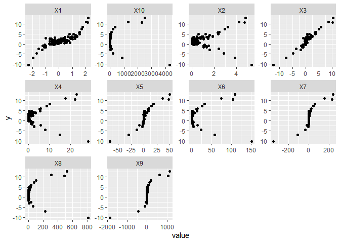
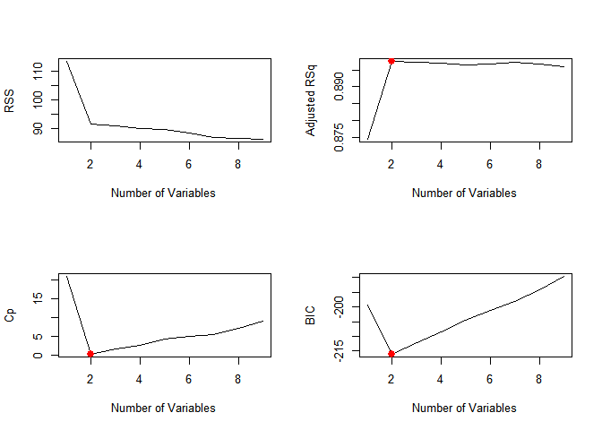
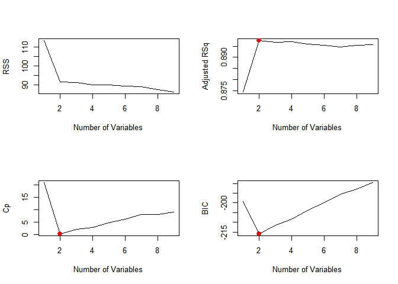
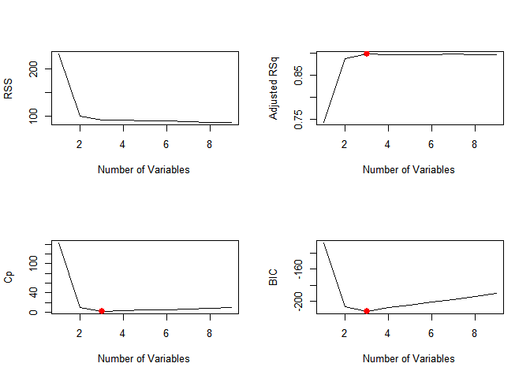

ISLR Ch.6
================

This is an [R Markdown](http://rmarkdown.rstudio.com) Notebook. When you execute code within the notebook, the results appear beneath the code.

### ex. 1

**We perform best subset, forward stepwise, and backward stepwise selection on a single data set. For each approach, we obtain p+1 models, containing 0, 1, 2,. .., p predictors. Explain your answers:**

**(a) Which of the three models with k predictors has the smallest training RSS?** All three models will have the same training RSS, and it will be the lowest in the model will all the p predictors. Since we are talking about training RSS, it is reduced for every predictor that we add since it can also model part of the noise (this clearly deteriorates the test RSS, but the training RSS is always equal or lower). Since the three models are fit on the same dataset (the complete one) they have also the same coefficients.

**(b) Which of the three models with k predictors has the smallest test RSS?** Since they are trained on the same dataset, the smallest test RSS will be in the best subse model (and in the forward or backward ones only if they suggest the same subset of predictors). Since it explores the whole "predictor space" the best subset is definitely slower but assured to find the best one, while the other rely on certain assumptions to reduce the searched combinations.

**(c) True or False:**

**i. The predictors in the k-variable model identified by forward stepwise are a subset of the predictors in the (k+1)-variable model identified by forward stepwise selection.** True, there is no substition of predictors, only addition

\*ii. The predictors in the k-variable model identified by backward stepwise are a subset of the predictors in the (k + 1)variable model identified by backward stepwise selection.\*\* True, only one of them was eliminated in the last step

**iii. The predictors in the k-variable model identified by backward stepwise are a subset of the predictors in the (k + 1)variable model identified by forward stepwise selection.** No, we can not be sure about it (it may be, it may be not)

**iv. The predictors in the k-variable model identified by forward stepwise are a subset of the predictors in the (k+1)-variable model identified by backward stepwise selection.** No, we can not be sure about it (it may be, it may be not)

**v. The predictors in the k-variable model identified by best subset are a subset of the predictors in the (k + 1)-variable model identified by best subset selection.** No, the combination selected may change if the best subset approach is chosen.

### ex. 2

**For parts (a) through (c), indicate which of i. through iv. is correct. Justify your answer.**

**(a) The lasso, relative to least squares, is:**

**i. More flexible and hence will give improved prediction accuracy when its increase in bias is less than its decrease in variance.**

**ii. More flexible and hence will give improved prediction accuracy when its increase in variance is less than its decrease in bias.**

**iii. Less flexible and hence will give improved prediction accuracy when its increase in bias is less than its decrease in variance.**

**iv. Less flexible and hence will give improved prediction accuracy when its increase in variance is less than its decrease in bias.**

The correct option is (iii). Lasso is less flexible, but selecting the proper level of inflexibility will reduce the variance of the model while adding only a moderate quantity of bias, especially when only a few predictors contain most of the signal to correctly fit the model (and the others are shrunk to zero).

**(b) The ridge regression, relative to least squares, is:** (iii) since Ridge regression is very similar (even if no coefficient is brought to zero), where the formula to minimize in order to fit the regression only differ from |betas| (lasso) to (betas)^2 (in the ridge)

**(c) Non-linear methods, relative to least squares, are:** (i) since they are able to better model complex relationships between prediction and response. They are superior when the linear model has a strong bias and a flexible approach can reduce it, with only a modest increase in variance compared to it

### ex. 3

**Suppose we estimate the regression coefficients in a linear regression model by minimizing \[equation on p.283\] for a particular value of s. For parts (a) through (e), indicate which of i. through v. is correct. Justify your answer.**

**i. Increase initially, and then eventually start decreasing in an inverted U shape**

**ii. Decrease initially, and then eventually start increasing in a U shape**

**iii. Steadily increase**

**iv. Steadily decrease**

**v. Remain constant**

**(a) As we increase s from 0, the training RSS will:** (iii) since in the training set the best possible fit is the one of the standard linear regression. Penalizing the coefficients, shrinking them, will increare progressively the training RSS

**(b) As we increase s from 0, the test RSS will:** (ii) since (unless the best coefficients are exactly zero), the initial decrease in the variance provided by the less flexible model compesates the increase in bias introduced by the lower betas. The reduction continues decreases until a point where the bias is growing more rapidly than the decrease in variance and test RSS starts to grow again

**(c) As we increase s from 0, the variance will:** (iv) as the model decrease its flexibility (and the betas are shrunk toward zero)

**(d) As we increase s from 0, the squared bias will:** (iii) increase as the model inflexibility prevent the model from estimating with more precision.

**(e) As we increase s from 0, the irreducible error will:** (v) since it does not depend on the model

### ex. 4

Same answers as in 5 since the different equation does not modify any of the previous considerations.

### ex. 5

**It is well-known that ridge regression tends to give similar coefficient values to correlated variables, whereas the lasso may give quite different coefficient values to correlated variables. We will now explore this property in a very simple setting. Suppose that n = 2, p = 2, x11 = x12, x21 = x22. Furthermore, suppose that y1+y2 = 0 and x11+x21 = 0 and x12+x22 = 0, so that the estimate for the intercept in a least squares, ridge regression, or lasso model is zero: ˆβ0 = 0.**

``` r
   | p1 | p2 | y
-----------------
 1 | x11| x12| y1
 2 |-x11|-x12|-y1
 
 beta0 = 0
```

**(a) Write out the ridge regression optimization problem in this setting.**

``` r
minimize( (y1 - (b1*x11 + b2*x12))^2 + (-y1 - (b1*(-x11) + b2*(-x12) ))^2 )
  with ( |b1|+|b2| )<s
```

**(b) Argue that in this setting, the ridge coefficient estimates satisfy βˆ1 = ˆβ2.**

``` r
# simplify (plase note i forgot x11=x12)
(y1 - b1*x11 - b2*x12)^2 + ( -y1 + b1*-x11 + b2*-x12 )^2

# rewrite 2nd term
(y1 - b1*x11 - b2*x12)^2 + (-(y1 - b1*-x11 - b2*-x12) )^2 

# we can remove the - in our minim. problem
2(y1 - b1*-x11 - b2*-x12)^2

#which is equivalent to minimize
y1 - b1*-x11 - b2*-x12
# or
y1 + b1*x11 + b2*x12

since x11 = x12, the coefficient should be the same
```

**(c) Write out the lasso optimization problem in this setting.**

``` r
   | p1 | p2 | y
-----------------
 1 | x11| x11| y1
 2 |-x11|-x11|-y1
 
 beta0 = 0
```

``` r
minimize( (y1 - (b1*x11 + b2*x12))^2 + (-y1 - (b1*(-x11) + b2*(-x12) ))^2 )
  with (b1+b2)^2 < s
```

**(d) Argue that in this setting, the lasso coefficients βˆ1 and βˆ2 are not unique—in other words, there are many possible solutions to the optimization problem in (c). Describe these solutions**

``` r
# simplify as in previous (b)
y1 + b1*x11 + b2*x12 with (b1+b2)^2 < s

# so we have two possible solution b1 = b2 and b1 = -b2
```

Help (unsure about conclusions)

### ex. 6

**6. We will now explore (6.12) and (6.13) further.**

**(a) Consider (6.12) with p = 1. For some choice of y1 and λ &gt; 0, plot (6.12) as a function of β1. Your plot should confirm that (6.12) is solved by (6.14).**

``` r
beta <- seq(from = -5, to = 5, by = 0.1)
lambda <- 10

# formula with p=1: (y - beta)^2 + lambda*(beta^2)
# which is: y^2 + y*(-2*beta) + (1 + lambda)*beta^2
a <- rep(1., 401)
b <- -2*beta
c <- (1 + lambda)*beta^2

quad <- function(a, b, c)
{
  a <- as.complex(a)
  answer <- c((-b + sqrt(b^2 - 4 * a * c)) / (2 * a),
              (-b - sqrt(b^2 - 4 * a * c)) / (2 * a))
  if(all(Im(answer) == 0)) answer <- Re(answer)
  if(answer[1] == answer[2]) return(answer[1])
  answer
}
```

``` r
y <- quad(a,b,c)
ggplot() +
  geom_point( aes( x = beta,
                   y = quad(a, b, c)[,1]))
```

**(b) Consider (6.13) with p = 1. For some choice of y1 and λ &gt; 0, plot (6.13) as a function of β1. Your plot should confirm that (6.13) is solved by (6.15)**

Help on the simulation part to prove solution

### ex. 7

Help

### ex. 8

**In this exercise, we will generate simulated data, and will then use this data to perform best subset selection.**

**(a) Use the rnorm() function to generate a predictor X of length n = 100, as well as a noise vector ϵ of length n = 100.**

``` r
set.seed(123)
x <- rnorm( n = 100)
e <- rnorm( n = 100)
```

**(b) Generate a response vector Y of length n = 100 according to the model Y = β0 + β1X + β2X2 + β3X3 + ϵ, where β0, β1, β2, and β3 are constants of your choice.**

``` r
beta0 <- 1.5
beta1 <- 1
beta2 <- 0.05
beta3 <- 0.8

y <- beta0 + beta1*x + beta2*x^2 + beta3*x^3 + e

d <- data.frame(matrix(0, nrow = length(x), ncol = 10))
for (i in 1:length(x)){
  for (j in 1:10) d[i,j] <- x[i]^j
}

d <- add_column(d, y)
d %>%
  gather(-y, key = "var", value = "value") %>% 
  ggplot(aes(x = value,
             y = y)) +
    geom_point() +
    facet_wrap(~ var, scales = "free")
```



**(c) Use the regsubsets() function to perform best subset selection in order to choose the best model containing the predictors X,X2,. ..,X10.**

``` r
regfit_full <- regsubsets(y ∼ ., 
                          data = d,
                          nvmax = 9)
regfit_full_sum <- summary(regfit_full)
```

**What is the best model obtained according to Cp, BIC, and adjusted R2? Show some plots to provide evidence for your answer, and report the coefficients of the best model obtained. Note you will need to use the data.frame() function to create a single data set containing both X and Y.**

``` r
plot_reg <- function(regfit_sum) {
  par(mfrow = c(2, 2))
  
  plot(regfit_sum$rss , 
       xlab = "Number of Variables", 
       ylab = "RSS",
       type = "l")
  
  plot(regfit_sum$adjr2 , 
       xlab = "Number of Variables", 
       ylab = "Adjusted RSq",
       type = "l")
  points(which.max(regfit_sum$adjr2), 
         regfit_sum$adjr2 [which.max(regfit_sum$adjr2)], 
         col = "red",
         cex = 2, 
         pch = 20)
  
  plot(regfit_sum$cp, 
       xlab = "Number of Variables", 
       ylab = "Cp",
       type = "l")
  points(which.min(regfit_sum$cp),
         regfit_sum$cp[which.min(regfit_sum$cp)], 
         col = "red",
         cex = 2, 
         pch = 20)
  
  plot(regfit_sum$bic , 
       xlab = "Number of Variables", 
       ylab = "BIC",
       type = "l")
  points(which.min(regfit_sum$bic), 
         regfit_sum$bic[which.min(regfit_sum$bic)], 
         col = "red",
         cex = 2, 
         pch = 20)
}

plot_reg(regfit_full_sum)
```



The best model selected is the one with two variables.

``` r
coef(regfit_full, 2)
```

    ## (Intercept)          X1          X3 
    ##   1.4368231   0.9173009   0.8176441

**(d) Repeat (c), using forward stepwise selection and also using backwards stepwise selection. How does your answer compare to the results in (c)?**

``` r
# forward
regfit_fwd <- regsubsets(y ∼ ., 
                         data = d,
                         nvmax = 9,
                         method = "forward")
regfit_fwd_sum <- summary(regfit_fwd)
plot_reg(regfit_fwd_sum)
```



``` r
coef(regfit_fwd, 2)
```

    ## (Intercept)          X1          X3 
    ##   1.4368231   0.9173009   0.8176441

``` r
# backward
regfit_bwd <- regsubsets(y ∼ ., 
                         data = d,
                         nvmax = 9,
                         method = "backward")
regfit_bwd_sum <- summary(regfit_bwd)
plot_reg(regfit_bwd_sum)
```



``` r
coef(regfit_fwd, 3)
```

    ## (Intercept)          X1          X2          X3 
    ##  1.47039390  0.92044621 -0.04154309  0.82043630

The best model provided by the forward stepwise selection is the same as the exhaustive one, while the one produced by the backwad is with three variables instea of 2. X1 and X3 are the same of the full model, and X2 is added to them. Clearly, in this last case, even if the X1 and X3 coefficient are very similar,they are not identical.

**(e) Now fit a lasso model to the simulated data, again using X,X2, .. .,X10 as predictors. Use cross-validation to select the optimal value of λ. Create plots of the cross-validation error as a function of λ. Report the resulting coefficient estimates, and discuss the results obtained.**

``` r
# unvalidated model
x <- model.matrix(y ∼ ., d)[, -1] # y is already in y
grid <- 10^seq(from = 10, to = -2, length = 100) 
lasso_mod <- glmnet(x, y, 
                    alpha = 1, 
                    lambda = grid)
```

``` r
#crossvalidated choice of lambda

set.seed(123)
train <- sample(x = 1:nrow(x), 
                size = nrow(x)/2)
test <- (-train) 
y_test <- y[test]

cv_out <- cv.glmnet( x[train , ], 
                     y[train], 
                     alpha = 1)
( best_lambda <- cv_out[["lambda.min"]] )

########
#
# Plot of Error vs lambda missing
#
#######

# MSE associated with best_lambda
lasso_pred <- predict(lasso_mod , 
                      s = best_lambda , 
                      newx = x[test , ])
mean((lasso_pred - y_test)^2)

# Coef
lasso_coef <- predict(lasso_mod , 
                      type = "coefficients", 
                      s= best_lambda)
lasso_coef[1:11,]
```

Best lambda is 0.08, so not very high, but sufficient to shrunk to zero most of the coefficients apart from beta1 and beta3.

**(f) Now generate a response vector Y according to the model Y = β0 + β7X7 + ϵ, and perform best subset selection and the lasso. Discuss the results obtained.**
