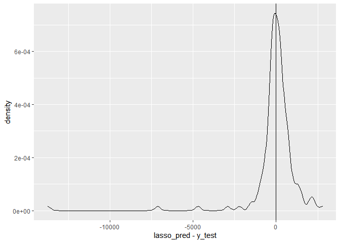

ISLR Ch.6
================

This is an [R Markdown](http://rmarkdown.rstudio.com) Notebook. When you execute code within the notebook, the results appear beneath the code.

### ex. 1

**We perform best subset, forward stepwise, and backward stepwise selection on a single data set. For each approach, we obtain p+1 models, containing 0, 1, 2,. .., p predictors. Explain your answers:**

**(a) Which of the three models with k predictors has the smallest training RSS?** All three models will have the same training RSS, and it will be the lowest in the model will all the p predictors. Since we are talking about training RSS, it is reduced for every predictor that we add since it can also model part of the noise (this clearly deteriorates the test RSS, but the training RSS is always equal or lower). Since the three models are fit on the same dataset (the complete one) they have also the same coefficients.

**(b) Which of the three models with k predictors has the smallest test RSS?** Since they are trained on the same dataset, the smallest test RSS will be in the best subse model (and in the forward or backward ones only if they suggest the same subset of predictors). Since it explores the whole "predictor space" the best subset is definitely slower but assured to find the best one, while the other rely on certain assumptions to reduce the searched combinations.

**(c) True or False:**

**i. The predictors in the k-variable model identified by forward stepwise are a subset of the predictors in the (k+1)-variable model identified by forward stepwise selection.** True, there is no substition of predictors, only addition

\*ii. The predictors in the k-variable model identified by backward stepwise are a subset of the predictors in the (k + 1)variable model identified by backward stepwise selection.\*\* True, only one of them was eliminated in the last step

**iii. The predictors in the k-variable model identified by backward stepwise are a subset of the predictors in the (k + 1)variable model identified by forward stepwise selection.** No, we can not be sure about it (it may be, it may be not)

**iv. The predictors in the k-variable model identified by forward stepwise are a subset of the predictors in the (k+1)-variable model identified by backward stepwise selection.** No, we can not be sure about it (it may be, it may be not)

**v. The predictors in the k-variable model identified by best subset are a subset of the predictors in the (k + 1)-variable model identified by best subset selection.** No, the combination selected may change if the best subset approach is chosen.

### ex. 2

**For parts (a) through (c), indicate which of i. through iv. is correct. Justify your answer.**

**(a) The lasso, relative to least squares, is:**

**i. More flexible and hence will give improved prediction accuracy when its increase in bias is less than its decrease in variance.**

**ii. More flexible and hence will give improved prediction accuracy when its increase in variance is less than its decrease in bias.**

**iii. Less flexible and hence will give improved prediction accuracy when its increase in bias is less than its decrease in variance.**

**iv. Less flexible and hence will give improved prediction accuracy when its increase in variance is less than its decrease in bias.**

The correct option is (iii). Lasso is less flexible, but selecting the proper level of inflexibility will reduce the variance of the model while adding only a moderate quantity of bias, especially when only a few predictors contain most of the signal to correctly fit the model (and the others are shrunk to zero).

**(b) The ridge regression, relative to least squares, is:** (iii) since Ridge regression is very similar (even if no coefficient is brought to zero), where the formula to minimize in order to fit the regression only differ from |betas| (lasso) to (betas)^2 (in the ridge)

**(c) Non-linear methods, relative to least squares, are:** (i) since they are able to better model complex relationships between prediction and response. They are superior when the linear model has a strong bias and a flexible approach can reduce it, with only a modest increase in variance compared to it

### ex. 3

**Suppose we estimate the regression coefficients in a linear regression model by minimizing \[equation on p.283\] for a particular value of s. For parts (a) through (e), indicate which of i. through v. is correct. Justify your answer.**

**i. Increase initially, and then eventually start decreasing in an inverted U shape**

**ii. Decrease initially, and then eventually start increasing in a U shape**

**iii. Steadily increase**

**iv. Steadily decrease**

**v. Remain constant**

**(a) As we increase s from 0, the training RSS will:** (iii) since in the training set the best possible fit is the one of the standard linear regression. Penalizing the coefficients, shrinking them, will increare progressively the training RSS

**(b) As we increase s from 0, the test RSS will:** (ii) since (unless the best coefficients are exactly zero), the initial decrease in the variance provided by the less flexible model compesates the increase in bias introduced by the lower betas. The reduction continues decreases until a point where the bias is growing more rapidly than the decrease in variance and test RSS starts to grow again

**(c) As we increase s from 0, the variance will:** (iv) as the model decrease its flexibility (and the betas are shrunk toward zero)

**(d) As we increase s from 0, the squared bias will:** (iii) increase as the model inflexibility prevent the model from estimating with more precision.

**(e) As we increase s from 0, the irreducible error will:** (v) since it does not depend on the model

### ex. 4

Same answers as in 5 since the different equation does not modify any of the previous considerations.

### ex. 5

**It is well-known that ridge regression tends to give similar coefficient values to correlated variables, whereas the lasso may give quite different coefficient values to correlated variables. We will now explore this property in a very simple setting. Suppose that n = 2, p = 2, x11 = x12, x21 = x22. Furthermore, suppose that y1+y2 = 0 and x11+x21 = 0 and x12+x22 = 0, so that the estimate for the intercept in a least squares, ridge regression, or lasso model is zero: ˆβ0 = 0.**

``` r
   | p1 | p2 | y
-----------------
 1 | x11| x12| y1
 2 |-x11|-x12|-y1
 
 beta0 = 0
```

**(a) Write out the ridge regression optimization problem in this setting.**

``` r
minimize( (y1 - (b1*x11 + b2*x12))^2 + (-y1 - (b1*(-x11) + b2*(-x12) ))^2 )
  with ( |b1|+|b2| )<s
```

**(b) Argue that in this setting, the ridge coefficient estimates satisfy βˆ1 = ˆβ2.**

``` r
# simplify (plase note i forgot x11=x12)
(y1 - b1*x11 - b2*x12)^2 + ( -y1 + b1*-x11 + b2*-x12 )^2

# rewrite 2nd term
(y1 - b1*x11 - b2*x12)^2 + (-(y1 - b1*-x11 - b2*-x12) )^2 

# we can remove the - in our minim. problem
2(y1 - b1*-x11 - b2*-x12)^2

#which is equivalent to minimize
y1 - b1*-x11 - b2*-x12
# or
y1 + b1*x11 + b2*x12

since x11 = x12, the coefficient should be the same
```

**(c) Write out the lasso optimization problem in this setting.**

``` r
   | p1 | p2 | y
-----------------
 1 | x11| x11| y1
 2 |-x11|-x11|-y1
 
 beta0 = 0
```

``` r
minimize( (y1 - (b1*x11 + b2*x12))^2 + (-y1 - (b1*(-x11) + b2*(-x12) ))^2 )
  with (b1+b2)^2 < s
```

**(d) Argue that in this setting, the lasso coefficients βˆ1 and βˆ2 are not unique—in other words, there are many possible solutions to the optimization problem in (c). Describe these solutions**

``` r
# simplify as in previous (b)
y1 + b1*x11 + b2*x12 with (b1+b2)^2 < s

# so we have two possible solution b1 = b2 and b1 = -b2
```

Help (unsure about conclusions)

### ex. 6

**6. We will now explore (6.12) and (6.13) further.**

**(a) Consider (6.12) with p = 1. For some choice of y1 and λ &gt; 0, plot (6.12) as a function of β1. Your plot should confirm that (6.12) is solved by (6.14).**

``` r
beta <- seq(from = -5, to = 5, by = 0.1)
lambda <- 10

# formula with p=1: (y - beta)^2 + lambda*(beta^2)
# which is: y^2 + y*(-2*beta) + (1 + lambda)*beta^2
a <- rep(1., 401)
b <- -2*beta
c <- (1 + lambda)*beta^2

quad <- function(a, b, c)
{
  a <- as.complex(a)
  answer <- c((-b + sqrt(b^2 - 4 * a * c)) / (2 * a),
              (-b - sqrt(b^2 - 4 * a * c)) / (2 * a))
  if(all(Im(answer) == 0)) answer <- Re(answer)
  if(answer[1] == answer[2]) return(answer[1])
  answer
}
```

``` r
y <- quad(a,b,c)
ggplot() +
  geom_point( aes( x = beta,
                   y = quad(a, b, c)[,1]))
```

**(b) Consider (6.13) with p = 1. For some choice of y1 and λ &gt; 0, plot (6.13) as a function of β1. Your plot should confirm that (6.13) is solved by (6.15)**

Help on the simulation part to prove solution

### ex. 7

Help

### ex. 8

**In this exercise, we will generate simulated data, and will then use this data to perform best subset selection.**

**(a) Use the rnorm() function to generate a predictor X of length n = 100, as well as a noise vector ϵ of length n = 100.**

``` r
set.seed(123)
x <- rnorm( n = 100)
e <- rnorm( n = 100)
```

**(b) Generate a response vector Y of length n = 100 according to the model Y = β0 + β1X + β2X2 + β3X3 + ϵ, where β0, β1, β2, and β3 are constants of your choice.**

``` r
beta0 <- 1.5
beta1 <- 1
beta2 <- 0.05
beta3 <- 0.8

y <- beta0 + beta1*x + beta2*x^2 + beta3*x^3 + e

d <- data.frame(matrix(0, nrow = length(x), ncol = 10))
for (i in 1:length(x)){
  for (j in 1:10) d[i,j] <- x[i]^j
}

d <- add_column(d, y)
d %>%
  gather(-y, key = "var", value = "value") %>% 
  ggplot(aes(x = value,
             y = y)) +
    geom_point() +
    facet_wrap(~ var, scales = "free")
```


**(c) Use the regsubsets() function to perform best subset selection in order to choose the best model containing the predictors X,X2,. ..,X10.**

``` r
regfit_full <- regsubsets(y ∼ ., 
                          data = d,
                          nvmax = 9)
regfit_full_sum <- summary(regfit_full)
```

**What is the best model obtained according to Cp, BIC, and adjusted R2? Show some plots to provide evidence for your answer, and report the coefficients of the best model obtained. Note you will need to use the data.frame() function to create a single data set containing both X and Y.**

``` r
plot_reg <- function(regfit_sum) {
  par(mfrow = c(2, 2))
  
  plot(regfit_sum$rss , 
       xlab = "Number of Variables", 
       ylab = "RSS",
       type = "l")
  
  plot(regfit_sum$adjr2 , 
       xlab = "Number of Variables", 
       ylab = "Adjusted RSq",
       type = "l")
  points(which.max(regfit_sum$adjr2), 
         regfit_sum$adjr2 [which.max(regfit_sum$adjr2)], 
         col = "red",
         cex = 2, 
         pch = 20)
  
  plot(regfit_sum$cp, 
       xlab = "Number of Variables", 
       ylab = "Cp",
       type = "l")
  points(which.min(regfit_sum$cp),
         regfit_sum$cp[which.min(regfit_sum$cp)], 
         col = "red",
         cex = 2, 
         pch = 20)
  
  plot(regfit_sum$bic , 
       xlab = "Number of Variables", 
       ylab = "BIC",
       type = "l")
  points(which.min(regfit_sum$bic), 
         regfit_sum$bic[which.min(regfit_sum$bic)], 
         col = "red",
         cex = 2, 
         pch = 20)
}

plot_reg(regfit_full_sum)
```


The best model selected is the one with two variables.

``` r
coef(regfit_full, 2)
```

    ## (Intercept)          X1          X3 
    ##   1.4368231   0.9173009   0.8176441

**(d) Repeat (c), using forward stepwise selection and also using backwards stepwise selection. How does your answer compare to the results in (c)?**

``` r
# forward
regfit_fwd <- regsubsets(y ∼ ., 
                         data = d,
                         nvmax = 9,
                         method = "forward")
regfit_fwd_sum <- summary(regfit_fwd)
plot_reg(regfit_fwd_sum)
```


``` r
coef(regfit_fwd, 2)
```

    ## (Intercept)          X1          X3 
    ##   1.4368231   0.9173009   0.8176441

``` r
# backward
regfit_bwd <- regsubsets(y ∼ ., 
                         data = d,
                         nvmax = 9,
                         method = "backward")
regfit_bwd_sum <- summary(regfit_bwd)
plot_reg(regfit_bwd_sum)
```


``` r
coef(regfit_fwd, 3)
```

    ## (Intercept)          X1          X2          X3 
    ##  1.47039390  0.92044621 -0.04154309  0.82043630

The best model provided by the forward stepwise selection is the same as the exhaustive one, while the one produced by the backwad is with three variables instea of 2. X1 and X3 are the same of the full model, and X2 is added to them. Clearly, in this last case, even if the X1 and X3 coefficient are very similar,they are not identical.

**(e) Now fit a lasso model to the simulated data, again using X,X2, .. .,X10 as predictors. Use cross-validation to select the optimal value of λ. Create plots of the cross-validation error as a function of λ. Report the resulting coefficient estimates, and discuss the results obtained.**

``` r
# unvalidated model
x <- model.matrix(y ∼ ., d)[, -1] # y is already in y
grid <- 10^seq(from = 10, to = -2, length = 100) 
lasso_mod <- glmnet(x, y, 
                    alpha = 1, 
                    lambda = grid)
```

``` r
#crossvalidated choice of lambda

set.seed(123)
train <- sample(x = 1:dim(x)[1], 
                size = dim(x)[1]/2)
test <- (-train) 
y_test <- y[test]

cv_out <- cv.glmnet( x[train , ], 
                     y[train], 
                     alpha = 1)
( best_lambda <- cv_out[["lambda.min"]] )
```

    ## [1] 0.008677741

``` r
ggplot() +
  geom_pointrange( aes( x = cv_out[["lambda"]],
                        y = cv_out[["cvm"]],
                        ymin = cv_out[["cvlo"]],
                        ymax = cv_out[["cvup"]] )) +
  scale_x_log10() +
  scale_y_log10()
```


``` r
# MSE associated with best_lambda
lasso_pred <- predict(lasso_mod , 
                      s = best_lambda , 
                      newx = x[test , ])
mean((lasso_pred - y_test)^2)
```

    ## [1] 0.951781

``` r
# Coef
lasso_coef <- predict(lasso_mod , 
                      type = "coefficients", 
                      s= best_lambda)
lasso_coef[1:11,]
```

    ##   (Intercept)            X1            X2            X3            X4 
    ##  1.502332e+00  9.130216e-01 -1.145606e-01  8.235765e-01  0.000000e+00 
    ##            X5            X6            X7            X8            X9 
    ##  0.000000e+00  0.000000e+00  0.000000e+00  6.487255e-04  0.000000e+00 
    ##           X10 
    ##  8.417303e-05

Best lambda is 0.008, so not very high, but sufficient to shrunk to zero most of the coefficients apart from beta1 and beta3.

**(f) Now generate a response vector Y according to the model Y = β0 + β7X7 + ϵ, and perform best subset selection and the lasso. Discuss the results obtained.**

``` r
beta7 <- 1.5
set.seed(123)
x <- rnorm( n = 100)
y2 <- beta0 + beta7*x^7 + e
d <- d %>% mutate( y = y2)

ggplot(d) + geom_point( aes( x = x,
                             y = y))
```


``` r
regfit_full <- regsubsets(y ∼ ., 
                          data = d,
                          nvmax = 9)
regfit_full_sum <- summary(regfit_full)
plot_reg(regfit_full_sum)
```


``` r
coef(regfit_full, 1)
```

    ## (Intercept)          X7 
    ##    1.393251    1.499704

``` r
x <- model.matrix(y ∼ ., d)[, -1] # y is already in y
grid <- 10^seq(from = 10, to = -2, length = 100) 
lasso_mod <- glmnet(x, y2, 
                    alpha = 1, 
                    lambda = grid)
#crossvalidated choice of lambda

set.seed(123)
train <- sample(x = 1:dim(x)[1], 
                size = dim(x)[1]/2)
test <- (-train) 
y_test <- y2[test]

cv_out <- cv.glmnet( x[train , ], 
                     y2[train], 
                     alpha = 1)
( best_lambda <- cv_out[["lambda.min"]] )
```

    ## [1] 2.721207

``` r
ggplot() +
  geom_pointrange( aes( x = cv_out[["lambda"]],
                        y = cv_out[["cvm"]],
                        ymin = cv_out[["cvlo"]],
                        ymax = cv_out[["cvup"]] )) +
  scale_x_log10() +
  scale_y_log10()
```


``` r
# MSE associated with best_lambda
lasso_pred <- predict(lasso_mod , 
                      s = best_lambda , 
                      newx = x[test , ])
mean((lasso_pred - y_test)^2)
```

    ## [1] 4.714608

``` r
# Coef
lasso_coef <- predict(lasso_mod , 
                      type = "coefficients", 
                      s=best_lambda)
lasso_coef[1:11,]
```

    ## (Intercept)          X1          X2          X3          X4          X5 
    ##    1.533337    0.000000    0.000000    0.000000    0.000000    0.000000 
    ##          X6          X7          X8          X9         X10 
    ##    0.000000    1.447825    0.000000    0.000000    0.000000

The best subset selection gave a bizarre result, failing to identify the correct variable, while the lasso shrunk to zero all coefficients apart from the correct beta.

### ex. 9

**In this exercise, we will predict the number of applications received using the other variables in the College data set.**

**(a) Split the data set into a training set and a test set. (b) Fit a linear model using least squares on the training set, and report the test error obtained.**

``` r
set.seed(123)

college <- College
train <- sample( x = 1:dim(college)[1], 
                 size = 0.8*dim(college)[1])
test <- (-train) 
y_test <- college[test, "Apps"]

lm_fit <- lm( Apps ~ .,
              data = college,
              subset = train)
# summary(lm_fit)
y_pred <- predict(lm_fit,
                  interval = "prediction",
                  newdata = college[test,])

errors <- c(lm = mean((y_test - y_pred)^2))
errors["lm"]
```

    ##      lm 
    ## 4610377

**(c) Fit a ridge regression model on the training set, with λ chosen by cross-validation. Report the test error obtained.**

``` r
x <- model.matrix(Apps ∼ .,
                  data = college)[, -1]
grid <- 10^seq(from = 10, to = -2, length = 100) 
ridge_mod <- glmnet(x[train,], 
                    college[train, "Apps"], 
                    alpha = 0, 
                    lambda = grid)

#crossvalidated choice of lambda

cv_out <- cv.glmnet( x[train, ], 
                     college[train, "Apps"], 
                     alpha = 0)
( best_lambda <- cv_out[["lambda.min"]] )
```

    ## [1] 313.5603

``` r
ggplot() +
  geom_pointrange( aes( x = cv_out[["lambda"]],
                        y = cv_out[["cvm"]],
                        ymin = cv_out[["cvlo"]],
                        ymax = cv_out[["cvup"]] )) +
  scale_x_log10() +
  scale_y_log10()
```


``` r
# MSE associated with best_lambda
ridge_pred <- predict(ridge_mod , 
                      s = best_lambda , 
                      newx = x[test, ])
( errors["ridge"] <- mean((ridge_pred - y_test)^2) )
```

    ## [1] 3938403

``` r
# Coef
ridge_coef <- predict(ridge_mod , 
                      type = "coefficients", 
                      s=best_lambda)
ggplot() +
  geom_point( aes(y = ridge_coef@x,
                 x = ridge_coef@Dimnames[[1]])) +
  coord_flip(ylim = c(-2,+2)) +
  ggtitle( "Ridge MSE = ", mean((ridge_pred - y_test)^2) )
```


**(d) Fit a lasso model on the training set, with λ chosen by crossvalidation. Report the test error obtained, along with the number of non-zero coefficient estimates.**

``` r
lasso_mod <- glmnet(x[train,], 
                    college[train, "Apps"], 
                    alpha = 1, 
                    lambda = grid)

#crossvalidated choice of lambda

cv_out <- cv.glmnet( x[train, ], 
                     college[train, "Apps"], 
                     alpha = 1)
( best_lambda <- cv_out[["lambda.min"]] )
```

    ## [1] 11.80534

``` r
ggplot() +
  geom_pointrange( aes( x = cv_out[["lambda"]],
                        y = cv_out[["cvm"]],
                        ymin = cv_out[["cvlo"]],
                        ymax = cv_out[["cvup"]] )) +
  scale_x_log10() +
  scale_y_log10()
```


``` r
# MSE associated with best_lambda
lasso_pred <- predict(lasso_mod , 
                      s = best_lambda , 
                      newx = x[test, ])
( errors["lasso"] <- mean((lasso_pred - y_test)^2) )
```

    ## [1] 2232155

``` r
# Coef
(lasso_coef <- predict(lasso_mod , 
                      type = "coefficients", 
                      s=best_lambda) )
```

    ## 18 x 1 sparse Matrix of class "dgCMatrix"
    ##                        s1
    ## (Intercept) -5.635101e+02
    ## PrivateYes  -5.694126e+02
    ## Accept       1.214179e+00
    ## Enroll       .           
    ## Top10perc    3.670011e+01
    ## Top25perc   -7.221290e+00
    ## F.Undergrad  6.029745e-02
    ## P.Undergrad  .           
    ## Outstate    -4.000401e-02
    ## Room.Board   1.480473e-01
    ## Books        1.038872e-03
    ## Personal     .           
    ## PhD         -4.496929e+00
    ## Terminal    -4.574465e+00
    ## S.F.Ratio    .           
    ## perc.alumni -6.747747e+00
    ## Expend       7.542227e-02
    ## Grad.Rate    8.775119e+00

``` r
ggplot() +
  geom_point( aes(y = lasso_coef@x,
                  x = lasso_coef@i)) +
  coord_flip() +
  ggtitle( "Lasso MSE = ", mean((lasso_pred - y_test)^2) )
```


**(e) Fit a PCR model on the training set, with M chosen by crossvalidation. Report the test error obtained, along with the value of M selected by cross-validation.**

``` r
pcr_fit <- pcr(Apps ~ .,
               data = college,
               subset = train,
               scale = TRUE,
               validation = "CV")
#summary(pcr_fit)
validationplot(pcr_fit , val.type = "MSEP")
```


From the plot, 4 components seem to capture most of the information in the dataset

``` r
pcr_pred <- predict(pcr_fit , x[test , ], ncomp = 4) 
( errors["PCAr"] <- mean((pcr_pred - y_test)^2) )
```

    ## [1] 5760389

**(f) Fit a PLS model on the training set, with M chosen by crossvalidation. Report the test error obtained, along with the value of M selected by cross-validation.**

``` r
pls_fit <- plsr(Apps ~ .,
               data = college,
               subset = train,
               scale = TRUE,
               validation = "CV")
#summary(pls_fit)
validationplot(pls_fit , val.type = "MSEP")
```


After 5 components, it does not seem to be any significant improvement

``` r
pls_pred <- predict(pcr_fit , x[test , ], ncomp = 5) 
( errors["PLSr"] <- mean((pls_pred - y_test)^2) )
```

    ## [1] 5791529

**(g) Comment on the results obtained. How accurately can we predict the number of college applications received? Is there much difference among the test errors resulting from these five approaches?**

``` r
ggplot() +
  geom_col( aes(x = names(errors),
                y = errors)) +
  coord_flip()
```


``` r
ggplot() +
  geom_density( aes(x = lasso_pred - y_test)) +
  geom_vline(xintercept = 0)
```



As we can see, most of the prediction are within 1000 for most of the test dataset. The lasso has a substantial advantage over the the other methods, as we can see from the linear model approach.

### ex. 10

**We have seen that as the number of features used in a model increases, the training error will necessarily decrease, but the test error may not. We will now explore this in a simulated data set.**

**(a) Generate a data set with p = 20 features, n =1,000 observations, and an associated quantitative response vector generated according to the model Y = Xβ + ϵ, where β has some elements that are exactly equal to zero.**

``` r
set.seed(123)
p <- 20
n <- 1000
beta <- runif(p, min = -4, max = 4)
beta[5:12] <- 0

data <- data.frame( matrix( data = rnorm(p*n, sd = 4),
                            nrow = 1000,
                            ncol = p) )

e <- rnorm(1000, sd = 2)
y <- rep(0, times = n)
for( i in 1:n) y[i] <- sum(data[i,] * beta) + e[i]

data["y"] <- y
```

**(b) Split your data set into a training set containing 100 observations and a test set containing 900 observations.**

``` r
train <- sample(x = n, size = 100)
test <- (1:n)[-train]
```

**(c) Perform best subset selection on the training set, and plot the training set MSE associated with the best model of each size.**

``` r
regfit_full <- regsubsets(y ∼ ., 
                          data = data[train,],
                          nvmax = 20)
regfit_full_sum <- summary(regfit_full)

train_mat <- model.matrix(y ∼ ., data = data[train, ])

val_errors_train <- rep(NA, p)
for (i in 1:p) { 
  coefi <- coef(regfit_full , id = i)
  pred <- train_mat[, names(coefi)] %*% coefi
  val_errors_train[i] <- mean((data[train, "y"] - pred)^2) 
}

ggplot() +
  geom_line( aes( x = 1:p,
                  y = val_errors_train))
```


**(d) Plot the test set MSE associated with the best model of each size.**

``` r
test_mat <- model.matrix(y ∼ ., data = data[test, ])

val_errors_test <- rep(NA, p)
for (i in 1:p) { 
  coefi <- coef(regfit_full , id = i)
  pred <- test_mat[, names(coefi)] %*% coefi
  val_errors_test[i] <- mean((data[test, "y"] - pred)^2) 
  }

ggplot() +
  geom_line( aes( x = 1:p,
                  y = val_errors_test)) +
  scale_y_log10()
```


**(e) For which model size does the test set MSE take on its minimum value?**

``` r
which.min(val_errors_test)
```

    ## [1] 12

**Comment on your results. If it takes on its minimum value for a model containing only an intercept or a model containing all of the features, then play around with the way that you are generating the data in (a) until you come up with a scenario in which the test set MSE is minimized for an intermediate model size.** Since the 8 variable with a beta coefficient set to 0 are noise, the model with 12 variables was expected to be the one with the lowest test MSE, whichis slightly increased with &gt;12 variable models.

**(f) How does the model at which the test set MSE is minimized compare to the true model used to generate the data? Comment on the coefficient values.**

``` r
coef(regfit_full,12)
```

    ## (Intercept)          X1          X2          X3          X4         X13 
    ##  -0.2828308  -1.6689506   2.3304298  -0.8542322   3.0362714   1.4888301 
    ##         X14         X15         X16         X17         X18         X19 
    ##   0.5567702  -3.1288740   3.2763534  -1.9658116  -3.6292481  -1.3683916 
    ##         X20 
    ##   3.7802492

``` r
beta[ beta != 0]
```

    ##  [1] -1.6993798  2.3064411 -0.7281846  3.0641392  1.4205651  0.5810672
    ##  [7] -3.1766025  3.1985998 -2.0312981 -3.6635237 -1.3766342  3.6360292

``` r
ggplot() +
  geom_point( aes(x = names(coef(regfit_full,12)),
                  y = coef(regfit_full,12)),
              alpha = 0.8) +
  geom_point(aes(x = 2:13,
                 y = beta[ beta != 0]),
             colour = "blue") +
  coord_flip()
```


As we can see, some of the beta coefficients are near each other (X14), while some others are really far away. For sure, all the coefficients that should be zero are zero even in the regfit model. Probably all this distance in the estimates is because of the very small training set (10%) which prevent the models from reaching a higher accuracy in prediction.

\*\*(g) Create a plot displaying of r,where \[formula on p.287\] for a range of values j is the jth coefficient estimate for the best model containing r coefficients. Comment on what you observe. How does this compare to the test MSE plot from (d)?

``` r
beta_pred <- data.frame( matrix(0, nrow = p, ncol = p))

for (i in 1:p) { 
  coefi <- coef(regfit_full , id = i)[-1]
  for(j in names(coefi)) {
    beta_pred[i, j] <- coefi[[j]]
  }}

beta_true <- data.frame( matrix( rep(beta, times = p), 
                                 nrow = p,
                                 byrow = TRUE))

tbse <- rep(NA, times = p) # total betas squadred error
for (i in 1:p) { 
  for( j in names(beta_pred)) {
    beta_pred[i, j] <- (beta_true[i, j] - beta_pred[i, j])^2
  }
  tbse[i] <- sum( beta_pred[i,] )
  }

### Do not use - different formula
### When bij does not exist, it leaves the difference to 0
###
# tbse <- rep(NA, times = p) # total betas squadred error
# for (i in 1:p) { 
#   for( j in names(beta_pred)) {
#     if( beta_pred[i, j] != 0 ) 
#       beta_pred[i, j] <- (beta_true[i, j] - beta_pred[i, j])^2
#   }
#   tbse[i] <- sum( beta_pred[i,] )
#   }
###

tbse_plot <- ggplot() +
  geom_line( aes( x = 1:p,
                  y = sqrt(tbse)))+
  geom_vline( xintercept = which.min(tbse),
              linetype = "dotted")
mse_plot <- ggplot() +
  geom_line( aes( x = 1:p,
                  y = val_errors_test),
             color = "blue") +
  geom_vline( xintercept = which.min(val_errors_test),
              linetype = "dotted") +
  scale_y_log10()
ggarrange(tbse_plot, mse_plot, nrow = 2)
```


The curves show a similar behaviour, with a minimum in the same point. I expected the total beta squared difference to have a minimum point at the best model point, since it shows the difference between the real and predicted coefficients.

### ex. 11

**We will now try to predict per capita crime rate in the Boston data set.**

``` r
boston <- Boston
p <- ncol(boston) - 1 # number of predictors
set.seed(123)

# train test split
train <- sample( x = 1:dim(boston)[1], 
                 size = 0.8*dim(boston)[1])
test <- (-train) 
y_test <- boston[test, "crim"]

lm_fit <- lm( crim ~ .,
              data = boston,
              subset = train)
lm_coef <- coef(lm_fit)
# summary(lm_fit)
lm_pred <- predict(lm_fit,
                   interval = "prediction",
                   newdata = boston[test,])

errors <- c(lm = mean((y_test - lm_pred[,"fit"])^2))
errors["lm"]
```

    ##       lm 
    ## 19.42308

**(a) Try out some of the regression methods explored in this chapter, such as best subset selection, the lasso, ridge regression, and PCR. Present and discuss results for the approaches that you consider.**

Let's begin with a best subset selection

``` r
regfit_full <- regsubsets(crim ∼ ., 
                          data = boston[train,],
                          nvmax = p)
regfit_full_sum <- summary(regfit_full)

test_mat <- model.matrix(crim ∼ ., data = boston[test, ])

val_errors_test <- rep(NA, p)
for (i in 1:p) { 
  coefi <- coef(regfit_full , id = i)
  pred <- test_mat[, names(coefi)] %*% coefi
  val_errors_test[i] <- mean((y_test - pred)^2) 
  }

ggplot() +
  geom_line( aes( x = 1:p,
                  y = val_errors_test)) +
  geom_vline( xintercept = 7,
              linetype = "dotted")
```


As we can see, the model with 7 predictors, even if not the best (actual minimum is the 11-variable model) is definitely comparable. The variable that are part of the model are...

``` r
# aim: set to 0 the predictor that are not present in bss
bss7_coef <- rep(0, p+1) # a p+1 vector of 0...
names(bss7_coef) <- colnames(test_mat) # with predictor names
coefs <- coef(regfit_full, 7)
bss7_coef[names(coefs)] <- coefs

bss11_coef <- rep(0, p+1) # a p+1 vector of 0...
names(bss11_coef) <- colnames(test_mat) # with predictor names
coefs <- coef(regfit_full, 11)
bss11_coef[names(coefs)] <- coefs
```

Since we have already run our model on the test set, let's extract them and their MSE.

``` r
errors["BSS_7"] <- val_errors_test[7]
errors["BSS_11"] <- val_errors_test[11]
```

The lm\_fit corresponds to the BSS\_12 model, so it won't be included.

Let's proceed with a lasso model selection, with a crossvalidation to select best lambda.

``` r
# unvalidated model
train_mat <- model.matrix(crim ∼ ., boston)[, -1]
lasso_mod <- glmnet(x = train_mat[train,], 
                    y = boston[train,"crim"], 
                    alpha = 1)

#crossvalidated choice of lambda

set.seed(123)
cv_out <- cv.glmnet(x = train_mat[train,], 
                    y = boston[train,"crim"], 
                    alpha = 1)
( best_lambda <- cv_out[["lambda.min"]] )
```

    ## [1] 0.06477899

``` r
ggplot() +
  geom_pointrange( aes( x = cv_out[["lambda"]],
                        y = cv_out[["cvm"]],
                        ymin = cv_out[["cvlo"]],
                        ymax = cv_out[["cvup"]] )) +
  scale_x_log10()
```


Now that we have our best lambda, we proceed to obtain the MSE

``` r
# MSE associated with best_lambda
lasso_pred <- predict(lasso_mod , 
                      s = best_lambda , 
                      newx = test_mat[,-1])
( errors["lasso"] <- mean((lasso_pred - y_test)^2) )
```

    ## [1] 18.91109

``` r
# Coef
(lasso_coef <- predict(lasso_mod , 
                      type = "coefficients", 
                      s= best_lambda) )
```

    ## 13 x 1 sparse Matrix of class "dgCMatrix"
    ##                      s1
    ## (Intercept)  9.15477580
    ## zn           0.03795171
    ## indus       -0.04287844
    ## chas        -0.46079076
    ## nox         -7.35000865
    ## rm           0.55337885
    ## age          .         
    ## dis         -0.77616689
    ## rad          0.56977931
    ## tax          .         
    ## ptratio     -0.25670505
    ## lstat        0.13908193
    ## medv        -0.18793498

As we can see, some of the coefficients are zero, as it is expected in the lasso.

But now move onto the ridge regression, which instead of bringing some of the coefs to zero, shrink nearly all of them of a similar amount.

``` r
ridge_mod <- glmnet(x = train_mat[train,], 
                    y = boston[train,"crim"], 
                    alpha = 0)

#crossvalidated choice of lambda

cv_out <- cv.glmnet(x = train_mat[train,], 
                    y = boston[train,"crim"], 
                    alpha = 0)
( best_lambda <- cv_out[["lambda.min"]] )
```

    ## [1] 0.5634146

``` r
ggplot() +
  geom_pointrange( aes( x = cv_out[["lambda"]],
                        y = cv_out[["cvm"]],
                        ymin = cv_out[["cvlo"]],
                        ymax = cv_out[["cvup"]] )) +
  scale_x_log10()
```


``` r
# MSE associated with best_lambda
ridge_pred <- predict(ridge_mod , 
                      s = best_lambda , 
                      newx = test_mat[,-1])
( errors["ridge"] <- mean((ridge_pred - y_test)^2) )
```

    ## [1] 18.46211

``` r
# Coef
(ridge_coef <- predict(ridge_mod , 
                      type = "coefficients", 
                      s= best_lambda) )
```

    ## 13 x 1 sparse Matrix of class "dgCMatrix"
    ##                       s1
    ## (Intercept)  5.489050980
    ## zn           0.036143866
    ## indus       -0.064292743
    ## chas        -0.687250291
    ## nox         -5.756989902
    ## rm           0.657507424
    ## age          0.001269565
    ## dis         -0.732692795
    ## rad          0.481371327
    ## tax          0.003329842
    ## ptratio     -0.205899093
    ## lstat        0.162685786
    ## medv        -0.170289862

Finally, a PCA regression is tried to see if there is any good principal component that captures data variability.

``` r
pcr_fit <- pcr(crim ~ .,
               data = boston,
               subset = train,
               scale = TRUE,
               validation = "CV")
#summary(pcr_fit)
validationplot(pcr_fit , val.type = "MSEP")
```


``` r
pcr_pred_3 <- predict(pcr_fit , test_mat[,-1], ncomp = 3) 
( errors["PCAr_3"] <- mean((pcr_pred_3 - y_test)^2) )
```

    ## [1] 20.96067

No clear point can be identified, since MSEP gradually decreases. Both PCA\_3comp will be collected.

Please note that the 3-component PCA can be also used to print the test dataset "all at once"

``` r
pcr_fit <- pcr(crim ~ .,
               data = boston,
               subset = test,
               scale = TRUE,
               ncomp = 3)

plot_ly(x = pcr_fit$scores[,1], 
        y = pcr_fit$scores[,2], 
        z = pcr_fit$scores[,3], 
        type = "scatter3d", 
        mode = "markers",
        color = log(y_test))
```

<!--html_preserve-->

<script type="application/json" data-for="htmlwidget-58b146668be84f829ee2">{"x":{"visdat":{"15dbd0694f5701":["function () ","plotlyVisDat"]},"cur_data":"15dbd0694f5701","attrs":{"15dbd0694f5701":{"x":[-2.08911657583864,-0.16953383578232,-1.1008787417979,-0.452246886399323,0.332914704405072,-0.63117731419558,-1.10641771229218,-2.44598803601022,-1.59714172215828,-1.46614434359431,0.188605401217216,-4.87280448607696,-4.71875537813979,-1.7706871498024,-0.869338464353428,-3.39282748217563,-2.15510029196022,-2.04902036969018,-0.722793196740773,-1.4439969750699,-0.747183230179806,-3.10795055446504,-0.318574726101233,0.195454851916368,1.18344534664847,1.73401887215167,0.964391703112585,1.55077551114224,1.37015285804674,2.39754841242783,3.24672565763502,2.65358479825198,2.6538468900071,2.31684632267359,2.17916030616272,0.923262217867446,-0.906568850258997,-2.29951372904542,-2.16152609060255,-3.06524585974119,-2.78189126366835,-4.58300830802969,-3.57117345070032,-4.98419038442971,-1.05633615745292,-1.16187934383645,-0.762642224653404,-0.760550433102918,-2.30175114076759,-0.978932589071417,-1.1149865812967,-2.2879516135935,-2.6892474977253,-1.55545412666011,-1.3234151609792,-1.00334641035081,-2.93874916134595,-2.85070989433023,-3.55293549562047,-4.58278070594445,-1.43084186785498,-1.02210185332927,-3.20903220955247,-0.0951784954481055,0.0476547342321528,-1.2323665963734,-1.1588562514838,-1.65242720024142,-1.73412884409124,1.53671720204574,2.992552858788,1.08334841234754,3.73656979608031,4.25563632833969,2.67933845445574,3.28247193874295,3.58894229416049,2.39580352114847,2.83269394539313,3.7442950789549,2.92371307995129,2.77745661236207,3.08762901636342,2.0595356678089,3.2459650695693,3.8392165465535,3.12415874971204,3.117387834143,2.88485495713958,2.60543959085131,2.86356129644394,3.08180600315801,1.97165206239462,2.54516813021393,2.16700460656381,1.41679952090689,3.04319570901851,1.61815287254995,-0.0638715386951131,0.00976638989714706,-0.219942722463336,-0.128010608391246],"y":[-0.0190874270850799,0.719025819383822,0.836899433042598,1.40010495446423,1.14929110896326,0.921592833429277,0.958515016993892,1.04200312401161,1.54556002684894,1.59136194851354,2.4757456968302,-0.099319640537395,0.107729117253961,1.24825236507964,1.2740380722174,0.163206007268374,1.33052216017725,0.766424953803861,0.749629604379112,0.710522916858452,0.510339253811454,-1.63115220829352,-0.471291403209527,0.729951027879476,0.774005681120748,1.24180484062479,0.612091767269285,-0.0522043313879021,-0.27516392863125,0.859808228825949,1.92034985875429,0.845136400424498,1.09027852706114,0.608235484994485,0.781298921844047,0.438233177052586,0.52879018710695,-0.836992151332483,-1.6194097565607,-1.99682294155229,-0.484027282616037,-0.157014925144768,0.816898773607612,-1.1095713678529,0.53361522861838,0.575339093252521,-3.09164792070414,0.471801057742291,-2.46067620644411,-2.55934876638289,1.86171008585907,1.09767125406619,0.739578594834917,-1.72860927089434,-1.31489430013022,0.550787074759155,-2.74195242836991,-0.412258280281994,-1.8028899781395,0.128107571733506,1.06194978248512,1.49683518174476,-0.366901751775705,1.779228530276,0.502617834787909,0.382015236043703,1.23561819235689,0.656156224366206,1.51349853618684,-5.6213632639904,-0.0254204095033853,-5.36728696828268,0.319750352787334,1.28359744813126,-0.60384950946369,-0.490629350133511,0.492515679959175,-1.44109190946867,-0.778071635302245,0.753712833261435,-0.904800217736959,-0.332494113501237,-0.0465641018861261,-0.657696904669059,-0.480045661367966,0.0681628152944762,-0.727055178342651,-0.437552974704744,-0.81831875531367,-1.55688607382158,-0.599879748785686,-0.0776101167814796,-0.0455257178745783,-0.289058812138109,-0.419348026808945,-1.64515460520483,-0.00850502552793736,-0.233014410251378,0.482095873311725,1.02943726208711,-0.608003046737862,-0.316986228916727],"z":[1.03703260110699,-0.127925153947334,-0.771136187117997,-0.498167861880877,-0.0131786328919985,0.205943080101322,-0.158698600470395,-0.477744240281062,-0.0506112060071681,0.00889644599474671,0.796694644718962,-1.80516441490197,-1.03500630273225,-1.26206670603164,-0.664991658031125,-0.78537435680298,-1.20516016948908,-1.00853223943347,-0.429160044200317,0.279832484498879,0.342504157132737,0.328222961291557,-0.02307580673113,0.449493401694492,1.55230233263156,1.70131310187741,1.47989151035141,0.364886312546436,0.384615827111508,0.551816822112857,0.865172657221139,2.86157255929609,2.83770660825806,2.69622939529696,2.54782632785641,1.86370188813763,1.02559044895435,0.954442539190126,1.30739890529524,0.962045505172978,0.0715273852810267,-1.88446439491378,-0.508121294914153,-0.652469335642531,0.149485878327556,0.0959998372764662,0.849682439899079,0.526724971171885,0.566002015390458,0.460805794515924,-0.968172638161341,-1.48815914469795,-1.69173014020188,2.68881446524047,2.57382324467947,2.16318474389776,2.19357047914861,-0.172560318005096,1.01522504552927,-0.876270764129245,0.284885981540472,0.394512047124641,-0.586280318407831,0.379690484290529,0.933691371456064,-0.261257056152191,-0.426997275623475,0.214146919639868,-0.956997440098018,-1.00527330035297,-0.547129869213828,-0.475128542551625,-0.43871586974439,-0.493134184111647,-0.722489484477479,-0.577846888726983,-0.653499312806271,-0.566998707453488,-0.690556858030276,-0.619660046614387,-0.581622805915914,-0.998109532736314,-0.909943917957284,-1.28628271360357,-0.693970732990546,-0.46962738930917,-0.530730821682207,-0.660467050447291,-0.788018337397433,-0.709010482206321,-0.851303342746876,-0.844081393517229,-1.49472561055994,-1.00052268298909,-1.20975086395734,-1.20740105839705,-0.862699503757703,-1.64359925521851,0.15247466702158,-0.0348975243802878,0.651880036531341,0.585411459938932],"mode":"markers","color":[-5.06403607082337,-0.449479693527584,0.0525260342514466,-0.219761775967802,-0.0452379806501943,-2.32851847502055,-2.52398017377414,-1.83658948514585,-1.7636385935114,-1.66940025360678,-1.37093295400719,-4.33437998120653,-4.24609811744964,-2.27031153244375,-1.76194827165643,-3.93682812434712,-2.84921062089122,-2.42746827514074,-2.87422285615679,-2.63791797892183,-3.1479514865315,-2.50262265559378,-1.90609345968499,-1.9326780802866,-2.37526331849203,-1.89458985503226,-1.7777382278658,0.176420848472986,-0.527547999910379,-1.38709468129066,0.487745310721893,1.41035262621296,0.846293070040128,1.00575476530812,0.894732003534746,0.188485851761799,-2.47135883724273,-2.8507665033038,-2.7199203736727,-2.88204650915017,-2.54147700127639,-4.02968104889638,-3.36824628152247,-3.82722240373568,-1.47102470528047,-1.61938724328777,-1.02697092752823,-0.621757184473272,-0.552881017499318,-0.652811704370542,-1.65375559308523,-1.07930978641361,-1.96397229187372,-0.410211353733397,-0.192056790782112,-0.272307535345581,-0.547593347958205,-2.34299050762908,-3.33036620090156,-4.70388615892725,-2.50115799037405,-1.95878264527799,-2.30258509299405,0.969065328591483,-1.3405946818689,-1.70600388041043,-3.37348494309562,-3.68967977428471,-3.46958329452862,1.24538726330446,1.30750815538373,1.73518559039658,2.07850109960278,3.11782157946064,1.66639463926993,2.2613161235954,3.2109121992087,2.66988439800228,2.64267221660273,3.25580930892149,2.4058093284293,3.62864897336371,1.99702549904027,1.86315722444043,2.66867160882001,2.71979430172596,2.27461556718342,2.23313747526855,1.90474881125035,2.1099816583913,1.55864344098212,1.54090850495968,1.15171061966313,1.32839508467371,1.46989764548713,1.53619817863696,1.85522241213869,1.57601969221081,-1.27450257051646,-1.72042534062373,-2.80082360125456,-2.21100914950684],"alpha_stroke":1,"sizes":[10,100],"spans":[1,20],"type":"scatter3d"}},"layout":{"margin":{"b":40,"l":60,"t":25,"r":10},"scene":{"xaxis":{"title":[]},"yaxis":{"title":[]},"zaxis":{"title":[]}},"hovermode":"closest","showlegend":false,"legend":{"yanchor":"top","y":0.5}},"source":"A","config":{"modeBarButtonsToAdd":["hoverclosest","hovercompare"],"showSendToCloud":false},"data":[{"x":[-2.08911657583864,-0.16953383578232,-1.1008787417979,-0.452246886399323,0.332914704405072,-0.63117731419558,-1.10641771229218,-2.44598803601022,-1.59714172215828,-1.46614434359431,0.188605401217216,-4.87280448607696,-4.71875537813979,-1.7706871498024,-0.869338464353428,-3.39282748217563,-2.15510029196022,-2.04902036969018,-0.722793196740773,-1.4439969750699,-0.747183230179806,-3.10795055446504,-0.318574726101233,0.195454851916368,1.18344534664847,1.73401887215167,0.964391703112585,1.55077551114224,1.37015285804674,2.39754841242783,3.24672565763502,2.65358479825198,2.6538468900071,2.31684632267359,2.17916030616272,0.923262217867446,-0.906568850258997,-2.29951372904542,-2.16152609060255,-3.06524585974119,-2.78189126366835,-4.58300830802969,-3.57117345070032,-4.98419038442971,-1.05633615745292,-1.16187934383645,-0.762642224653404,-0.760550433102918,-2.30175114076759,-0.978932589071417,-1.1149865812967,-2.2879516135935,-2.6892474977253,-1.55545412666011,-1.3234151609792,-1.00334641035081,-2.93874916134595,-2.85070989433023,-3.55293549562047,-4.58278070594445,-1.43084186785498,-1.02210185332927,-3.20903220955247,-0.0951784954481055,0.0476547342321528,-1.2323665963734,-1.1588562514838,-1.65242720024142,-1.73412884409124,1.53671720204574,2.992552858788,1.08334841234754,3.73656979608031,4.25563632833969,2.67933845445574,3.28247193874295,3.58894229416049,2.39580352114847,2.83269394539313,3.7442950789549,2.92371307995129,2.77745661236207,3.08762901636342,2.0595356678089,3.2459650695693,3.8392165465535,3.12415874971204,3.117387834143,2.88485495713958,2.60543959085131,2.86356129644394,3.08180600315801,1.97165206239462,2.54516813021393,2.16700460656381,1.41679952090689,3.04319570901851,1.61815287254995,-0.0638715386951131,0.00976638989714706,-0.219942722463336,-0.128010608391246],"y":[-0.0190874270850799,0.719025819383822,0.836899433042598,1.40010495446423,1.14929110896326,0.921592833429277,0.958515016993892,1.04200312401161,1.54556002684894,1.59136194851354,2.4757456968302,-0.099319640537395,0.107729117253961,1.24825236507964,1.2740380722174,0.163206007268374,1.33052216017725,0.766424953803861,0.749629604379112,0.710522916858452,0.510339253811454,-1.63115220829352,-0.471291403209527,0.729951027879476,0.774005681120748,1.24180484062479,0.612091767269285,-0.0522043313879021,-0.27516392863125,0.859808228825949,1.92034985875429,0.845136400424498,1.09027852706114,0.608235484994485,0.781298921844047,0.438233177052586,0.52879018710695,-0.836992151332483,-1.6194097565607,-1.99682294155229,-0.484027282616037,-0.157014925144768,0.816898773607612,-1.1095713678529,0.53361522861838,0.575339093252521,-3.09164792070414,0.471801057742291,-2.46067620644411,-2.55934876638289,1.86171008585907,1.09767125406619,0.739578594834917,-1.72860927089434,-1.31489430013022,0.550787074759155,-2.74195242836991,-0.412258280281994,-1.8028899781395,0.128107571733506,1.06194978248512,1.49683518174476,-0.366901751775705,1.779228530276,0.502617834787909,0.382015236043703,1.23561819235689,0.656156224366206,1.51349853618684,-5.6213632639904,-0.0254204095033853,-5.36728696828268,0.319750352787334,1.28359744813126,-0.60384950946369,-0.490629350133511,0.492515679959175,-1.44109190946867,-0.778071635302245,0.753712833261435,-0.904800217736959,-0.332494113501237,-0.0465641018861261,-0.657696904669059,-0.480045661367966,0.0681628152944762,-0.727055178342651,-0.437552974704744,-0.81831875531367,-1.55688607382158,-0.599879748785686,-0.0776101167814796,-0.0455257178745783,-0.289058812138109,-0.419348026808945,-1.64515460520483,-0.00850502552793736,-0.233014410251378,0.482095873311725,1.02943726208711,-0.608003046737862,-0.316986228916727],"z":[1.03703260110699,-0.127925153947334,-0.771136187117997,-0.498167861880877,-0.0131786328919985,0.205943080101322,-0.158698600470395,-0.477744240281062,-0.0506112060071681,0.00889644599474671,0.796694644718962,-1.80516441490197,-1.03500630273225,-1.26206670603164,-0.664991658031125,-0.78537435680298,-1.20516016948908,-1.00853223943347,-0.429160044200317,0.279832484498879,0.342504157132737,0.328222961291557,-0.02307580673113,0.449493401694492,1.55230233263156,1.70131310187741,1.47989151035141,0.364886312546436,0.384615827111508,0.551816822112857,0.865172657221139,2.86157255929609,2.83770660825806,2.69622939529696,2.54782632785641,1.86370188813763,1.02559044895435,0.954442539190126,1.30739890529524,0.962045505172978,0.0715273852810267,-1.88446439491378,-0.508121294914153,-0.652469335642531,0.149485878327556,0.0959998372764662,0.849682439899079,0.526724971171885,0.566002015390458,0.460805794515924,-0.968172638161341,-1.48815914469795,-1.69173014020188,2.68881446524047,2.57382324467947,2.16318474389776,2.19357047914861,-0.172560318005096,1.01522504552927,-0.876270764129245,0.284885981540472,0.394512047124641,-0.586280318407831,0.379690484290529,0.933691371456064,-0.261257056152191,-0.426997275623475,0.214146919639868,-0.956997440098018,-1.00527330035297,-0.547129869213828,-0.475128542551625,-0.43871586974439,-0.493134184111647,-0.722489484477479,-0.577846888726983,-0.653499312806271,-0.566998707453488,-0.690556858030276,-0.619660046614387,-0.581622805915914,-0.998109532736314,-0.909943917957284,-1.28628271360357,-0.693970732990546,-0.46962738930917,-0.530730821682207,-0.660467050447291,-0.788018337397433,-0.709010482206321,-0.851303342746876,-0.844081393517229,-1.49472561055994,-1.00052268298909,-1.20975086395734,-1.20740105839705,-0.862699503757703,-1.64359925521851,0.15247466702158,-0.0348975243802878,0.651880036531341,0.585411459938932],"mode":"markers","type":"scatter3d","marker":{"colorbar":{"title":"","ticklen":2},"cmin":-5.06403607082337,"cmax":3.62864897336371,"colorscale":[["0","rgba(68,1,84,1)"],["0.0416666666666667","rgba(70,19,97,1)"],["0.0833333333333334","rgba(72,32,111,1)"],["0.125","rgba(71,45,122,1)"],["0.166666666666667","rgba(68,58,128,1)"],["0.208333333333333","rgba(64,70,135,1)"],["0.25","rgba(60,82,138,1)"],["0.291666666666667","rgba(56,93,140,1)"],["0.333333333333333","rgba(49,104,142,1)"],["0.375","rgba(46,114,142,1)"],["0.416666666666667","rgba(42,123,142,1)"],["0.458333333333333","rgba(38,133,141,1)"],["0.5","rgba(37,144,140,1)"],["0.541666666666667","rgba(33,154,138,1)"],["0.583333333333333","rgba(39,164,133,1)"],["0.625","rgba(47,174,127,1)"],["0.666666666666667","rgba(53,183,121,1)"],["0.708333333333333","rgba(79,191,110,1)"],["0.75","rgba(98,199,98,1)"],["0.791666666666667","rgba(119,207,85,1)"],["0.833333333333333","rgba(147,214,70,1)"],["0.875","rgba(172,220,52,1)"],["0.916666666666667","rgba(199,225,42,1)"],["0.958333333333333","rgba(226,228,40,1)"],["1","rgba(253,231,37,1)"]],"showscale":false,"color":[-5.06403607082337,-0.449479693527584,0.0525260342514466,-0.219761775967802,-0.0452379806501943,-2.32851847502055,-2.52398017377414,-1.83658948514585,-1.7636385935114,-1.66940025360678,-1.37093295400719,-4.33437998120653,-4.24609811744964,-2.27031153244375,-1.76194827165643,-3.93682812434712,-2.84921062089122,-2.42746827514074,-2.87422285615679,-2.63791797892183,-3.1479514865315,-2.50262265559378,-1.90609345968499,-1.9326780802866,-2.37526331849203,-1.89458985503226,-1.7777382278658,0.176420848472986,-0.527547999910379,-1.38709468129066,0.487745310721893,1.41035262621296,0.846293070040128,1.00575476530812,0.894732003534746,0.188485851761799,-2.47135883724273,-2.8507665033038,-2.7199203736727,-2.88204650915017,-2.54147700127639,-4.02968104889638,-3.36824628152247,-3.82722240373568,-1.47102470528047,-1.61938724328777,-1.02697092752823,-0.621757184473272,-0.552881017499318,-0.652811704370542,-1.65375559308523,-1.07930978641361,-1.96397229187372,-0.410211353733397,-0.192056790782112,-0.272307535345581,-0.547593347958205,-2.34299050762908,-3.33036620090156,-4.70388615892725,-2.50115799037405,-1.95878264527799,-2.30258509299405,0.969065328591483,-1.3405946818689,-1.70600388041043,-3.37348494309562,-3.68967977428471,-3.46958329452862,1.24538726330446,1.30750815538373,1.73518559039658,2.07850109960278,3.11782157946064,1.66639463926993,2.2613161235954,3.2109121992087,2.66988439800228,2.64267221660273,3.25580930892149,2.4058093284293,3.62864897336371,1.99702549904027,1.86315722444043,2.66867160882001,2.71979430172596,2.27461556718342,2.23313747526855,1.90474881125035,2.1099816583913,1.55864344098212,1.54090850495968,1.15171061966313,1.32839508467371,1.46989764548713,1.53619817863696,1.85522241213869,1.57601969221081,-1.27450257051646,-1.72042534062373,-2.80082360125456,-2.21100914950684],"line":{"colorbar":{"title":"","ticklen":2},"cmin":-5.06403607082337,"cmax":3.62864897336371,"colorscale":[["0","rgba(68,1,84,1)"],["0.0416666666666667","rgba(70,19,97,1)"],["0.0833333333333334","rgba(72,32,111,1)"],["0.125","rgba(71,45,122,1)"],["0.166666666666667","rgba(68,58,128,1)"],["0.208333333333333","rgba(64,70,135,1)"],["0.25","rgba(60,82,138,1)"],["0.291666666666667","rgba(56,93,140,1)"],["0.333333333333333","rgba(49,104,142,1)"],["0.375","rgba(46,114,142,1)"],["0.416666666666667","rgba(42,123,142,1)"],["0.458333333333333","rgba(38,133,141,1)"],["0.5","rgba(37,144,140,1)"],["0.541666666666667","rgba(33,154,138,1)"],["0.583333333333333","rgba(39,164,133,1)"],["0.625","rgba(47,174,127,1)"],["0.666666666666667","rgba(53,183,121,1)"],["0.708333333333333","rgba(79,191,110,1)"],["0.75","rgba(98,199,98,1)"],["0.791666666666667","rgba(119,207,85,1)"],["0.833333333333333","rgba(147,214,70,1)"],["0.875","rgba(172,220,52,1)"],["0.916666666666667","rgba(199,225,42,1)"],["0.958333333333333","rgba(226,228,40,1)"],["1","rgba(253,231,37,1)"]],"showscale":false,"color":[-5.06403607082337,-0.449479693527584,0.0525260342514466,-0.219761775967802,-0.0452379806501943,-2.32851847502055,-2.52398017377414,-1.83658948514585,-1.7636385935114,-1.66940025360678,-1.37093295400719,-4.33437998120653,-4.24609811744964,-2.27031153244375,-1.76194827165643,-3.93682812434712,-2.84921062089122,-2.42746827514074,-2.87422285615679,-2.63791797892183,-3.1479514865315,-2.50262265559378,-1.90609345968499,-1.9326780802866,-2.37526331849203,-1.89458985503226,-1.7777382278658,0.176420848472986,-0.527547999910379,-1.38709468129066,0.487745310721893,1.41035262621296,0.846293070040128,1.00575476530812,0.894732003534746,0.188485851761799,-2.47135883724273,-2.8507665033038,-2.7199203736727,-2.88204650915017,-2.54147700127639,-4.02968104889638,-3.36824628152247,-3.82722240373568,-1.47102470528047,-1.61938724328777,-1.02697092752823,-0.621757184473272,-0.552881017499318,-0.652811704370542,-1.65375559308523,-1.07930978641361,-1.96397229187372,-0.410211353733397,-0.192056790782112,-0.272307535345581,-0.547593347958205,-2.34299050762908,-3.33036620090156,-4.70388615892725,-2.50115799037405,-1.95878264527799,-2.30258509299405,0.969065328591483,-1.3405946818689,-1.70600388041043,-3.37348494309562,-3.68967977428471,-3.46958329452862,1.24538726330446,1.30750815538373,1.73518559039658,2.07850109960278,3.11782157946064,1.66639463926993,2.2613161235954,3.2109121992087,2.66988439800228,2.64267221660273,3.25580930892149,2.4058093284293,3.62864897336371,1.99702549904027,1.86315722444043,2.66867160882001,2.71979430172596,2.27461556718342,2.23313747526855,1.90474881125035,2.1099816583913,1.55864344098212,1.54090850495968,1.15171061966313,1.32839508467371,1.46989764548713,1.53619817863696,1.85522241213869,1.57601969221081,-1.27450257051646,-1.72042534062373,-2.80082360125456,-2.21100914950684]}},"frame":null},{"x":[-4.98419038442971,4.25563632833969],"y":[-5.6213632639904,2.4757456968302],"type":"scatter3d","mode":"markers","opacity":0,"hoverinfo":"none","showlegend":false,"marker":{"colorbar":{"title":"","ticklen":2,"len":0.5,"lenmode":"fraction","y":1,"yanchor":"top"},"cmin":-5.06403607082337,"cmax":3.62864897336371,"colorscale":[["0","rgba(68,1,84,1)"],["0.0416666666666667","rgba(70,19,97,1)"],["0.0833333333333334","rgba(72,32,111,1)"],["0.125","rgba(71,45,122,1)"],["0.166666666666667","rgba(68,58,128,1)"],["0.208333333333333","rgba(64,70,135,1)"],["0.25","rgba(60,82,138,1)"],["0.291666666666667","rgba(56,93,140,1)"],["0.333333333333333","rgba(49,104,142,1)"],["0.375","rgba(46,114,142,1)"],["0.416666666666667","rgba(42,123,142,1)"],["0.458333333333333","rgba(38,133,141,1)"],["0.5","rgba(37,144,140,1)"],["0.541666666666667","rgba(33,154,138,1)"],["0.583333333333333","rgba(39,164,133,1)"],["0.625","rgba(47,174,127,1)"],["0.666666666666667","rgba(53,183,121,1)"],["0.708333333333333","rgba(79,191,110,1)"],["0.75","rgba(98,199,98,1)"],["0.791666666666667","rgba(119,207,85,1)"],["0.833333333333333","rgba(147,214,70,1)"],["0.875","rgba(172,220,52,1)"],["0.916666666666667","rgba(199,225,42,1)"],["0.958333333333333","rgba(226,228,40,1)"],["1","rgba(253,231,37,1)"]],"showscale":true,"color":[-5.06403607082337,3.62864897336371],"line":{"color":"rgba(255,127,14,1)"}},"z":[-1.88446439491378,2.86157255929609],"frame":null}],"highlight":{"on":"plotly_click","persistent":false,"dynamic":false,"selectize":false,"opacityDim":0.2,"selected":{"opacity":1},"debounce":0},"shinyEvents":["plotly_hover","plotly_click","plotly_selected","plotly_relayout","plotly_brushed","plotly_brushing","plotly_clickannotation","plotly_doubleclick","plotly_deselect","plotly_afterplot","plotly_sunburstclick"],"base_url":"https://plot.ly"},"evals":[],"jsHooks":[]}</script>
<!--/html_preserve-->
But now that all the different approaches have been tried and evaluated on the test set, it is time to compare them through their MSE

``` r
ggplot() +
  geom_col( aes( fill = names(errors),
                 x = names(errors),
                 y = errors)) +
  coord_flip()
```


And then watching how was the distribution of their errors

``` r
ggplot(alpha = 0.5) +
  geom_density( aes(x = lasso_pred-y_test),
                fill = "blue", alpha = 0.5) +
  geom_density( aes(x = ridge_pred-y_test),
                fill = "green", alpha = 0.5) +
  geom_density( aes(x = lm_pred-y_test),
                fill = "red", alpha = 0.5) +
  geom_density( aes(x = pcr_pred_3-y_test),
                fill = "orange", alpha = 0.5) +
  geom_vline( xintercept = 0,
              linetype = "dotted")
```


And the value of the coefficients (PCA has not, so it is not shown)

``` r
ggplot() +
  geom_point( aes( x = colnames(test_mat),
                   y = lm_coef),
              color = "red", alpha = 0.5) +
  geom_point( aes( x = colnames(test_mat),
                 y = bss7_coef),
            color = "purple", alpha = 0.5) +
  geom_point( aes( x = colnames(test_mat),
                 y = bss11_coef),
            color = "violet", alpha = 0.5) +
  # geom_point( aes( x = colnames(test_mat),
  #                y = lasso_coef),
  #           color = "blue", alpha = 0.5) +
  # geom_point( aes( x = colnames(test_mat),
  #                y = ridge_coef),
  #           color = "green", alpha = 0.5) +
  coord_flip()
```


**(c) Does your chosen model involve all of the features in the data set? Why or why not?** Lasso\_model has not all the features, so it's easier to explain it and understand coefficients.
