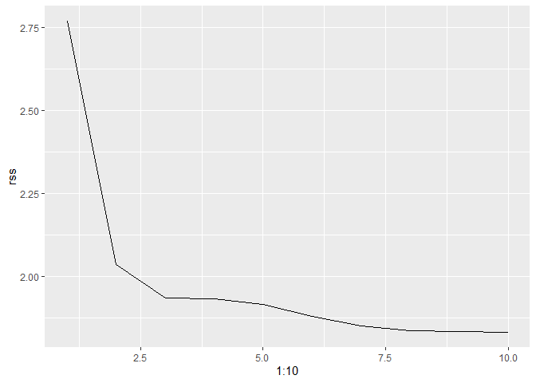

ISLR Ch.7
================

This is an [R Markdown](http://rmarkdown.rstudio.com) Notebook. When you execute code within the notebook, the results appear beneath the code.

### ex. 1

### ex. 2

### ex. 3

### ex. 4

### ex. 5

**Consider two curves, ˆg1 and ˆg2, defined by \[equation on p.323\]. where g(m) represents the mth derivative of g.**

**(a) As λ →∞, will ˆg1 or ˆg2 have the smaller training RSS?** g1, because since it has less costraints on the shape of the fitting line, it an provide a better fit on training data

**(b) As λ →∞, will ˆg1 or ˆg2 have the smaller test RSS?** Unsure, it really depends on the data. In a setting where more flexibility is required, g1 will probably behave better.

**(c) For λ = 0, will ˆg1 or ˆg2 have the smaller training and test RSS?** They will have exactly the same training and test error since the formula simplifies to the MSE for linear regression.

### ex. 6

**In this exercise, you will further analyze the Wage data set considered throughout this chapter.**

**(a) Perform polynomial regression to predict wage using age. Use cross-validation to select the optimal degree d for the polynomial. What degree was chosen, and how does this compare to the results of hypothesis testing using ANOVA? Make a plot of the resulting polynomial fit to the data.**

``` r
set.seed(123)
wage <- Wage
cv_error <- rep(NA, 5)

for (i in 1:5) { 
  lm_fit <- glm(wage ∼ poly(age , i),
                data = wage)
  cv_error[i] <- cv.glm(wage , lm_fit , K = 10)$delta[1]
}
cv_error
```

    ## [1] 1676.988 1602.473 1597.036 1594.582 1594.424

``` r
ggplot() +
  geom_line( aes( x = 1:5,
                  y = cv_error))
```


``` r
fit_1 <- lm(wage ∼ age , data = wage)
fit_2 <- lm(wage ∼ poly(age , 2), data = wage)
fit_3 <- lm(wage ∼ poly(age , 3), data = wage)
fit_4 <- lm(wage ∼ poly(age , 4), data = wage)
fit_5 <- lm(wage ∼ poly(age , 5), data = wage)

(anova_fit <- anova(fit_1, fit_2, fit_3, fit_4, fit_5) )
```

    ## Analysis of Variance Table
    ## 
    ## Model 1: wage ~ age
    ## Model 2: wage ~ poly(age, 2)
    ## Model 3: wage ~ poly(age, 3)
    ## Model 4: wage ~ poly(age, 4)
    ## Model 5: wage ~ poly(age, 5)
    ##   Res.Df     RSS Df Sum of Sq        F    Pr(>F)    
    ## 1   2998 5022216                                    
    ## 2   2997 4793430  1    228786 143.5931 < 2.2e-16 ***
    ## 3   2996 4777674  1     15756   9.8888  0.001679 ** 
    ## 4   2995 4771604  1      6070   3.8098  0.051046 .  
    ## 5   2994 4770322  1      1283   0.8050  0.369682    
    ## ---
    ## Signif. codes:  0 '***' 0.001 '**' 0.01 '*' 0.05 '.' 0.1 ' ' 1

As we can see from the CV, little improvement can be seen after the 3rd degree polinomial, and ANOVA shows the same thing, suggesting no better model in the 4th compared to the 3rd.

``` r
wage %>%
  select(wage, age) %>% 
  mutate( wage_pred_3 = predict(fit_3)) %>% 
  ggplot() +
    geom_jitter( aes( x = age,
                     y = wage),
                alpha = 0.2) +
    geom_line( aes( x = age,
                    y = wage_pred_3),
               color = "red")
```


**(b) Fit a step function to predict wage using age, and perform crossvalidation to choose the optimal number of cuts. Make a plot of the fit obtained.**

``` r
n <- 20
cut_error <- rep(NA, n)

for (i in 2:n) { 
  lm_fit <- glm(wage ∼ cut(age , i, labels = FALSE),
                data = wage)
  cut_error[i] <- cv.glm(wage , lm_fit , K = 10)$delta[1]
}

#cut_error
ggplot() +
  geom_line( aes( x = 1:n,
                  y = cut_error)) +
  coord_cartesian( ylim  = c(1500,max(cut_error)))
```

    ## Warning: Removed 1 row(s) containing missing values (geom_path).


Any break more than 9 does not seem to have any significant improvement, so it can be chosen to plot

``` r
breaks <- 9
lm_fit <- lm( wage ∼ cut(age , breaks),
                data = wage)
summary(lm_fit)
```

    ## 
    ## Call:
    ## lm(formula = wage ~ cut(age, breaks), data = wage)
    ## 
    ## Residuals:
    ##     Min      1Q  Median      3Q     Max 
    ## -98.548 -24.896  -4.754  15.590 201.404 
    ## 
    ## Coefficients:
    ##                             Estimate Std. Error t value Pr(>|t|)    
    ## (Intercept)                   73.344      3.030  24.208  < 2e-16 ***
    ## cut(age, breaks)(24.9,31.8]   25.386      3.619   7.014 2.84e-12 ***
    ## cut(age, breaks)(31.8,38.7]   39.746      3.485  11.406  < 2e-16 ***
    ## cut(age, breaks)(38.7,45.6]   45.289      3.404  13.306  < 2e-16 ***
    ## cut(age, breaks)(45.6,52.4]   43.594      3.443  12.660  < 2e-16 ***
    ## cut(age, breaks)(52.4,59.3]   46.060      3.640  12.655  < 2e-16 ***
    ## cut(age, breaks)(59.3,66.2]   45.605      4.391  10.385  < 2e-16 ***
    ## cut(age, breaks)(66.2,73.1]   26.230      7.173   3.657  0.00026 ***
    ## cut(age, breaks)(73.1,80.1]   21.217     11.522   1.841  0.06566 .  
    ## ---
    ## Signif. codes:  0 '***' 0.001 '**' 0.01 '*' 0.05 '.' 0.1 ' ' 1
    ## 
    ## Residual standard error: 40.08 on 2991 degrees of freedom
    ## Multiple R-squared:  0.0799, Adjusted R-squared:  0.07744 
    ## F-statistic: 32.47 on 8 and 2991 DF,  p-value: < 2.2e-16

``` r
## one way to extract the breakpoints
labs <- levels(cut(wage[,"age"],breaks))
levels <- cbind(lower = as.numeric( sub("\\((.+),.*", "\\1", labs) ),
                upper = as.numeric( sub("[^,]*,([^]]*)\\]", "\\1", labs) ),
                intercept = as.numeric(lm_fit[["coefficients"]]))

# add 0 intercept
levels[2:9,"intercept"] <- levels[2:breaks,"intercept"] + levels[1,"intercept"]

ggplot() +
  geom_jitter( data = wage,
              aes( x = age,
                   y = wage),
              alpha = 0.2) +
  geom_segment( aes(x = levels[,"lower"],
                    y = levels[,"intercept"],
                    xend = levels[,"upper"],
                    yend = levels[,"intercept"]),
                color = "red", size = 1) 
```


### ex. 7

**The Wage data set contains a number of other features not explored in this chapter, such as marital status (maritl), job class (jobclass), and others. Explore the relationships between some of these other predictors and wage, and use non-linear fitting techniques in order to fit flexible models to the data. Create plots of the results obtained, and write a summary of your findings.**

Firs, print predictors vs wage and fit a lm for comparison

``` r
wage <- Wage %>% select(-region, -logwage)

wage %>%
  gather(-wage, key = "var", value = "value") %>% 
  ggplot(aes(x = value, 
             fill = cut(wage, 5))) +
    geom_histogram( stat = "count",
                    position = "fill") +
    facet_wrap(~ var, scales = "free")
```

    ## Warning: attributes are not identical across measure variables;
    ## they will be dropped

    ## Warning: Ignoring unknown parameters: binwidth, bins, pad


Methods (all with CV):

-   Poly\_fit with poly\_wrapper()
-   Natural spline
-   Smooth spline
-   Local regression

``` r
set.seed(123)

# Poly_fit
poly_wrapper <- function(data, pred, resp, k = 5, display = TRUE) {
  cv_error <- rep(NA, k)
  for (i in 1:length(cv_error)) { 
    lm_formula <- as.formula(paste(resp,
                                   " ∼ poly(", 
                                   pred, 
                                   " ,", 
                                   i,
                                   ")" ))
    lm_fit <- glm(lm_formula,
                  data = data)
  cv_error[i] <- cv.glm(data , lm_fit , K = 10)$delta[1]
  }
  g <- ggplot() +
         geom_line( aes( x = 1:length(cv_error),
                         y = cv_error))
  
  if(display == TRUE) {
    print(g)
    return(cbind("df" = 1:length(cv_error), cv_error))
    }
  else return(cbind("df" = 1:length(cv_error), cv_error))
}

poly_error <- poly_wrapper(wage, "age", "wage")
```


``` r
# Natural_spline_fit
natsp_wrapper <- function(data, pred, resp, display = TRUE) {
  cv_error <- rep(NA, 20)
  for (i in 1:length(cv_error)) { 
    lm_formula <- as.formula(paste(resp,
                                   " ∼ ns(", 
                                   pred, 
                                   ", df = ", 
                                   i,
                                   ")" ))
    lm_fit <- glm(lm_formula,
                  data = data)
  cv_error[i] <- cv.glm(data , lm_fit , K = 10)$delta[1]
  }
  g <- ggplot() +
         geom_line( aes( x = 1:length(cv_error),
                         y = cv_error))
  
  if(display == TRUE) {
    print(g)
    return(cbind("df" = 1:length(cv_error), cv_error))
    }
  else return(cbind("df" = 1:length(cv_error), cv_error))
}

natsp_error <- natsp_wrapper(wage, "age", "wage")
```


``` r
# Smoothed_spline_fit
smooth_wrapper <- function(data, pred, resp, display = FALSE) {
  
  smooth_fit <- smooth.spline(x = data[[pred]] , 
                              y = data[[resp]] ,
                              cv = TRUE)
  return( cbind( "df" = smooth_fit[["df"]],
                 "cv_error" = smooth_fit[["cv.crit"]] ))
}

smooth_error <- smooth_wrapper(wage, "age", "wage")
```

    ## Warning in smooth.spline(x = data[[pred]], y = data[[resp]], cv = TRUE): cross-
    ## validation with non-unique 'x' values seems doubtful

``` r
# Skeleton function for K-fold home-made validation

kfold_wrapper <- function(data, pred, resp, display = TRUE) {
  k <- 10 # folds of validation
  fold <- sample(1:k,
                 dim(data)[1],
                 replace = TRUE)

  
  cv_error <- rep(NA, 10)
  span_vector <- (2/3)^(0:length(cv_error))
  
  for (i in 1:length(cv_error)) { 
    formula <- as.formula(paste(resp, 
                                " ∼ ", 
                                pred)) #and other terms if needed
    fold_error <- rep(NA, k)
    for( j in 1:k){
      model_fit <- model_function(formula,
                         data = data,
                         subset = (fold != j) )
      model_preds <- predict( model_fit,
                              newdata = data[fold == j, pred])
      fold_error[j] <- rnorm(1) # Error formula
      }
    cv_error[i] <- mean(fold_error)
  }
  
  g <- ggplot() +
         geom_line( aes( x = 1:length(cv_error),
                         y = cv_error))
  
  if(display == TRUE) {
    print(g)
    return(cv_error)
    }
  else return(cv_error)
}
```

``` r
# Loess
loess_wrapper <- function(data, pred, resp, display = TRUE) {
  k <- 10 # folds of validation
  fold <- sample(1:k,
                 dim(data)[1],
                 replace = TRUE)

  
  cv_error <- rep(NA, 10)
  span_vector <- seq( from = 0.1, 
                      to = 0.8, 
                      length.out = length(cv_error))
  
  for (i in 1:length(cv_error)) { 
    formula <- as.formula(paste(resp,
                                " ∼ ", 
                                pred))
    fold_error <- rep(NA, k)
    for( j in 1:k){
      model_fit <- loess(formula,
                         data = data,
                         span = span_vector[i],
                         subset = (fold != j) )
      model_preds <- predict( model_fit,
                              newdata = data[fold == j, pred])
      
      ### is the formula for error right?
      fold_error[j] <- mean(
        sqrt(
          sum( 
            (data[fold == j, resp] - model_preds)^2 
          )
        )
      )
      
      }
    cv_error[i] <- mean(fold_error, na.rm = TRUE)
  }
  
  g <- ggplot() +
         geom_line( aes( x = span_vector,
                         y = cv_error))
  
  if(display == TRUE) {
    print(g)
    return(cbind("span" = span_vector, cv_error))
    }
  else return(cbind("span" = span_vector, cv_error))
}

loess_error <- loess_wrapper(wage, "age", "wage")
```

    ## Warning in simpleLoess(y, x, w, span, degree = degree, parametric =
    ## parametric, : pseudoinverse used at 41

    ## Warning in simpleLoess(y, x, w, span, degree = degree, parametric =
    ## parametric, : neighborhood radius 1

    ## Warning in simpleLoess(y, x, w, span, degree = degree, parametric =
    ## parametric, : reciprocal condition number 0

    ## Warning in simpleLoess(y, x, w, span, degree = degree, parametric =
    ## parametric, : pseudoinverse used at 40

    ## Warning in simpleLoess(y, x, w, span, degree = degree, parametric =
    ## parametric, : neighborhood radius 1

    ## Warning in simpleLoess(y, x, w, span, degree = degree, parametric =
    ## parametric, : reciprocal condition number 0

    ## Warning in simpleLoess(y, x, w, span, degree = degree, parametric =
    ## parametric, : There are other near singularities as well. 1

    ## Warning in simpleLoess(y, x, w, span, degree = degree, parametric =
    ## parametric, : pseudoinverse used at 40

    ## Warning in simpleLoess(y, x, w, span, degree = degree, parametric =
    ## parametric, : neighborhood radius 1

    ## Warning in simpleLoess(y, x, w, span, degree = degree, parametric =
    ## parametric, : reciprocal condition number 0


Now that we have the 4 functions to compute the fit, let's put all of the on a single graph

``` r
validation_plot <- function(poly_error, 
                            natsp_error,
                            smooth_error,
                            loess_error) {
  poly_plot <- ggplot() +
    geom_line( aes( x = poly_error[,"df"],
                    y = poly_error[,"cv_error"]))
  natsp_plot <- ggplot() +
    geom_line( aes( x = natsp_error[,"df"],
                    y = natsp_error[,"cv_error"]))
  smooth_plot <- ggplot() +
    geom_point( aes( x = smooth_error[,"df"],
                     y = smooth_error[,"cv_error"])) +
    geom_hline( yintercept = smooth_error[,"cv_error"])
  loess_plot <- ggplot() +
    geom_line( aes( x = loess_error[,"span"],
                    y = loess_error[,"cv_error"]))
  ggarrange(poly_plot, natsp_plot, smooth_plot, loess_plot, 
            ncol = 2, nrow = 2)
}

validation_plot(poly_error, natsp_error, smooth_error, loess_error)
```


Predictors:

-   marit1
-   race
-   interaction table(wage\[,"health"\], wage\[,"health\_ins"\])

``` r
set.seed(123)
dims <- dim(wage)[1]
train <- sample(dims,  dims*0.8)

pred <- "age"
resp <- "wage"

train_mat <- wage[train,c(pred,resp)] # model.matrix(wage ∼ ., data = wage[train, ])
test_mat <- wage[-train,c(pred,resp)]


poly_error <- poly_wrapper(train_mat, pred,resp, display = FALSE)
natsp_error <- natsp_wrapper(train_mat, pred,resp, display = FALSE)
smooth_error <- smooth_wrapper(train_mat, pred,resp, display = FALSE)
```

    ## Warning in smooth.spline(x = data[[pred]], y = data[[resp]], cv = TRUE): cross-
    ## validation with non-unique 'x' values seems doubtful

``` r
loess_error <- loess_wrapper(train_mat,pred,resp, display = FALSE)
```

    ## Warning in simpleLoess(y, x, w, span, degree = degree, parametric =
    ## parametric, : pseudoinverse used at 40

    ## Warning in simpleLoess(y, x, w, span, degree = degree, parametric =
    ## parametric, : neighborhood radius 1

    ## Warning in simpleLoess(y, x, w, span, degree = degree, parametric =
    ## parametric, : reciprocal condition number 0

``` r
validation_plot(poly_error, natsp_error, smooth_error, loess_error)
```


``` r
poly_df <- 3
natsp_df <- 7
smooth_df <- smooth_error[1,"df"]
loess_span <- 0.8

errors <- vector()

## poly
poly_formula <- as.formula(paste(resp, " ∼ poly(", 
                                 pred, ",", 
                                 poly_df,")" ))
poly_fit <- lm(poly_formula, data = train_mat)
poly_preds <- predict(poly_fit,
                     newdata = test_mat)
errors["poly"] <- mean( (poly_preds - test_mat[,resp])^2 )


## natsp
natsp_formula <- as.formula(paste(resp, " ∼ ns(", 
                                 pred, ", df =", 
                                 natsp_df,")" ))
natsp_fit <- glm(natsp_formula, data = train_mat)
natsp_preds <- predict(natsp_fit,
                     newdata = test_mat)
errors["natsp"] <- mean( (natsp_preds - test_mat[,resp])^2 )

smooth_fit <- smooth.spline(x = train_mat[[pred]] , 
                            y = train_mat[[resp]]  ,
                            df = smooth_df)
smooth_preds <- predict(smooth_fit,
                     newdata = test_mat)
errors["smooth"] <- mean( (smooth_preds[["y"]] - test_mat[,resp])^2 )

loess_formula <- as.formula(paste(resp, " ∼ ", 
                                 pred ))
loess_fit <- loess(loess_formula,
                   data = train_mat,
                   span = loess_span )
loess_preds <- predict( loess_fit,
                        newdata = test_mat)
errors["loess"] <- mean( (loess_preds - test_mat[,resp])^2 )

ggplot() +
  geom_point( aes( x = names(errors),
                   y = errors,
                   color = names(errors)),
              size = 2)
```


### ex. 8

**Fit some of the non-linear models investigated in this chapter to the Auto data set. Is there evidence for non-linear relationships in this data set? Create some informative plots to justify your answer.**

``` r
auto <- Auto %>% 
  select(-name) %>% 
  mutate( displacement = as.integer(displacement))

set.seed(123)
dims <- dim(auto)[1]
train <- sample(dims,  dims*0.8)

auto %>%
  gather(-c(horsepower, year), key = "var", value = "value") %>% 
  ggplot(aes(x = value, 
             y = horsepower,
             color = year)) +
    geom_point() +
    facet_wrap(~ var, scales = "free")
```


``` r
pred <- "displacement"
resp <- "horsepower"

train_mat <- auto[train,c(pred,resp)]
test_mat <- auto[-train,c(pred,resp)]


poly_error <- poly_wrapper(train_mat, pred,resp, display = FALSE)
natsp_error <- natsp_wrapper(train_mat, pred,resp, display = FALSE)
smooth_error <- smooth_wrapper(train_mat, pred,resp, display = FALSE)
```

    ## Warning in smooth.spline(x = data[[pred]], y = data[[resp]], cv = TRUE): cross-
    ## validation with non-unique 'x' values seems doubtful

``` r
loess_error <- loess_wrapper(train_mat,pred,resp, display = FALSE)
```

    ## Warning in simpleLoess(y, x, w, span, degree = degree, parametric =
    ## parametric, : pseudoinverse used at 97

    ## Warning in simpleLoess(y, x, w, span, degree = degree, parametric =
    ## parametric, : neighborhood radius 1

    ## Warning in simpleLoess(y, x, w, span, degree = degree, parametric =
    ## parametric, : reciprocal condition number 0

    ## Warning in simpleLoess(y, x, w, span, degree = degree, parametric =
    ## parametric, : There are other near singularities as well. 1

    ## Warning in simpleLoess(y, x, w, span, degree = degree, parametric =
    ## parametric, : pseudoinverse used at 97

    ## Warning in simpleLoess(y, x, w, span, degree = degree, parametric =
    ## parametric, : neighborhood radius 1

    ## Warning in simpleLoess(y, x, w, span, degree = degree, parametric =
    ## parametric, : reciprocal condition number 0

    ## Warning in simpleLoess(y, x, w, span, degree = degree, parametric =
    ## parametric, : There are other near singularities as well. 1

    ## Warning in simpleLoess(y, x, w, span, degree = degree, parametric =
    ## parametric, : pseudoinverse used at 101

    ## Warning in simpleLoess(y, x, w, span, degree = degree, parametric =
    ## parametric, : neighborhood radius 4

    ## Warning in simpleLoess(y, x, w, span, degree = degree, parametric =
    ## parametric, : reciprocal condition number 0

    ## Warning in simpleLoess(y, x, w, span, degree = degree, parametric =
    ## parametric, : There are other near singularities as well. 1

    ## Warning in simpleLoess(y, x, w, span, degree = degree, parametric =
    ## parametric, : pseudoinverse used at 97

    ## Warning in simpleLoess(y, x, w, span, degree = degree, parametric =
    ## parametric, : neighborhood radius 1

    ## Warning in simpleLoess(y, x, w, span, degree = degree, parametric =
    ## parametric, : reciprocal condition number 0

    ## Warning in simpleLoess(y, x, w, span, degree = degree, parametric =
    ## parametric, : There are other near singularities as well. 1

    ## Warning in simpleLoess(y, x, w, span, degree = degree, parametric =
    ## parametric, : pseudoinverse used at 97

    ## Warning in simpleLoess(y, x, w, span, degree = degree, parametric =
    ## parametric, : neighborhood radius 1

    ## Warning in simpleLoess(y, x, w, span, degree = degree, parametric =
    ## parametric, : reciprocal condition number 0

    ## Warning in simpleLoess(y, x, w, span, degree = degree, parametric =
    ## parametric, : There are other near singularities as well. 1

    ## Warning in simpleLoess(y, x, w, span, degree = degree, parametric =
    ## parametric, : pseudoinverse used at 97

    ## Warning in simpleLoess(y, x, w, span, degree = degree, parametric =
    ## parametric, : neighborhood radius 1

    ## Warning in simpleLoess(y, x, w, span, degree = degree, parametric =
    ## parametric, : reciprocal condition number 0

    ## Warning in simpleLoess(y, x, w, span, degree = degree, parametric =
    ## parametric, : There are other near singularities as well. 1

    ## Warning in simpleLoess(y, x, w, span, degree = degree, parametric =
    ## parametric, : pseudoinverse used at 98

    ## Warning in simpleLoess(y, x, w, span, degree = degree, parametric =
    ## parametric, : neighborhood radius 1

    ## Warning in simpleLoess(y, x, w, span, degree = degree, parametric =
    ## parametric, : reciprocal condition number 0

    ## Warning in simpleLoess(y, x, w, span, degree = degree, parametric =
    ## parametric, : There are other near singularities as well. 1

    ## Warning in simpleLoess(y, x, w, span, degree = degree, parametric =
    ## parametric, : pseudoinverse used at 98

    ## Warning in simpleLoess(y, x, w, span, degree = degree, parametric =
    ## parametric, : neighborhood radius 1

    ## Warning in simpleLoess(y, x, w, span, degree = degree, parametric =
    ## parametric, : reciprocal condition number 0

    ## Warning in simpleLoess(y, x, w, span, degree = degree, parametric =
    ## parametric, : There are other near singularities as well. 1

    ## Warning in simpleLoess(y, x, w, span, degree = degree, parametric =
    ## parametric, : pseudoinverse used at 97

    ## Warning in simpleLoess(y, x, w, span, degree = degree, parametric =
    ## parametric, : neighborhood radius 1

    ## Warning in simpleLoess(y, x, w, span, degree = degree, parametric =
    ## parametric, : reciprocal condition number 0

    ## Warning in simpleLoess(y, x, w, span, degree = degree, parametric =
    ## parametric, : There are other near singularities as well. 1

    ## Warning in simpleLoess(y, x, w, span, degree = degree, parametric =
    ## parametric, : pseudoinverse used at 98

    ## Warning in simpleLoess(y, x, w, span, degree = degree, parametric =
    ## parametric, : neighborhood radius 1

    ## Warning in simpleLoess(y, x, w, span, degree = degree, parametric =
    ## parametric, : reciprocal condition number 0

    ## Warning in simpleLoess(y, x, w, span, degree = degree, parametric =
    ## parametric, : There are other near singularities as well. 1

``` r
validation_plot(poly_error, natsp_error, smooth_error, loess_error)
```


``` r
poly_df <- 4
natsp_df <- 11
smooth_df <- smooth_error[1,"df"]
loess_span <- 0.2

errors <- vector()

## poly
poly_formula <- as.formula(paste(resp, " ∼ poly(", 
                                 pred, ",", 
                                 poly_df,")" ))
poly_fit <- lm(poly_formula, data = train_mat)
poly_preds <- predict(poly_fit,
                     newdata = test_mat)
errors["poly"] <- mean( (poly_preds - test_mat[,resp])^2 )


## natsp
natsp_formula <- as.formula(paste(resp, " ∼ ns(", 
                                 pred, ", df =", 
                                 natsp_df,")" ))
natsp_fit <- glm(natsp_formula, data = train_mat)
natsp_preds <- predict(natsp_fit,
                     newdata = test_mat)
errors["natsp"] <- mean( (natsp_preds - test_mat[,resp])^2 )

smooth_fit <- smooth.spline(x = train_mat[[pred]] , 
                            y = train_mat[[resp]]  ,
                            df = smooth_df)

smooth_preds <- as.data.frame(predict(smooth_fit,
                        newdata = test_mat[,pred])) ###it can not work!
errors["smooth"] <- mean( (smooth_preds[["y"]] - test_mat[,resp])^2 )
```

    ## Warning in smooth_preds[["y"]] - test_mat[, resp]: la lunghezza più lunga
    ## dell'oggetto non è un multiplo della lunghezza più corta dell'oggetto

``` r
loess_formula <- as.formula(paste(resp, " ∼ ", 
                                 pred ))
loess_fit <- loess(loess_formula,
                   data = train_mat,
                   span = loess_span )
loess_preds <- predict( loess_fit,
                        newdata = test_mat)
errors["loess"] <- mean( (loess_preds - test_mat[,resp])^2 )

ggplot() +
  geom_point( aes( x = names(errors),
                   y = errors,
                   color = names(errors)),
              size = 2)
```


``` r
ggplot() +
  geom_line(aes( x = smooth_preds[["x"]],
                  y = smooth_preds[["y"]] )) +
  geom_line(aes( x = test_mat[,pred],
                 y = loess_preds)) +
  geom_point(aes( x = test_mat[,pred],
                  y = test_mat[,resp] ),
             color = "blue")
```


### ex. 9

**This question uses the variables dis (the weighted mean of distances to five Boston employment centers) and nox (nitrogen oxides concentration in parts per 10 million) from the Boston data. We will treat dis as the predictor and nox as the response**

``` r
boston <- Boston %>% select(dis, nox)
pred <- "dis"
resp <- "nox"
```

**(a) Use the poly() function to fit a cubic polynomial regression to predict nox using dis. Report the regression output, and plot the resulting data and polynomial fits.**

``` r
poly_formula <- as.formula(paste(resp, " ∼ poly(", 
                                 pred, ",", 
                                 3,")" ))
poly_fit <- glm(poly_formula, data = boston)
poly_preds <- predict(poly_fit)

summary(poly_fit)
```

    ## 
    ## Call:
    ## glm(formula = poly_formula, data = boston)
    ## 
    ## Deviance Residuals: 
    ##       Min         1Q     Median         3Q        Max  
    ## -0.121130  -0.040619  -0.009738   0.023385   0.194904  
    ## 
    ## Coefficients:
    ##                Estimate Std. Error t value Pr(>|t|)    
    ## (Intercept)    0.554695   0.002759 201.021  < 2e-16 ***
    ## poly(dis, 3)1 -2.003096   0.062071 -32.271  < 2e-16 ***
    ## poly(dis, 3)2  0.856330   0.062071  13.796  < 2e-16 ***
    ## poly(dis, 3)3 -0.318049   0.062071  -5.124 4.27e-07 ***
    ## ---
    ## Signif. codes:  0 '***' 0.001 '**' 0.01 '*' 0.05 '.' 0.1 ' ' 1
    ## 
    ## (Dispersion parameter for gaussian family taken to be 0.003852802)
    ## 
    ##     Null deviance: 6.7810  on 505  degrees of freedom
    ## Residual deviance: 1.9341  on 502  degrees of freedom
    ## AIC: -1370.9
    ## 
    ## Number of Fisher Scoring iterations: 2

``` r
ggplot(boston) +
  geom_point( aes( x = dis,
                  y = nox)) + 
  geom_line( aes( x = dis,
                  y = poly_preds),
             color = "blue")
```


**(b) Plot the polynomial fits for a range of different polynomial degrees (say, from 1 to 10), and report the associated residual sum of squares.**

``` r
rss <- rep(NA, 10)
lm_fit <- vector("list", length = length(rss))

for (i in 1:length(rss)) { 
  lm_formula <- as.formula(paste(resp,
                                 " ∼ poly(", 
                                 pred, 
                                 " ,", 
                                 i,
                                 ")" ))
    lm_fit[[i]] <- lm(lm_formula,
                    data = boston)
    rss[i] <- sum(lm_fit[[i]][["residuals"]]^2)
}

lm_preds <- data.frame( map( 1:10, ~ predict( lm_fit[[.x]] )  ),
                        boston["dis"],
                        boston["nox"])
colnames(lm_preds) <- c( as_vector(map(1:10, ~ paste0("poly", .x))) ,
                         "dis", "nox")

ggplot() + geom_line(aes(x= 1:10, y=rss))
```



``` r
rss
```

    ##  [1] 2.768563 2.035262 1.934107 1.932981 1.915290 1.878257 1.849484 1.835630
    ##  [9] 1.833331 1.832171

``` r
lm_preds %>% 
  gather(-c(nox,dis), key = "var", value = "value") %>% 
  ggplot() +
    geom_point( aes( x = dis,
                     y = nox),
                alpha = 0.2) +
    geom_line( aes(  x = dis,
                     y = value,
                     color = var)) +
    facet_wrap(~ var)
```


**(c) Perform cross-validation or another approach to select the optimal degree for the polynomial, and explain your results**

``` r
poly_error <- poly_wrapper(boston, pred, resp, k = 10)
```


As we can see, the function has a minimum at polynomial of 3rd or 4th degree, representing the CV error for that value. As expected, after a certain degree of the polynomial fit, the test error (in this case the CV error, which behaves in a similar fashion) increases

``` r
poly_error
```

    ##       df    cv_error
    ##  [1,]  1 0.005533798
    ##  [2,]  2 0.004074767
    ##  [3,]  3 0.003876028
    ##  [4,]  4 0.003889291
    ##  [5,]  5 0.004142155
    ##  [6,]  6 0.005384007
    ##  [7,]  7 0.009916967
    ##  [8,]  8 0.010812571
    ##  [9,]  9 0.023635671
    ## [10,] 10 0.006476183

**(d) Use the bs() function to fit a regression spline to predict nox using dis. Report the output for the fit using four degrees of freedom. How did you choose the knots? Plot the resulting fit**

``` r
bs_fit <- glm(nox ~ bs(dis, df = 4) ,
              data = boston)
summary(bs_fit)
```

    ## 
    ## Call:
    ## glm(formula = nox ~ bs(dis, df = 4), data = boston)
    ## 
    ## Deviance Residuals: 
    ##       Min         1Q     Median         3Q        Max  
    ## -0.124622  -0.039259  -0.008514   0.020850   0.193891  
    ## 
    ## Coefficients:
    ##                  Estimate Std. Error t value Pr(>|t|)    
    ## (Intercept)       0.73447    0.01460  50.306  < 2e-16 ***
    ## bs(dis, df = 4)1 -0.05810    0.02186  -2.658  0.00812 ** 
    ## bs(dis, df = 4)2 -0.46356    0.02366 -19.596  < 2e-16 ***
    ## bs(dis, df = 4)3 -0.19979    0.04311  -4.634 4.58e-06 ***
    ## bs(dis, df = 4)4 -0.38881    0.04551  -8.544  < 2e-16 ***
    ## ---
    ## Signif. codes:  0 '***' 0.001 '**' 0.01 '*' 0.05 '.' 0.1 ' ' 1
    ## 
    ## (Dispersion parameter for gaussian family taken to be 0.003837874)
    ## 
    ##     Null deviance: 6.7810  on 505  degrees of freedom
    ## Residual deviance: 1.9228  on 501  degrees of freedom
    ## AIC: -1371.9
    ## 
    ## Number of Fisher Scoring iterations: 2

Knots where chosen at the quartile points

``` r
ggplot() +
  geom_jitter(aes( x = boston[[pred]],
                  y = boston[[resp]]),
             alpha = 0.2) +
  geom_line( aes( x = boston[[pred]],
                  y = predict(bs_fit)),
             color = "blue")
```


**(e) Now fit a regression spline for a range of degrees of freedom, and plot the resulting fits and report the resulting RSS. Describe the results obtained.**

``` r
rss <- rep(NA, 10)
bs_fit <- vector("list", length = length(rss))

for (i in 1:length(rss)) { 
  lm_formula <- as.formula(paste(resp,
                                 " ∼ bs(", 
                                 pred, 
                                 ", df = 10*", 
                                 i,
                                 ")" ))
    bs_fit[[i]] <- glm(lm_formula,
                       data = boston)
    rss[i] <- sum(bs_fit[[i]][["residuals"]]^2)
}

bs_preds <- data.frame( map( 1:10, ~ predict( bs_fit[[.x]] )  ),
                        boston["dis"],
                        boston["nox"])
colnames(bs_preds) <- c( as_vector(map(1:10, ~ paste0("bs", .x, "0"))) ,
                         "dis", "nox")

ggplot() + 
  geom_line(aes(x= 10*(1:10), y=rss)) +
  labs( x = "df")
```


``` r
rss
```

    ##  [1] 1.792535 1.776727 1.765632 1.699837 1.679047 1.655161 1.631209 1.566352
    ##  [9] 1.538220 1.487721

``` r
bs_preds %>% 
  gather(-c(nox,dis), key = "var", value = "value") %>% 
  ggplot() +
    geom_point( aes( x = dis,
                     y = nox),
                alpha = 0.2) +
    geom_line( aes(  x = dis,
                     y = value,
                     color = var)) +
    facet_wrap(~ var)
```


Minimal df = 3 (corresponding to the first fit), with 2 corresponding at the linear regression (1 df because of the intercept). RSS steadily decreases because we are not cross-validating, and as we can see the fit is pretty wiggly the more degrees of freedom we have.

**(f) Perform cross-validation or another approach in order to select the best degrees of freedom for a regression spline on this data. Describe your results.**

Since the first run between 0 and 100 (by 10) suggest a minimum around 10, you can find the algorithm to check the first 15 dfs.

``` r
cv_error <- rep(NA, 15)
for (i in 1:length(cv_error)) { 
  bs_formula <- as.formula(paste(resp,
                                   " ∼ bs(", 
                                   pred, 
                                   ", df = ", 
                                   i,
                                   ")" ))
  bs_fit <- glm(bs_formula,
                data = boston)
  cv_error[i] <- cv.glm(boston , bs_fit , K = 10)$delta[1]
  }
```

    ## Warning in bs(dis, df = 1): 'df' was too small; have used 3

    ## Warning in bs(dis, df = 1): 'df' was too small; have used 3

    ## Warning in bs(dis, df = 1): 'df' was too small; have used 3

    ## Warning in bs(dis, degree = 3L, knots = numeric(0), Boundary.knots = c(1.137, :
    ## some 'x' values beyond boundary knots may cause ill-conditioned bases

    ## Warning in bs(dis, degree = 3L, knots = numeric(0), Boundary.knots = c(1.137, :
    ## some 'x' values beyond boundary knots may cause ill-conditioned bases

    ## Warning in bs(dis, df = 1): 'df' was too small; have used 3

    ## Warning in bs(dis, df = 1): 'df' was too small; have used 3

    ## Warning in bs(dis, df = 1): 'df' was too small; have used 3

    ## Warning in bs(dis, df = 1): 'df' was too small; have used 3

    ## Warning in bs(dis, df = 1): 'df' was too small; have used 3

    ## Warning in bs(dis, df = 1): 'df' was too small; have used 3

    ## Warning in bs(dis, df = 1): 'df' was too small; have used 3

    ## Warning in bs(dis, degree = 3L, knots = numeric(0), Boundary.knots = c(1.1296, :
    ## some 'x' values beyond boundary knots may cause ill-conditioned bases

    ## Warning in bs(dis, degree = 3L, knots = numeric(0), Boundary.knots = c(1.1296, :
    ## some 'x' values beyond boundary knots may cause ill-conditioned bases

    ## Warning in bs(dis, df = 1): 'df' was too small; have used 3

    ## Warning in bs(dis, df = 2): 'df' was too small; have used 3

    ## Warning in bs(dis, df = 2): 'df' was too small; have used 3

    ## Warning in bs(dis, df = 2): 'df' was too small; have used 3

    ## Warning in bs(dis, df = 2): 'df' was too small; have used 3

    ## Warning in bs(dis, df = 2): 'df' was too small; have used 3

    ## Warning in bs(dis, df = 2): 'df' was too small; have used 3

    ## Warning in bs(dis, df = 2): 'df' was too small; have used 3

    ## Warning in bs(dis, df = 2): 'df' was too small; have used 3

    ## Warning in bs(dis, degree = 3L, knots = numeric(0), Boundary.knots = c(1.1691, :
    ## some 'x' values beyond boundary knots may cause ill-conditioned bases

    ## Warning in bs(dis, degree = 3L, knots = numeric(0), Boundary.knots = c(1.1691, :
    ## some 'x' values beyond boundary knots may cause ill-conditioned bases

    ## Warning in bs(dis, df = 2): 'df' was too small; have used 3

    ## Warning in bs(dis, df = 2): 'df' was too small; have used 3

    ## Warning in bs(dis, df = 2): 'df' was too small; have used 3

    ## Warning in bs(dis, degree = 3L, knots = numeric(0), Boundary.knots = c(1.1296, :
    ## some 'x' values beyond boundary knots may cause ill-conditioned bases

    ## Warning in bs(dis, degree = 3L, knots = numeric(0), Boundary.knots = c(1.1296, :
    ## some 'x' values beyond boundary knots may cause ill-conditioned bases

    ## Warning in bs(dis, degree = 3L, knots = numeric(0), Boundary.knots = c(1.137, :
    ## some 'x' values beyond boundary knots may cause ill-conditioned bases

    ## Warning in bs(dis, degree = 3L, knots = numeric(0), Boundary.knots = c(1.137, :
    ## some 'x' values beyond boundary knots may cause ill-conditioned bases

    ## Warning in bs(dis, degree = 3L, knots = c(`50%` = 3.2628), Boundary.knots =
    ## c(1.137, : some 'x' values beyond boundary knots may cause ill-conditioned bases

    ## Warning in bs(dis, degree = 3L, knots = c(`50%` = 3.2628), Boundary.knots =
    ## c(1.137, : some 'x' values beyond boundary knots may cause ill-conditioned bases

    ## Warning in bs(dis, degree = 3L, knots = c(`50%` = 3.26745), Boundary.knots =
    ## c(1.1296, : some 'x' values beyond boundary knots may cause ill-conditioned
    ## bases

    ## Warning in bs(dis, degree = 3L, knots = c(`50%` = 3.26745), Boundary.knots =
    ## c(1.1296, : some 'x' values beyond boundary knots may cause ill-conditioned
    ## bases

    ## Warning in bs(dis, degree = 3L, knots = c(`33.33333%` = 2.4212, `66.66667%`
    ## = 4.36263333333333: some 'x' values beyond boundary knots may cause ill-
    ## conditioned bases

    ## Warning in bs(dis, degree = 3L, knots = c(`33.33333%` = 2.4212, `66.66667%`
    ## = 4.36263333333333: some 'x' values beyond boundary knots may cause ill-
    ## conditioned bases

    ## Warning in bs(dis, degree = 3L, knots = c(`33.33333%` = 2.346, `66.66667%` =
    ## 4.2673: some 'x' values beyond boundary knots may cause ill-conditioned bases

    ## Warning in bs(dis, degree = 3L, knots = c(`33.33333%` = 2.346, `66.66667%` =
    ## 4.2673: some 'x' values beyond boundary knots may cause ill-conditioned bases

    ## Warning in bs(dis, degree = 3L, knots = c(`25%` = 2.1103, `50%` = 3.2157, : some
    ## 'x' values beyond boundary knots may cause ill-conditioned bases

    ## Warning in bs(dis, degree = 3L, knots = c(`25%` = 2.1103, `50%` = 3.2157, : some
    ## 'x' values beyond boundary knots may cause ill-conditioned bases

    ## Warning in bs(dis, degree = 3L, knots = c(`25%` = 2.09705, `50%` = 3.17575, :
    ## some 'x' values beyond boundary knots may cause ill-conditioned bases

    ## Warning in bs(dis, degree = 3L, knots = c(`25%` = 2.09705, `50%` = 3.17575, :
    ## some 'x' values beyond boundary knots may cause ill-conditioned bases

    ## Warning in bs(dis, degree = 3L, knots = c(`20%` = 1.94264, `40%` = 2.62318, :
    ## some 'x' values beyond boundary knots may cause ill-conditioned bases

    ## Warning in bs(dis, degree = 3L, knots = c(`20%` = 1.94264, `40%` = 2.62318, :
    ## some 'x' values beyond boundary knots may cause ill-conditioned bases

    ## Warning in bs(dis, degree = 3L, knots = c(`20%` = 1.98762, `40%` = 2.7147, :
    ## some 'x' values beyond boundary knots may cause ill-conditioned bases

    ## Warning in bs(dis, degree = 3L, knots = c(`20%` = 1.98762, `40%` = 2.7147, :
    ## some 'x' values beyond boundary knots may cause ill-conditioned bases

    ## Warning in bs(dis, degree = 3L, knots = c(`16.66667%` = 1.8651, `33.33333%`
    ## = 2.40296666666667, : some 'x' values beyond boundary knots may cause ill-
    ## conditioned bases

    ## Warning in bs(dis, degree = 3L, knots = c(`16.66667%` = 1.8651, `33.33333%`
    ## = 2.40296666666667, : some 'x' values beyond boundary knots may cause ill-
    ## conditioned bases

    ## Warning in bs(dis, degree = 3L, knots = c(`16.66667%` = 1.85083333333333, : some
    ## 'x' values beyond boundary knots may cause ill-conditioned bases

    ## Warning in bs(dis, degree = 3L, knots = c(`16.66667%` = 1.85083333333333, : some
    ## 'x' values beyond boundary knots may cause ill-conditioned bases

    ## Warning in bs(dis, degree = 3L, knots = c(`14.28571%` = 1.78037142857143, : some
    ## 'x' values beyond boundary knots may cause ill-conditioned bases

    ## Warning in bs(dis, degree = 3L, knots = c(`14.28571%` = 1.78037142857143, : some
    ## 'x' values beyond boundary knots may cause ill-conditioned bases

    ## Warning in bs(dis, degree = 3L, knots = c(`14.28571%` = 1.7912, `28.57143%` =
    ## 2.1678, : some 'x' values beyond boundary knots may cause ill-conditioned bases

    ## Warning in bs(dis, degree = 3L, knots = c(`14.28571%` = 1.7912, `28.57143%` =
    ## 2.1678, : some 'x' values beyond boundary knots may cause ill-conditioned bases

    ## Warning in bs(dis, degree = 3L, knots = c(`12.5%` = 1.751575, `25%` = 2.10525, :
    ## some 'x' values beyond boundary knots may cause ill-conditioned bases

    ## Warning in bs(dis, degree = 3L, knots = c(`12.5%` = 1.751575, `25%` = 2.10525, :
    ## some 'x' values beyond boundary knots may cause ill-conditioned bases

    ## Warning in bs(dis, degree = 3L, knots = c(`11.11111%` = 1.66397777777778, : some
    ## 'x' values beyond boundary knots may cause ill-conditioned bases

    ## Warning in bs(dis, degree = 3L, knots = c(`11.11111%` = 1.66397777777778, : some
    ## 'x' values beyond boundary knots may cause ill-conditioned bases

    ## Warning in bs(dis, degree = 3L, knots = c(`11.11111%` = 1.66864444444444, : some
    ## 'x' values beyond boundary knots may cause ill-conditioned bases

    ## Warning in bs(dis, degree = 3L, knots = c(`11.11111%` = 1.66864444444444, : some
    ## 'x' values beyond boundary knots may cause ill-conditioned bases

    ## Warning in bs(dis, degree = 3L, knots = c(`10%` = 1.65178, `20%` = 1.9512, :
    ## some 'x' values beyond boundary knots may cause ill-conditioned bases

    ## Warning in bs(dis, degree = 3L, knots = c(`10%` = 1.65178, `20%` = 1.9512, :
    ## some 'x' values beyond boundary knots may cause ill-conditioned bases

    ## Warning in bs(dis, degree = 3L, knots = c(`10%` = 1.6156, `20%` = 1.9512, : some
    ## 'x' values beyond boundary knots may cause ill-conditioned bases

    ## Warning in bs(dis, degree = 3L, knots = c(`10%` = 1.6156, `20%` = 1.9512, : some
    ## 'x' values beyond boundary knots may cause ill-conditioned bases

    ## Warning in bs(dis, degree = 3L, knots = c(`9.090909%` = 1.59007272727273, : some
    ## 'x' values beyond boundary knots may cause ill-conditioned bases

    ## Warning in bs(dis, degree = 3L, knots = c(`9.090909%` = 1.59007272727273, : some
    ## 'x' values beyond boundary knots may cause ill-conditioned bases

    ## Warning in bs(dis, degree = 3L, knots = c(`9.090909%` = 1.59713636363636, : some
    ## 'x' values beyond boundary knots may cause ill-conditioned bases

    ## Warning in bs(dis, degree = 3L, knots = c(`9.090909%` = 1.59713636363636, : some
    ## 'x' values beyond boundary knots may cause ill-conditioned bases

    ## Warning in bs(dis, degree = 3L, knots = c(`8.333333%` = 1.57073333333333, : some
    ## 'x' values beyond boundary knots may cause ill-conditioned bases

    ## Warning in bs(dis, degree = 3L, knots = c(`8.333333%` = 1.57073333333333, : some
    ## 'x' values beyond boundary knots may cause ill-conditioned bases

    ## Warning in bs(dis, degree = 3L, knots = c(`8.333333%` = 1.61175833333333, : some
    ## 'x' values beyond boundary knots may cause ill-conditioned bases

    ## Warning in bs(dis, degree = 3L, knots = c(`8.333333%` = 1.61175833333333, : some
    ## 'x' values beyond boundary knots may cause ill-conditioned bases

    ## Warning in bs(dis, degree = 3L, knots = c(`7.692308%` = 1.58815384615385, : some
    ## 'x' values beyond boundary knots may cause ill-conditioned bases

    ## Warning in bs(dis, degree = 3L, knots = c(`7.692308%` = 1.58815384615385, : some
    ## 'x' values beyond boundary knots may cause ill-conditioned bases

    ## Warning in bs(dis, degree = 3L, knots = c(`7.692308%` = 1.53283076923077, : some
    ## 'x' values beyond boundary knots may cause ill-conditioned bases

    ## Warning in bs(dis, degree = 3L, knots = c(`7.692308%` = 1.53283076923077, : some
    ## 'x' values beyond boundary knots may cause ill-conditioned bases

``` r
ggplot() +
  geom_line( aes( x = 1:15,
                       y = cv_error)) +
  labs( x = "df")
```


CV curves suggest 5 to 10 degrees of freedom, with 10 as the minimum value.

``` r
best_bs_fit <- glm(nox ~ bs(dis, df = 10) ,
                   data = boston)

ggplot() +
  geom_jitter(aes( x = boston[[pred]],
                  y = boston[[resp]]),
             alpha = 0.2) +
  geom_line( aes( x = boston[[pred]],
                  y = predict(best_bs_fit)),
             color = "blue")
```


