ISLR Ch.8
================

This is an [R Markdown](http://rmarkdown.rstudio.com) Notebook. When you execute code within the notebook, the results appear beneath the code.

### ex. 1

Made on paper

### ex. 2

**It is mentioned in Section 8.2.3 that boosting using depth-one trees (or stumps) leads to an additive model: that is, a model of the form **

f(X)= sum\_j( fj(Xj) )

**Explain why this is the case**

Since in boosting, given the current model, we fit a decision tree to the residuals from the model, what happens is that at each iteration of the algorithm we add a binary split (thus adding a 2-step non-continuous function). A model built on addition of step functions is an additive model. So, the model if fit to the residuals, which are calculated form a sum of step functions.

### ex. 3

**Consider the Gini index, classification error, and entropy in a simple classification setting with two classes. Create a single plot that displays each of these quantities as a function of ˆpm1. The x-axis should display ˆpm1, ranging from 0 to 1, and the y-axis should display the value of the Gini index, classification error, and entropy.**

Remember that pmk represents the proportion of training observations in the mth region that are from the kth class. Since we are in 2-class setting, pm2 = 1- pm1.

``` r
pm1 <- seq(from = 0, to = 1, length.out = 1e3)
data <- data.frame(pm1) %>% 
  mutate( pm2 = 1 - pm1,
          cl_err = as.double( map( pm1, ∼ 1 - max(.x, 1 - .x))),
          gini_err = 2 * pm1 * pm2,
          entropy = -1 * ( pm1 * log2(pm1) + pm2 * log2(pm2)) )

ggplot(data,
       aes( x = pm1)) +
  geom_line( aes( y = cl_err),
             color = "blue") +
  geom_line( aes( y = gini_err),
             color = "red") +
  geom_line( aes( y = entropy),
             color = "green")
```

    ## Warning: Removed 2 row(s) containing missing values (geom_path).

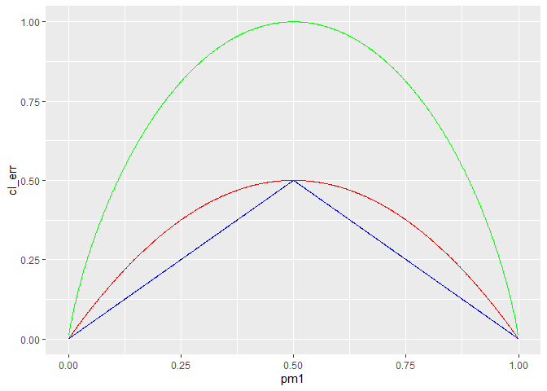

### ex. 4

made on paper

### ex. 5

**Suppose we produce ten bootstrapped samples from a data set containing red and green classes. We then apply a classification tree to each bootstrapped sample and, for a specific value of X, produce 10 estimates of**

P(Class is Red|X): 0.1, 0.15, 0.2, 0.2, 0.55, 0.6, 0.6, 0.65, 0.7, and 0.75

``` r
pred <- c(0.1, 0.15, 0.2, 0.2, 0.55, 0.6, 0.6, 0.65, 0.7, 0.75)
```

Let's assume decision boundary is at 0.5.

**There are two common ways to combine these results together into a single class prediction. One is the majority vote approach discussed in this chapter. The second approach is to classify based on the average probability. In this example, what is the final classification under each of these two approaches?**

``` r
# majority
( sum( pred > 0.5) )
```

    ## [1] 6

since most of the predictions (6 out of 10) are for red class.

``` r
( mean( pred))
```

    ## [1] 0.45

Since mean of predictions is under the assumed threashold, predicted for average probability is green.

### ex. 6

**Provide a detailed explanation of the algorithm that is used to fit a regression tree.**

Each time we want to split the predictors space (assuming we alredy know the current RSS) we perform the following steps:

-   for each value of each predictor we calculate the resulting RSS of a split made in that point. Formula is standard, to calculate the amount of RSS we imagine to assigas the value for the new half-plane the mean of the predictor points in that region.

-   the next split correspond to the value of the predictor that provides the greatest reduction in the RSS, the new RSS is calculated and we can check if we have reached a stop condition (e.g. each node wih less thant 5 points, max number of leaves,...)

### ex. 7

**In the lab, we applied random forests to the Boston data using mtry = 6 and using ntree = 25 and ntree = 500. Create a plot displaying the test error resulting from random forests on this data set for a more comprehensive range of values for mtry and ntree. You can model your plot after Figure 8.10. Describe the results obtained.**

``` r
boston <- Boston
set.seed (1) 

mtry = 2*(1:6)
ntree = c(10*1:10, 200*1:5)
mse = data.frame( mtry = as.numeric(), 
                  ntree = as.numeric(), 
                  value = as.numeric())

train <- sample (1:nrow(boston), nrow(boston) / 2)
boston_test <- boston[-train , "medv"]

for( i in 1:length(mtry) ) {
  for( j in 1:length(ntree) ){
    rf_boston <- randomForest(medv ∼ ., 
                          data = boston , 
                          subset = train , 
                          mtry = mtry[i],
                          ntree = ntree[j])

     yhat_rf <- predict(rf_boston , 
                        newdata = boston[-train , ])

     mse <- mse %>% 
       add_row( mtry = mtry[i],
                ntree = ntree[j],
                value = mean((yhat_rf - boston_test)^2) )
  }
}

ggplot(mse) +
  geom_contour_filled( aes(x = mtry,
                    y = ntree,
                    z = value)) +
  scale_y_log10()
```

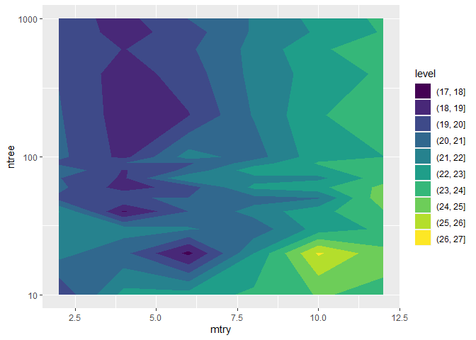

As we can see, the MSE ranges between 17 and 27 in our parameter grid, with a test MSE which has a minimum around mtry = 6 and tree = 20.

### ex. 8

**In the lab, a classification tree was applied to the Carseats data set after converting Sales into a qualitative response variable. Now we will seek to predict Sales using regression trees and related approaches, treating the response as a quantitative variable.**

**(a) Split the data set into a training set and a test set.**

``` r
car <- Carseats
mse <- list()

set.seed(123)
train <- sample (1:nrow(car), nrow(car) * 0.8)
car_test <- car[-train , "Sales"]
```

**(b) Fit a regression tree to the training set. Plot the tree, and interpret the results. What test MSE do you obtain?**

``` r
# first a linear model for comparison
lm_fit <- lm( Sales ∼ .,
              data = car,
              subset = train)
lm_preds <- predict(lm_fit,
                    newdata = car[-train,])
(mse["lm"] <- mean((lm_preds - car_test)^2))
```

    ## [1] 1.143472

``` r
tree_fit <- tree( Sales ∼ .,
                  data = car,
                  subset = train)
tree_preds <- predict(tree_fit,
                      newdata = car[-train,])
(mse["tree"] <- mean((tree_preds - car_test)^2))
```

    ## [1] 4.1593

``` r
plot(tree_fit, pretty = 0)
```

    ## Warning in text.default(x[1L], y[1L], "|", ...): parametro grafico "pretty" non
    ## valido

    ## Warning in plot.xy(xy.coords(x, y), type = type, ...): parametro grafico
    ## "pretty" non valido

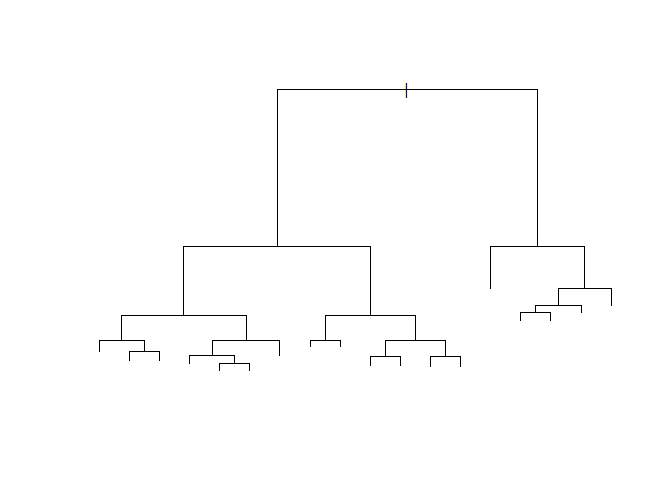

As we can see, Test MSE of a default tree is substantially bigger than the one of a standard linear model.

**(c) Use cross-validation in order to determine the optimal level of tree complexity. Does pruning the tree improve the test MSE?**

``` r
cv_car <- cv.tree(tree_fit)

ggplot() +
  geom_line(aes(x = cv_car[["size"]],
                y = cv_car[["dev"]]))
```

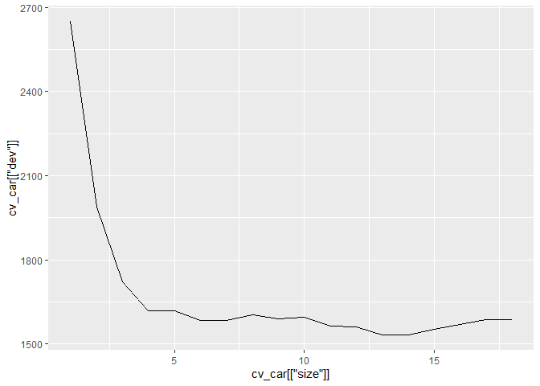

From the cross validation a number of split between 13 and 14 seems to minimize test MSE.

``` r
prune_car <- prune.tree(tree_fit,
                        best = 13)
plot(prune_car)
text(prune_car, pretty = 0)
```

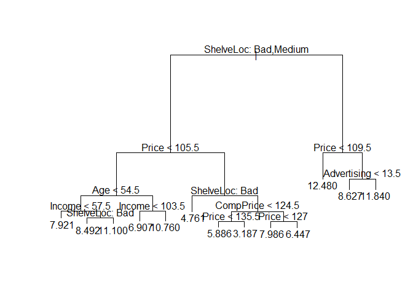

``` r
pruned_preds <- predict(prune_car,
                        newdata = car[-train,])
(mse["pruned"] <- mean((pruned_preds - car_test)^2))
```

    ## [1] 4.151507

The actual improvement in the test MSE in only modest (almost non-existent), but the model with less splits is definitely more understandable

**(d) Use the bagging approach in order to analyze this data. What test MSE do you obtain? Use the importance() function to determine which variables are most important.**

``` r
bagg_fit <- randomForest( Sales ∼ .,
                          data = car,
                          subset = train,
                          mtry = 10,
                          importance = TRUE)

bagg_preds <- predict(bagg_fit,
                        newdata = car[-train,])
(mse["bagging"] <- mean((bagg_preds - car_test)^2))
```

    ## [1] 2.106296

``` r
importance(bagg_fit) %>%
  as.data.frame() %>%
  transmute( MSE = `%IncMSE`,
             NodePurity = IncNodePurity) %>% 
  rownames_to_column() %>% 
  arrange(desc(MSE)) %>% 
  ggplot() +
    geom_point( aes( x = rowname,
                     y = MSE,
                     color = rowname),
                size = 2) +
  coord_flip() +
  ggtitle("% decrease in MSE by predictor")
```

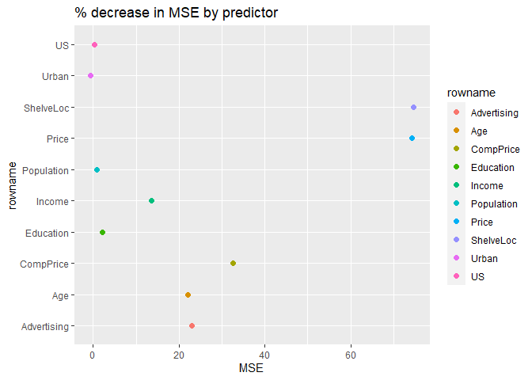

So as we can see, variables that are most important are ShelveLoc, Price, CompPrice, Age and Advertising.

**(e) Use random forests to analyze this data. What test MSE do you obtain? Use the importance() function to determine which variables are most important. Describe the effect of m, the number of variables considered at each split, on the error rate obtained.**

``` r
rf_fit <- randomForest( Sales ∼ .,
                          data = car,
                          subset = train,
                          importance = TRUE)

rf_preds <- predict(rf_fit,
                        newdata = car[-train,])
(mse["random forest"] <- mean((rf_preds - car_test)^2))
```

    ## [1] 2.579996

``` r
importance(rf_fit) %>%
  as.data.frame() %>%
  transmute( MSE = `%IncMSE`,
             NodePurity = IncNodePurity) %>% 
  rownames_to_column() %>% 
  arrange(desc(MSE)) %>% 
  ggplot() +
    geom_point( aes( x = rowname,
                     y = MSE,
                     color = rowname),
                size = 2) +
  coord_flip() +
  ggtitle("% decrease in MSE by predictor")
```

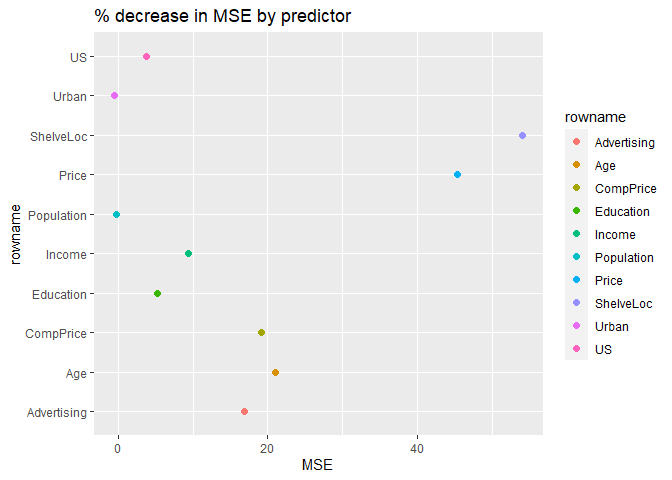

While in bagging the number of variables used at each split is the same as the predictors, in the random\_forest 3 predictors, thus resulting in decorrelation of tress. Sometimes this has a good effect on the model, sometimes it don't (like in this case).

Moreover, we could decide a better m by cross\_validation, even if it is not standard implementation of the library.

**(f) Now analyze the data using BART, and report your results.**

``` r
x_train <- model.matrix( Sales ∼ .,
                         data = car[train,])
y_train <- car[train, "Sales"]
x_test <- model.matrix( Sales ∼ .,
                         data = car[-train,])

bart_fit <- gbart(x_train , y_train , x.test = x_test)
```

    ## *****Calling gbart: type=1
    ## *****Data:
    ## data:n,p,np: 320, 11, 80
    ## y1,yn: 3.066531, 1.886531
    ## x1,x[n*p]: 104.000000, 1.000000
    ## xp1,xp[np*p]: 138.000000, 1.000000
    ## *****Number of Trees: 200
    ## *****Number of Cut Points: 69 ... 1
    ## *****burn,nd,thin: 100,1000,1
    ## *****Prior:beta,alpha,tau,nu,lambda,offset: 2,0.95,0.284787,3,0.198835,7.59347
    ## *****sigma: 1.010327
    ## *****w (weights): 1.000000 ... 1.000000
    ## *****Dirichlet:sparse,theta,omega,a,b,rho,augment: 0,0,1,0.5,1,11,0
    ## *****printevery: 100
    ## 
    ## MCMC
    ## done 0 (out of 1100)
    ## done 100 (out of 1100)
    ## done 200 (out of 1100)
    ## done 300 (out of 1100)
    ## done 400 (out of 1100)
    ## done 500 (out of 1100)
    ## done 600 (out of 1100)
    ## done 700 (out of 1100)
    ## done 800 (out of 1100)
    ## done 900 (out of 1100)
    ## done 1000 (out of 1100)
    ## time: 9s
    ## trcnt,tecnt: 1000,1000

``` r
bart_preds <- bart_fit[["yhat.test.mean"]]
(mse["BART"] <- mean((bart_preds - car_test)^2))
```

    ## [1] 1.664449

``` r
mse %>% 
  unlist() %>%
  as.data.frame() %>% 
  ggplot() +
    geom_point( aes( x = names(mse),
                     y = .,
                     color = names(mse)),
                size = 2) +
  coord_flip() +
  ggtitle("MSE")
```

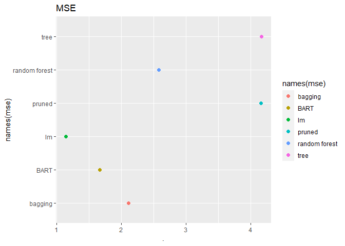

### ex. 9

**This problem involves the OJ data set which is part of the ISLR2 package.**

**(a) Create a training set containing a random sample of 800 observations, and a test set containing the remaining observations.**

``` r
oj <- ISLR2::OJ
mse <- vector()

set.seed(123)
train <- sample (1:nrow(oj), 800)
oj_test <- oj[-train , "Purchase"]
```

1.  Fit a tree to the training data, with Purchase as the response and the other variables as predictors. Use the summary() function to produce summary statistics about the tree, and describe the results obtained. What is the training error rate? How many terminal nodes does the tree have?

``` r
tree_fit <- tree( Purchase ∼ .,
                  data = oj,
                  subset = train)
summary(tree_fit)
```

    ## 
    ## Classification tree:
    ## tree(formula = Purchase ~ ., data = oj, subset = train)
    ## Variables actually used in tree construction:
    ## [1] "LoyalCH"   "PriceDiff"
    ## Number of terminal nodes:  8 
    ## Residual mean deviance:  0.7625 = 603.9 / 792 
    ## Misclassification error rate: 0.165 = 132 / 800

As we can see from the summary, the tree has 8 terminal nodes, using only 2 variables to accurately predict the outcome. Train classification error = 16.5%, while on the test set the error rate is 18.5% (see later).

But let's fit a simple logistic regression to have a comparison.

``` r
lr_fit <- glm( Purchase ∼ .,
                  data = oj,
                  subset = train,
                  family = binomial)

lr_preds <- predict(lr_fit,
                    newdata = oj[-train,],
                    type = "response")
```

    ## Warning in predict.lm(object, newdata, se.fit, scale = 1, type = if (type == :
    ## prediction from a rank-deficient fit may be misleading

``` r
table(lr_preds > 0.5, oj_test == "MM")
```

    ##        
    ##         FALSE TRUE
    ##   FALSE   146   28
    ##   TRUE     20   76

``` r
(mse["lr"] <- sum((lr_preds > 0.5) != (oj_test == "MM"))/length(oj_test) )
```

    ## [1] 0.1777778

So the test error (accuracy) from the logistic regression is slightly less than the one from the tree

**(c) Type in the name of the tree object in order to get a detailed text output. Pick one of the terminal nodes, and interpret the information displayed.**

``` r
tree_fit
```

    ## node), split, n, deviance, yval, (yprob)
    ##       * denotes terminal node
    ## 
    ##  1) root 800 1071.00 CH ( 0.60875 0.39125 )  
    ##    2) LoyalCH < 0.5036 350  415.10 MM ( 0.28000 0.72000 )  
    ##      4) LoyalCH < 0.276142 170  131.00 MM ( 0.12941 0.87059 )  
    ##        8) LoyalCH < 0.0356415 56   10.03 MM ( 0.01786 0.98214 ) *
    ##        9) LoyalCH > 0.0356415 114  108.90 MM ( 0.18421 0.81579 ) *
    ##      5) LoyalCH > 0.276142 180  245.20 MM ( 0.42222 0.57778 )  
    ##       10) PriceDiff < 0.05 74   74.61 MM ( 0.20270 0.79730 ) *
    ##       11) PriceDiff > 0.05 106  144.50 CH ( 0.57547 0.42453 ) *
    ##    3) LoyalCH > 0.5036 450  357.10 CH ( 0.86444 0.13556 )  
    ##      6) PriceDiff < -0.39 27   32.82 MM ( 0.29630 0.70370 ) *
    ##      7) PriceDiff > -0.39 423  273.70 CH ( 0.90071 0.09929 )  
    ##       14) LoyalCH < 0.705326 130  135.50 CH ( 0.78462 0.21538 )  
    ##         28) PriceDiff < 0.145 43   58.47 CH ( 0.58140 0.41860 ) *
    ##         29) PriceDiff > 0.145 87   62.07 CH ( 0.88506 0.11494 ) *
    ##       15) LoyalCH > 0.705326 293  112.50 CH ( 0.95222 0.04778 ) *

So if we take `3) LoyalCH > 0.5036 450  357.10 CH ( 0.86444 0.13556 )` we can see that the third split involves the variable LoyalCH, which is described by:

-   var, the variable used at the split (or "<leaf>" for a terminal node),
-   n, the (weighted) number of cases reaching that node,
-   dev the deviance of the node,
-   yval, the fitted value at the node (the mean for regression trees, a majority class for classification trees)
-   split, a two-column matrix of the labels for the left and right splits at the node.

**(d) Create a plot of the tree, and interpret the results.**

``` r
plot(tree_fit)
text(tree_fit , pretty = 0)
```

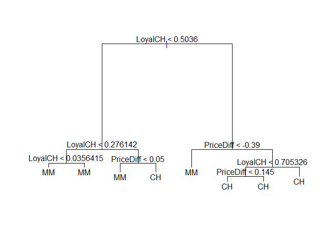

As we can see, to obtain a good enough tree (where in each step we maximize the reduction in impurity) until terminal nodes are too small to split, we only use two variable (PriceDiff and LoyalCH).

**(e) Predict the response on the test data, and produce a confusion matrix comparing the test labels to the predicted test labels. What is the test error rate?**

``` r
tree_preds <- predict(tree_fit,
                      newdata = oj[-train,],
                      type = "class")
(mse["tree"] <- sum(tree_preds != oj_test)/length(oj_test) )
```

    ## [1] 0.1851852

Test error rate is slightly over the training error rate, with most of error coming from MM classified as CH.

``` r
table(tree_preds, oj_test)
```

    ##           oj_test
    ## tree_preds  CH  MM
    ##         CH 150  34
    ##         MM  16  70

**(f) Apply the cv.tree() function to the training set in order to determine the optimal tree size.**

``` r
( cv_tree_fit <- cv.tree(tree_fit , FUN = prune.misclass) )
```

    ## $size
    ## [1] 8 5 3 2 1
    ## 
    ## $dev
    ## [1] 141 138 161 165 313
    ## 
    ## $k
    ## [1] -Inf    0    8   11  154
    ## 
    ## $method
    ## [1] "misclass"
    ## 
    ## attr(,"class")
    ## [1] "prune"         "tree.sequence"

**(g) Produce a plot with tree size on the x-axis and cross-validated classification error rate on the y-axis.**

``` r
ggplot() +
  geom_line( aes( x = cv_tree_fit[["size"]],
                  y = cv_tree_fit[["dev"]]))
```

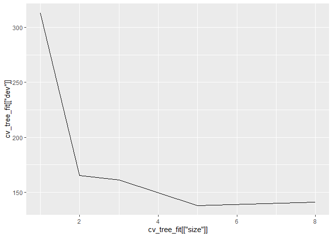

**(h) Which tree size corresponds to the lowest cross-validated classification error rate?** So 5 seems to be the better parameter obtained through cross-validation.

**(i) Produce a pruned tree corresponding to the optimal tree size obtained using cross-validation.**

``` r
pruned_tree_fit <- prune.misclass(tree_fit , best = 5)
plot(pruned_tree_fit)
text(pruned_tree_fit , pretty = 0)
```

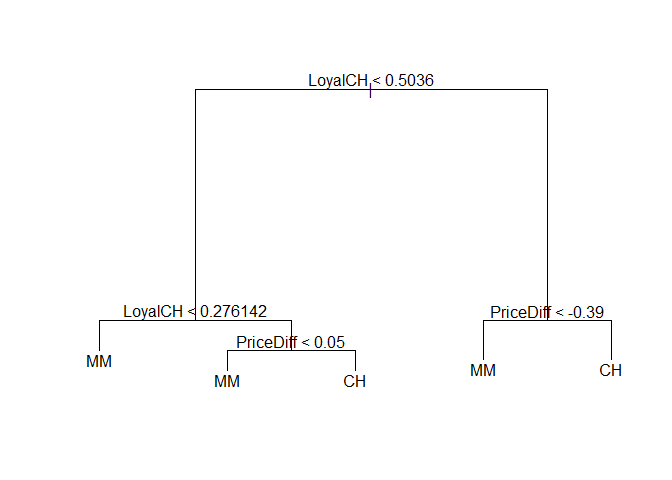

1.  Compare the training error rates between the pruned and unpruned trees. Which is higher?

``` r
pruned_preds <- predict(pruned_tree_fit,
                        newdata = oj[-train,],
                        type = "class")
(mse["pruned"] <- sum(pruned_preds != oj_test)/length(oj_test) )
```

    ## [1] 0.1851852

1.  Compare the test error rates between the pruned and unpruned trees. Which is higher?\*\*

``` r
mse %>% 
  unlist() %>%
  as.data.frame() %>% 
  ggplot() +
    geom_point( aes( x = names(mse),
                     y = .,
                     color = names(mse)),
                size = 2) +
  coord_flip() +
  ggtitle("MSE")
```

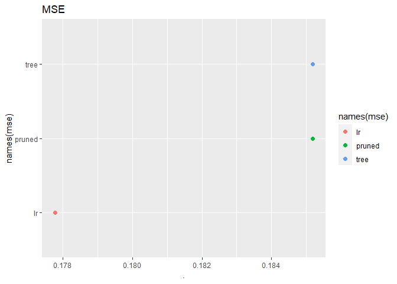

They are the same error rate, which means that additional leaves did not bring any additional predictive accuracy on the test set.

### ex. 10

**We now use boosting to predict Salary in the Hitters data set.**

**(a) Remove the observations for whom the salary information is unknown, and then log-transform the salaries.**

``` r
hit <- Hitters
hit %>%
  summarise_all(funs(sum(is.na(.))))
```

    ## Warning: `funs()` was deprecated in dplyr 0.8.0.
    ## Please use a list of either functions or lambdas: 
    ## 
    ##   # Simple named list: 
    ##   list(mean = mean, median = median)
    ## 
    ##   # Auto named with `tibble::lst()`: 
    ##   tibble::lst(mean, median)
    ## 
    ##   # Using lambdas
    ##   list(~ mean(., trim = .2), ~ median(., na.rm = TRUE))
    ## This warning is displayed once every 8 hours.
    ## Call `lifecycle::last_lifecycle_warnings()` to see where this warning was generated.

    ##   AtBat Hits HmRun Runs RBI Walks Years CAtBat CHits CHmRun CRuns CRBI CWalks
    ## 1     0    0     0    0   0     0     0      0     0      0     0    0      0
    ##   League Division PutOuts Assists Errors Salary NewLeague
    ## 1      0        0       0       0      0     59         0

As we can see, out of 322 obs, 59 does not have a salary.

``` r
hit <-  hit %>%
  filter( !is.na(Salary) ) %>% 
  mutate( logSalary = log(Salary)) %>% 
  select(-Salary)
```

**(b) Create a training set consisting of the first 200 observations, and a test set consisting of the remaining observations.**

``` r
train <- 1:200
hit_test <- hit[-train, "logSalary"]
```

**(c) Perform boosting on the training set with 1,000 trees for a range of values of the shrinkage parameter λ. Produce a plot with different shrinkage values on the x-axis and the corresponding training set MSE on the y-axis.**

``` r
data <- data.frame(
  lambda = 1e-3*1:100,
  trainMSE = double(length = 100),
  testMSE = double(length = 100)
  )

for(i in 1:100) {
  boost_fit <- gbm(logSalary ∼ ., 
                 data = hit[train , ], 
                 distribution = "gaussian",
                 n.trees = 1e3, 
                 interaction.depth = 4,
                 shrinkage = data[["lambda"]])  
  data[i, "trainMSE"] <- last(boost_fit[["train.error"]])
  
  boost_pred <- predict(boost_fit,
                        newdata = hit[-train,])
  data[i, "testMSE"] <- mean((boost_pred - hit_test)^2)
}
```

    ## Using 1000 trees...
    ## 
    ## Using 1000 trees...
    ## 
    ## Using 1000 trees...
    ## 
    ## Using 1000 trees...
    ## 
    ## Using 1000 trees...
    ## 
    ## Using 1000 trees...
    ## 
    ## Using 1000 trees...
    ## 
    ## Using 1000 trees...
    ## 
    ## Using 1000 trees...
    ## 
    ## Using 1000 trees...
    ## 
    ## Using 1000 trees...
    ## 
    ## Using 1000 trees...
    ## 
    ## Using 1000 trees...
    ## 
    ## Using 1000 trees...
    ## 
    ## Using 1000 trees...
    ## 
    ## Using 1000 trees...
    ## 
    ## Using 1000 trees...
    ## 
    ## Using 1000 trees...
    ## 
    ## Using 1000 trees...
    ## 
    ## Using 1000 trees...
    ## 
    ## Using 1000 trees...
    ## 
    ## Using 1000 trees...
    ## 
    ## Using 1000 trees...
    ## 
    ## Using 1000 trees...
    ## 
    ## Using 1000 trees...
    ## 
    ## Using 1000 trees...
    ## 
    ## Using 1000 trees...
    ## 
    ## Using 1000 trees...
    ## 
    ## Using 1000 trees...
    ## 
    ## Using 1000 trees...
    ## 
    ## Using 1000 trees...
    ## 
    ## Using 1000 trees...
    ## 
    ## Using 1000 trees...
    ## 
    ## Using 1000 trees...
    ## 
    ## Using 1000 trees...
    ## 
    ## Using 1000 trees...
    ## 
    ## Using 1000 trees...
    ## 
    ## Using 1000 trees...
    ## 
    ## Using 1000 trees...
    ## 
    ## Using 1000 trees...
    ## 
    ## Using 1000 trees...
    ## 
    ## Using 1000 trees...
    ## 
    ## Using 1000 trees...
    ## 
    ## Using 1000 trees...
    ## 
    ## Using 1000 trees...
    ## 
    ## Using 1000 trees...
    ## 
    ## Using 1000 trees...
    ## 
    ## Using 1000 trees...
    ## 
    ## Using 1000 trees...
    ## 
    ## Using 1000 trees...
    ## 
    ## Using 1000 trees...
    ## 
    ## Using 1000 trees...
    ## 
    ## Using 1000 trees...
    ## 
    ## Using 1000 trees...
    ## 
    ## Using 1000 trees...
    ## 
    ## Using 1000 trees...
    ## 
    ## Using 1000 trees...
    ## 
    ## Using 1000 trees...
    ## 
    ## Using 1000 trees...
    ## 
    ## Using 1000 trees...
    ## 
    ## Using 1000 trees...
    ## 
    ## Using 1000 trees...
    ## 
    ## Using 1000 trees...
    ## 
    ## Using 1000 trees...
    ## 
    ## Using 1000 trees...
    ## 
    ## Using 1000 trees...
    ## 
    ## Using 1000 trees...
    ## 
    ## Using 1000 trees...
    ## 
    ## Using 1000 trees...
    ## 
    ## Using 1000 trees...
    ## 
    ## Using 1000 trees...
    ## 
    ## Using 1000 trees...
    ## 
    ## Using 1000 trees...
    ## 
    ## Using 1000 trees...
    ## 
    ## Using 1000 trees...
    ## 
    ## Using 1000 trees...
    ## 
    ## Using 1000 trees...
    ## 
    ## Using 1000 trees...
    ## 
    ## Using 1000 trees...
    ## 
    ## Using 1000 trees...
    ## 
    ## Using 1000 trees...
    ## 
    ## Using 1000 trees...
    ## 
    ## Using 1000 trees...
    ## 
    ## Using 1000 trees...
    ## 
    ## Using 1000 trees...
    ## 
    ## Using 1000 trees...
    ## 
    ## Using 1000 trees...
    ## 
    ## Using 1000 trees...
    ## 
    ## Using 1000 trees...
    ## 
    ## Using 1000 trees...
    ## 
    ## Using 1000 trees...
    ## 
    ## Using 1000 trees...
    ## 
    ## Using 1000 trees...
    ## 
    ## Using 1000 trees...
    ## 
    ## Using 1000 trees...
    ## 
    ## Using 1000 trees...
    ## 
    ## Using 1000 trees...
    ## 
    ## Using 1000 trees...
    ## 
    ## Using 1000 trees...
    ## 
    ## Using 1000 trees...

``` r
ggplot(data) +
  geom_point( aes(x = lambda,
                 y = trainMSE),
             color = "green")
```

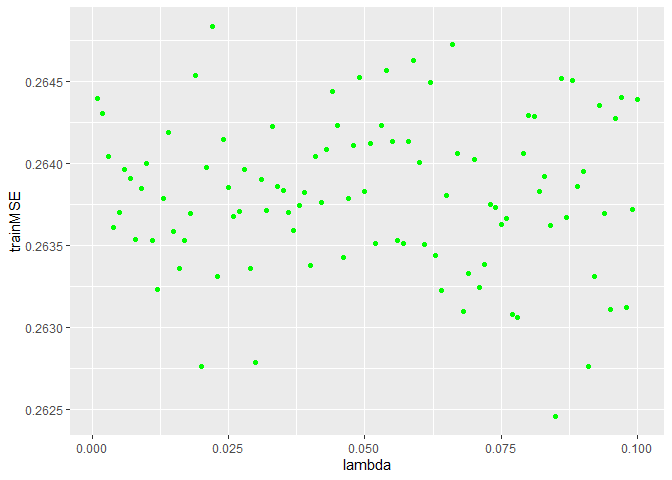

**(d) Produce a plot with different shrinkage values on the x-axis and the corresponding test set MSE on the y-axis.**

``` r
ggplot(data,
       aes(x = lambda,
                  y = testMSE)) +
      geom_point( color = "blue") +
  geom_smooth()
```

    ## `geom_smooth()` using method = 'loess' and formula 'y ~ x'

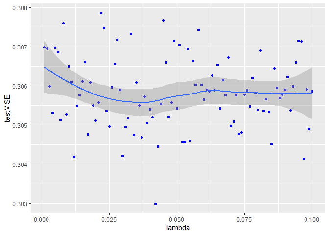

\[first-run with lambda between 1e-4 and 1e-2\] The test error is lower than the train error, uncommon but possible (this suggest an underfitting of the curve, given by too few trees of a too low lambda).

\[current run with lambda 10x bigger\] Problem solved.

**(e) Compare the test MSE of boosting to the test MSE that results from applying two of the regression approaches seen in Chapters 3 and 6.**

``` r
lm_fit <- glm( logSalary ∼ .,
              data = hit,
              subset = train)
lm_preds <- predict(lm_fit,
                    newdata = hit[-train,])
(mean((lm_preds - hit_test)^2))
```

    ## [1] 0.4917959

``` r
#ridge reg
hit_mat <- model.matrix(logSalary ∼ ., hit)[, -1]
hit_train <- hit[train, "logSalary"]

ridge_fit <- glmnet(hit_mat[train,], hit_train, 
                    alpha = 0)

cv_out <- cv.glmnet(hit_mat[train,],
                    hit_train, 
                    alpha = 0)
# plot(cv_out)
ridge_preds <- predict(ridge_fit , 
                      s = cv_out[["lambda.min"]] , 
                      newx = hit_mat[-train,])
(mean((ridge_preds - hit_test)^2))
```

    ## [1] 0.4570283

**(f) Which variables appear to be the most important predictors in the boosted model?**

``` r
summary(boost_fit) %>% 
  filter(rel.inf > 0)
```

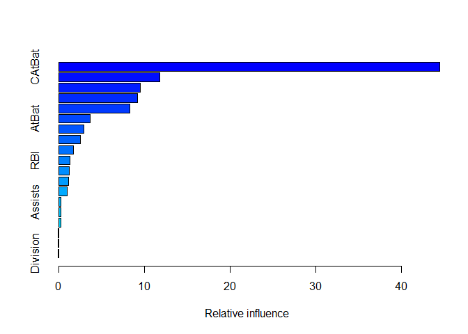

    ##                 var     rel.inf
    ## CAtBat       CAtBat 44.48109264
    ## CWalks       CWalks 11.81339454
    ## CHits         CHits  9.56531567
    ## CRBI           CRBI  9.20397594
    ## CRuns         CRuns  8.29638423
    ## AtBat         AtBat  3.70497084
    ## Walks         Walks  2.98958311
    ## CHmRun       CHmRun  2.57368000
    ## Hits           Hits  1.69831151
    ## RBI             RBI  1.31323282
    ## Runs           Runs  1.25463026
    ## PutOuts     PutOuts  1.16061815
    ## Years         Years  0.97377696
    ## Assists     Assists  0.30542286
    ## HmRun         HmRun  0.26607028
    ## Errors       Errors  0.24664811
    ## League       League  0.05851486
    ## NewLeague NewLeague  0.05279738
    ## Division   Division  0.04157984

Most 5 important variables seem to be CAtBat, CWalks, CHits, CRBI and CRuns.

**(g) Now apply bagging to the training set. What is the test set MSE for this approach?**

``` r
bag_fit <- randomForest(logSalary ∼ ., 
                        data = hit,
                        subset = train , 
                        mtry = 19,
                        importance = TRUE)
bag_pred <- predict(bag_fit,
                        newdata = hit[-train,])
( mean((bag_pred - hit_test)^2) )
```

    ## [1] 0.2333398

The test set with bagging is significantly lower than any other method.
